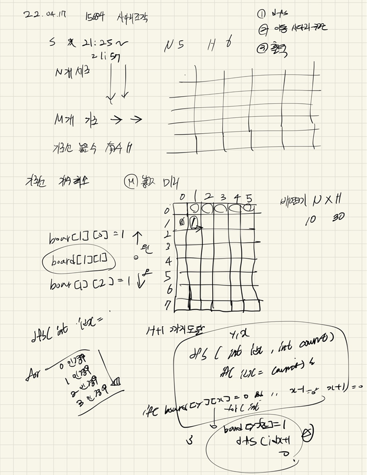

## 22-04-17-15684-사다리조작

## 목차

> 01.dfs
>
> 02.사다리타기
>
> 03.실수한점
>
> 04.전체소스



## 01.dfs

```c++
void dfs(int y, int x, int idx, int count)
{
	if (ret == 1) return;
	if (idx == count)
	{
		if (searchNumber()) ret = 1;
		return;
	}

	for (int i = y; i <=H; i++)
	{
		for (int j = x; j <=N; j++)
		{
			if (board[i][j - 1] == 0 && board[i][j] == 0 && board[i][j + 1] == 0) {// 놓을수 있는 경우
				board[i][j] = 1;
				dfs(i, j + 1, idx + 1, count);
				board[i][j] = 0;
			}
		}
		x = 1;
	}
}
```

## 02.사다리타기

```c++
int searchNumber() {
	for (int i = 1; i <= N; i++)
	{
		int y = 1, x = i;
		while (1)
		{
			if (board[y][x] == 1) {//오른쪽이동 x++
				x++;
			}
			else if (board[y][x - 1] == 1) {//왼쪽이동 x--;
				x--;
			}
			y++;
			if (y == H + 1) break;
		}
		if (x != i)return 0;
	}
	return 1;
}
```

## 03.실수한점

- N, H가 입력으로 들어오는데
  - N은 행이아니고 열이고
  - H는 열이 아니고 행임
    - 이것을 반대로 N을 행  H를 열로 생각하고 구현했음
    - 그래서 처음에 또 틀림
- 보편적으로 N인 행, M이 열인 문제를 계속 접하다보니 이런 실수가 있었음 주의 할 것

## 04.전체소스

```c++
#include<stdio.h>
#include<iostream>
#include<vector>
#define NS 12
#define HS 32
using namespace std;
int N, M, H,ret;
int board[HS][NS];

void init()
{
	N = M = 0;
	ret = -1;
	scanf("%d %d %d", &N, &M, &H);
	for (int i = 0; i < M; i++)
	{
		int y,x;
		scanf("%d %d", &y, &x);
		board[y][x] = 1;
	}
}

int searchNumber() {
	for (int i = 1; i <= N; i++)
	{
		int y = 1, x = i;
		while (1)
		{
			if (board[y][x] == 1) {//오른쪽이동 x++
				x++;
			}
			else if (board[y][x - 1] == 1) {//왼쪽이동 x--;
				x--;
			}
			y++;
			if (y == H + 1) break;
		}
		if (x != i)return 0;
	}
	return 1;
}

void dfs(int y, int x, int idx, int count)
{
	if (ret == 1) return;
	if (idx == count)
	{
		if (searchNumber()) ret = 1;
		return;
	}

	for (int i = y; i <=H; i++)
	{
		for (int j = x; j <=N; j++)
		{
			if (board[i][j - 1] == 0 && board[i][j] == 0 && board[i][j + 1] == 0) {// 놓을수 있는 경우
				board[i][j] = 1;
				dfs(i, j + 1, idx + 1, count);
				board[i][j] = 0;
			}
		}
		x = 1;
	}
}

int main(void)
{
	init();
	for (int i = 0; i <= 3; i++)
	{
		dfs(1, 1, 0, i);
		if (ret == 1) {
			ret = i;
			break;
		}
	}
	printf("%d\n", ret);
	return 0;
}
```

