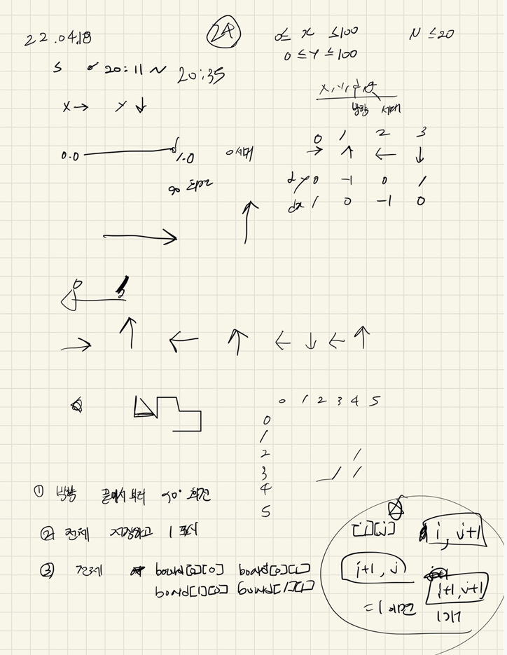

## 22-04-18-15685-드래곤커브

## 목차

> 01.드래곤방향저장
>
> 02.정사각형 개수 세기
>
> 03.전체소스



## 01.드래곤방향저장

```c++
		for (int i = 0; i < g; i++) {
			for (int j = dragonDir.size() - 1; j >= 0; j--) {
				int dir = dragonDir[j] + 1;
				if (dir == 4) dir = 0;
				dragonDir.push_back(dir);//90도 회전 저장
			}
		}
```

- 이문제의 핵심
  - 그냥 저장되어있는 방향 거꾸로 돌면서 90도해서 다시 저장하면됨

## 02.정사각형 개수 세기

```c++
void squareCheck() {
	for (int i = 0; i < 100; i++) {
		for (int j = 0; j < 100; j++) {
			if (board[i][j] == 1 && board[i][j + 1] == 1 && board[i + 1][j] == 1 && board[i + 1][j + 1] == 1) {
				ret++;
			}
		}
	}
}
```

## 03.전체소스

```c++
#include<stdio.h>
#include<iostream>
#include<vector>
using namespace std;
int N, ret;
int dy[] = { 0,-1,0,1 };
int dx[] = { 1,0,-1,0 };
int board[104][104];
void init()
{
	N = ret = 0;
	scanf("%d", &N);
}

void squareCheck() {
	for (int i = 0; i < 100; i++) {
		for (int j = 0; j < 100; j++) {
			if (board[i][j] == 1 && board[i][j + 1] == 1 && board[i + 1][j] == 1 && board[i + 1][j + 1] == 1) {
				ret++;
			}
		}
	}
}
void dragonCurve() {
	for (int n = 0; n < N; n++) {
		vector<int>dragonDir;
		int x, y, d, g;
		scanf("%d %d %d %d", &x, &y, &d, &g);
		dragonDir.push_back(d);
		for (int i = 0; i < g; i++) {
			for (int j = dragonDir.size() - 1; j >= 0; j--) {
				int dir = dragonDir[j] + 1;
				if (dir == 4) dir = 0;
				dragonDir.push_back(dir);//90도 회전 저장
			}
		}
		board[y][x] = 1;

		//배열에 기록 남기기
		for (int j = 0; j < dragonDir.size(); j++) {
			int ny = y + dy[dragonDir[j]];
			int nx = x + dx[dragonDir[j]];
			board[ny][nx] = 1;
			y = ny; x = nx;
		}
	}
	squareCheck();
}

int main(void)
{
	init();
	dragonCurve();
	printf("%d\n", ret);
	return 0;
}
```

