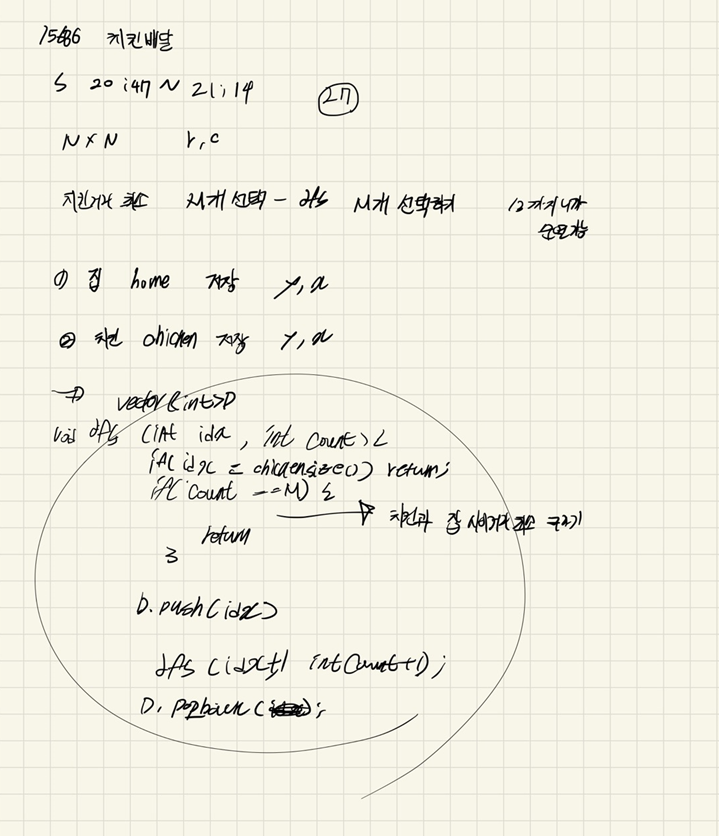

## 22-04-18-15686-치킨배달

## 목차

> 01.dfs 방식 1
>
> 02.dfs 방식 2
>
> 03.dfs1,2 설명
>
> 04.전체소스



## 01.dfs 방식 1

```c++
void dfs(int idx, int count) {
	if (idx > chicken.size()) return;
	if (count == M) {
		int dis = absDistance();
		ret = ret > dis ? dis : ret;
		return;
	}

	D.push_back(idx);
	dfs(idx + 1, count + 1);
	D.pop_back();
	dfs(idx + 1, count);
}
```

## 02.dfs 방식 2

```c++
void dfs(int idx, int count) {
	if (count == M) {
		int dis = absDistance();
		ret = ret > dis ? dis : ret;
		return;
	}
	for (int i = idx; i < chicken.size(); i++) {
		if (D[i] == 0) {
			D[i] = 1;
			dfs(i + 1, count + 1);
			D[i] = 0;
		}
	}
}
```

## 03.dfs1,2 설명

- 저장 방식 -> 3개있는 치킨집을 1 2 3 이라고 했을때 2개만 선택하는 경우 
  - dfs 1
    - 1 2
    - 1 3
    - 2 3
  - dfs2
    - 1 1 0
    - 1 0 1
    - 0 1 1

## 04.전체소스

```c++
#include<stdio.h>
#include<iostream>
#include<vector>
#define NS 54
using namespace std;
int N, M, ret;
struct pos {
	int y, x;
};
vector<int>D;
//int D[14];
vector<pos>home;
vector<pos>chicken;
int board[NS][NS];

int absDistance() {
	int sum = 0;
	for (int h = 0; h < home.size(); h++) {
		int chickenD = 0x7fffffff;
		for (int d = 0; d < D.size(); d++) {
			int dis = abs(home[h].y - chicken[D[d]].y) + abs(home[h].x - chicken[D[d]].x);
			chickenD = chickenD > dis ? dis : chickenD;
		}
		sum += chickenD;
	}

	return sum;
}

//void dfs(int idx, int count) {
//	if (count == M) {
//		int dis = absDistance();
//		ret = ret > dis ? dis : ret;
//		return;
//	}
//	for (int i = idx; i < chicken.size(); i++) {
//		if (D[i] == 0) {
//			D[i] = 1;
//			dfs(i + 1, count + 1);
//			D[i] = 0;
//		}
//	}
//}

void dfs(int idx, int count) {
	if (idx > chicken.size()) return;
	if (count == M) {
		int dis = absDistance();
		ret = ret > dis ? dis : ret;
		return;
	}

	D.push_back(idx);
	dfs(idx + 1, count + 1);
	D.pop_back();
	dfs(idx + 1, count);
}

void init() {
	N = M = 0;
	ret = 0x7fffffff;
	scanf("%d %d", &N, &M);
	for (int i = 0; i < N; i++) {
		for (int j = 0; j < N; j++) {
			scanf("%d", &board[i][j]);
			if (board[i][j] == 1)home.push_back({ i,j });
			else if (board[i][j] == 2) chicken.push_back({ i,j });
		}
	}
}
int main(void) {
	init();
	dfs(0, 0);
	printf("%d\n", ret);
	return 0;
}
```


