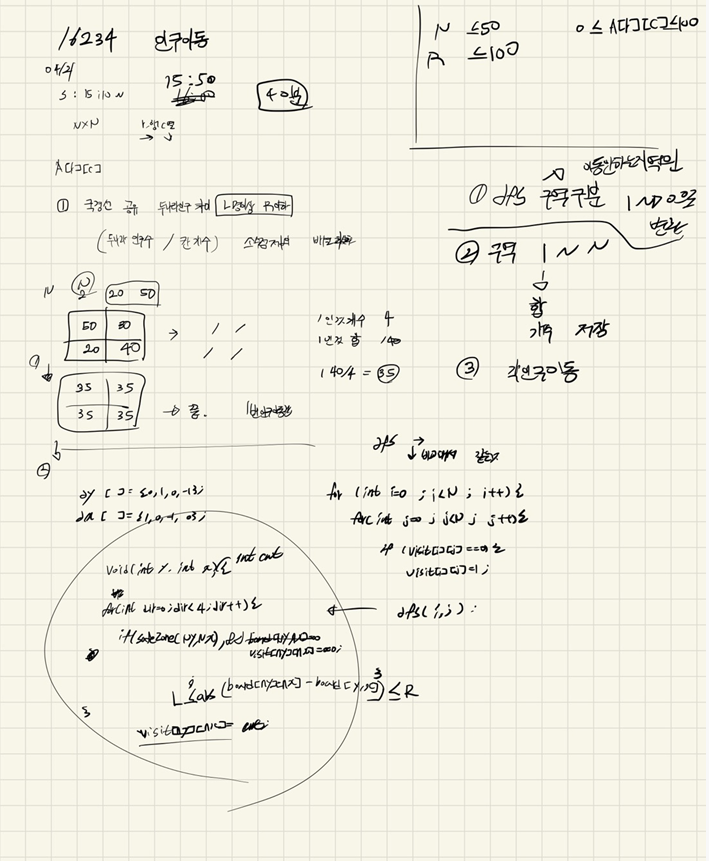

## 목차

> 01.dfs구역 나누기
>
> 02.인구이동 계산
>
> 03.젠체소스



## 01.dfs구역 나누기

```c++
bool safeZone(int y, int x)
{
	return 0 <= y && y < N && 0 <= x && x < N;
}
void dfs(int y, int x, int cnt) {
	for (int dir = 0; dir < 4; dir++) {
		int ny = y + dy[dir]; int nx = x + dx[dir];
		int DA = abs(A[y][x] - A[ny][nx]);
		if (safeZone(ny, nx)&& visit[ny][nx]==0 && (L <= DA && DA <= R)) {
			visit[ny][nx] = cnt;
			dfs(ny, nx, cnt);
		}
	}
}
```

## 02.인구이동 계산

```sql
//인구 이동구역 숫자 및 사람 수 저장
for (int i = 0; i < N; i++) {
	for (int j = 0; j < N; j++) {
		people[visit[i][j]].people += A[i][j];
		people[visit[i][j]].number++;
	}
}

//인구이동 구역에 대한 인구수 계산
for (int i = 1; i <= N * N; i++) {
	if (people[i].number != 0 && people[i].number != 1) {
		people[i].people = people[i].people / people[i].number;
	}
}
```

## 03.전체소스

```c++
#include<stdio.h>
#include<iostream>
#include<vector>
#include<algorithm>
#include<string.h>
#define NS 54
using namespace std;
int N, R, L, A[NS][NS];
int visit[NS][NS];
int dy[] = { 0,1,0,-1 };
int dx[] = { 1,0,-1,0 };

struct Data {
	int people,  number;
};

bool safeZone(int y, int x)
{
	return 0 <= y && y < N && 0 <= x && x < N;
}
void dfs(int y, int x, int cnt) {
	for (int dir = 0; dir < 4; dir++) {
		int ny = y + dy[dir]; int nx = x + dx[dir];
		int DA = abs(A[y][x] - A[ny][nx]);
		if (safeZone(ny, nx)&& visit[ny][nx]==0 && (L <= DA && DA <= R)) {
			visit[ny][nx] = cnt;
			dfs(ny, nx, cnt);
		}
	}
}
void init() {
	N = R = L = 0;
	scanf("%d %d %d", &N, &L, &R);
	for (int i = 0; i < N; i++) {
		for (int j = 0; j < N; j++) {
			scanf("%d", &A[i][j]);
		}
	}
}

int main(void)
{
	int time=0;
	init();
	while (1) {
		int cnt = 0;
		memset(visit, 0, sizeof(visit));
		for (int i = 0; i < N; i++) {
			for (int j = 0; j < N; j++) {
				if (visit[i][j] == 0) {
					cnt++;
					visit[i][j] = cnt;
					dfs(i, j, cnt);

				}
			}
		}
		if (cnt == N*N)break;
		Data people[254] = { 0, };
		for (int i = 0; i < N; i++) {
			for (int j = 0; j < N; j++) {
				people[visit[i][j]].people += A[i][j];
				people[visit[i][j]].number++;
			}
		}
		for (int i = 1; i <= N * N; i++) {
			if (people[i].number != 0 && people[i].number != 1) {
				people[i].people = people[i].people / people[i].number;
			}
		}
		for (int i = 0; i < N; i++) {
			for (int j = 0; j < N; j++) {
				if (people[visit[i][j]].number == 1)continue;
				A[i][j] = people[visit[i][j]].people;
			}
		}
		time++;
	}
		printf("%d\n",time);
	return 0;
}
```

