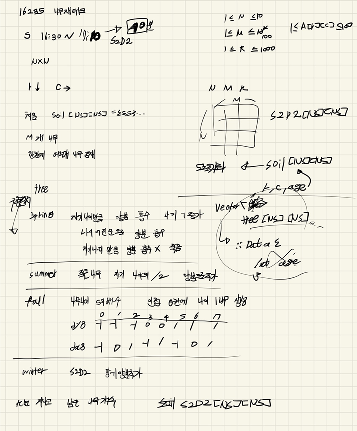

## 목차

> 01.봄
>
> 02.여름
>
> 03.가을
>
> 04.겨울
>
> 05.전체소스



## 01.봄

- 실수로 나이를 증가하고 양분을 제거함

```c++
void spring() {//봄 양분 흡수
		for (int i = 0; i < N; i++) {
		for (int j = 0; j < N; j++) {
			sort(tree[i][j].begin(), tree[i][j].end());//나이순서대로 정렬
			for (int k = 0; k < tree[i][j].size(); k++) {
				if (A[i][j] - tree[i][j][k] >= 0) {//양분 흡수 하는 경우
					A[i][j] -= tree[i][j][k];
					tree[i][j][k]++;
				}				
				else{
					A_Death[i][j] += tree[i][j][k] / 2;//죽은 나무 영양분 저장
					tree[i][j].erase(tree[i][j].begin() + k);
					k--;
				}
			}
		}
	}
}
```

## 02.여름

```c++
void summer() {//죽은 양분 저장
	for (int i = 0; i < N; i++) {
		for (int j = 0; j < N; j++){
			A[i][j] += A_Death[i][j];
			A_Death[i][j] = 0;
		}
	}
}
```

## 03.가을

- 8방향인데 dir <4 라고 잘못 입력

```c++
void fall() {//번식 
	for (int i = 0; i < N; i++) {
		for (int j = 0; j < N; j++) {
			for (int k = 0; k < tree[i][j].size(); k++) {
				if (tree[i][j][k] % 5 == 0) {//번식 가능한 나이가 된 경우
					for (int dir = 0; dir < 8; dir++) {
						int ny = i + dy8[dir]; int nx = j + dx8[dir];
						if (0 <= ny && ny < N && 0 <= nx && nx < N) {
							tree[ny][nx].push_back(1);
						}
					}
				}
			}
		}
	}
}
```

## 04.겨울

```c++
void winter() {
	for (int i = 0; i < N; i++) {
		for (int j = 0; j < N; j++) {
			A[i][j] += S2D2[i][j];
		}
	}
}
```

## 05.전체소스

```c++
#include<stdio.h>
#include<iostream>
#include<vector>
#include<string.h>
#include<algorithm>
#define NS 14
using namespace std;
int A[NS][NS];//soil
int A_Death[NS][NS];
int S2D2[NS][NS];
int dy8[]={ -1,-1,-1,0,0,1,1,1 };
int dx8[]={ -1,0,1,-1,1,-1,0,1 };
int N, M, K,ret;
vector<int>tree[NS][NS];

void spring() {//봄 양분 흡수
		for (int i = 0; i < N; i++) {
		for (int j = 0; j < N; j++) {
			sort(tree[i][j].begin(), tree[i][j].end());//나이순서대로 정렬
			for (int k = 0; k < tree[i][j].size(); k++) {
				if (A[i][j] - tree[i][j][k] >= 0) {//양분 흡수 하는 경우
					A[i][j] -= tree[i][j][k];
					tree[i][j][k]++;
				}				
				else{
					A_Death[i][j] += tree[i][j][k] / 2;//죽은 나무 영양분 저장
					tree[i][j].erase(tree[i][j].begin() + k);
					k--;
				}
			}
		}
	}
}
void summer() {//죽은 양분 저장
	for (int i = 0; i < N; i++) {
		for (int j = 0; j < N; j++){
			A[i][j] += A_Death[i][j];
			A_Death[i][j] = 0;
		}
	}
}
void fall() {//번식 
	for (int i = 0; i < N; i++) {
		for (int j = 0; j < N; j++) {
			for (int k = 0; k < tree[i][j].size(); k++) {
				if (tree[i][j][k] % 5 == 0) {//번식 가능한 나이가 된 경우
					for (int dir = 0; dir < 8; dir++) {
						int ny = i + dy8[dir]; int nx = j + dx8[dir];
						if (0 <= ny && ny < N && 0 <= nx && nx < N) {
							tree[ny][nx].push_back(1);
						}
					}
				}
			}
		}
	}
}
void winter() {
	for (int i = 0; i < N; i++) {
		for (int j = 0; j < N; j++) {
			A[i][j] += S2D2[i][j];
		}
	}
}
void init() {
	N = M = K = 0;
	ret = 0;
	memset(S2D2, 0, sizeof(S2D2));
	scanf("%d %d %d", &N, &M, &K);
	for (int i = 0; i < N; i++) {
		for (int j = 0; j < N; j++) {
			A[i][j] = 5;
			tree[i][j].clear();
			scanf("%d", &S2D2[i][j]);
		}
	}

	for (int i = 0; i < M; i++) {
		int r, c, age;
		scanf("%d %d %d", &r, &c, &age);
		tree[r-1][c-1].push_back(age);
	}
}
void treeCount()
{
	for (int i = 0; i < N; i++) {
		for (int j = 0; j < N; j++) {
			ret += tree[i][j].size();
		}
	}
}
void treeMoney() {
	for (int k= 0; k < K; k++) {
		spring();
		summer();
		fall();
		winter();
	}
	treeCount();
}
int main(void)
{
	int testCase = 1;
	for (int tc = 1;tc <= testCase; tc++) {
		init();
		treeMoney();
		printf("%d\n",ret);
	}

	return 0;
}
```

