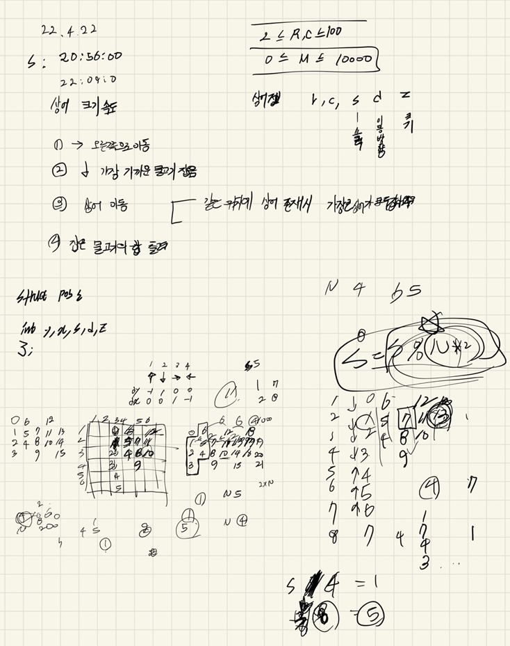

## 2022-04-22-17143-낚시왕

## 목차

> 00.제일 중요한 부분
>
> 01.상어 낚시 부분
>
> 02.상어 이동
>
> 03.같은위치 상어 먹기
>
> 04.전체소스



## 00.제일 중요한 부분

- s 부분이 1000이므로 시초가남

  ```c++
  if (c.d == 0 || c.d == 1)c.s = c.s % ((N * 2) - 2);
  else c.s = c.s % ((M * 2) - 2);
  ```

## 01.상어 낚시 부분

```c++
for (int i = 0; i < M; i++) {//낚시 가능 횟수
    if (Shark.size() == 0)break;
    sort(Shark.begin(), Shark.end(), cmp);
    for (int j = 0; j < Shark.size(); j++) {//낚시 부분
        if (Shark.size() == 0)break;
        if (Shark[j].x == i) {//바늘에 걸린 녀석
            ret += Shark[j].z;
            Shark.erase(Shark.begin() + j);
            break;
        }
    }
```

## 02.상어이동

- before

  ```c++
  for (int j = 0; j < Shark.size(); j++) {//상어 이동
      for (int s = 0; s < Shark[j].s; s++) {
  
          Data n;
          n.y = Shark[j].y + dy[Shark[j].d]; n.x = Shark[j].x + dx[Shark[j].d];
          if (safeZone(n.y, n.x)) {
              Shark[j].y = n.y;
              Shark[j].x = n.x;
          }
          else {
              if (Shark[j].d == 0)Shark[j].d = 1;
              else if (Shark[j].d == 1)Shark[j].d = 0;
              else if (Shark[j].d == 2)Shark[j].d = 3;
              else if (Shark[j].d == 3)Shark[j].d = 2;
              s--;
          }
      }
  }
  ```

- after

  ```c++
  for (int s = 0; s < Shark.size(); s++) {//상어 이동
      if (Shark.size() == 0) break;
      Data n = Shark[s];
      for (int speed = 0; speed < Shark[s].s; speed++) {
          n.y = n.y + dy[n.d];
          n.x = n.x + dx[n.d];
          if (n.y < 0 || n.y == N || n.x < 0 || n.x == M) {
              n.y = n.y - dy[n.d];
              n.x = n.x - dx[n.d];
              if (n.d == 0) n.d = 1;
              else if (n.d == 1) n.d = 0;
              else if (n.d == 2) n.d = 3;
              else if (n.d == 3) n.d = 2;
              speed--;
          }
      }
      Shark[s] = n;
  }
  ```

## 03.같은위치 상어 먹기

- before

  ```c++
  //for (int s = 0; s < Shark.size()-1; s++) {
  //	if (Shark.size() == 0)break;
  //	Data c = Shark[s];
  //	for (int i = s + 1; i < Shark.size(); i++) {
  //		if (Shark[s].y == Shark[i].y&&Shark[s].x == Shark[i].x) {
  //			if (c.z < Shark[i].z) {
  //				c = Shark[i];
  //			}
  //			Shark.erase(Shark.begin() + i);
  //			i--;
  //		}
  //		Shark[s] = c;
  //	}
  //}
  ```

  - 이렇게 하면 시간초과

- after

  ```c++
  for (int i = 0; i < Shark.size() - 1; i++) {
      if (Shark.size() == 1)break;
      if (Shark[i].y == Shark[i + 1].y&&Shark[i].x == Shark[i + 1].x) {
          if (Shark[i].z > Shark[i + 1].z) {
              Shark.erase(Shark.begin() + i + 1);
              i--;
          }
          else if (Shark[i].z < Shark[i + 1].z) {
              Shark.erase(Shark.begin() + i);
              i--;
          }
      }
  }
  ```

  - 같은 위치에 있는 상어들 중에서 큰놈만 살리고 죽이는 경우

## 04.전체소스

```c++
#include<stdio.h>
#include<iostream>
#include<vector>
#include<string.h>
#include<algorithm>
#define SS 1004
using namespace std;
int N, M, S;//격자 y x , 상어수
int ret;
int dy[] = { -1,1,0,0 };
int dx[] = { 0,0,1,-1 };
struct Data {
	int y, x, s, d, z;
};
vector<Data>Shark;
bool safeZone(int y, int x) {
	return 0 <= y && y < N && 0 <= x && x < M;
}
bool cmp(Data a, Data b) {
	if (a.y == b.y)return a.x < b.x;
	return a.y < b.y;
}
void init() {
	scanf("%d %d %d", &N, &M, &S);
	int idx = 0;
	for (int s = 0; s < S; s++) {
		Data c;
		scanf("%d %d %d %d %d", &c.y, &c.x, &c.s, &c.d, &c.z);
		c.y--;
		c.x--;
		c.z;
		c.d--;
		if (c.d == 0 || c.d == 1)c.s = c.s % ((N * 2) - 2);
		else c.s = c.s % ((M * 2) - 2);
		Shark.push_back(c);
	}
}
void sharkFishing() {
	for (int i = 0; i < M; i++) {//낚시 가능 횟수
		if (Shark.size() == 0)break;
		sort(Shark.begin(), Shark.end(), cmp);
		for (int j = 0; j < Shark.size(); j++) {//낚시 부분
			if (Shark.size() == 0)break;
			if (Shark[j].x == i) {//바늘에 걸린 녀석
				ret += Shark[j].z;
				Shark.erase(Shark.begin() + j);
				break;
			}
		}


		for (int s = 0; s < Shark.size(); s++) {//상어 이동
			if (Shark.size() == 0) break;
			Data n = Shark[s];
			for (int speed = 0; speed < Shark[s].s; speed++) {
				n.y = n.y + dy[n.d];
				n.x = n.x + dx[n.d];
				if (n.y < 0 || n.y == N || n.x < 0 || n.x == M) {
					n.y = n.y - dy[n.d];
					n.x = n.x - dx[n.d];
					if (n.d == 0) n.d = 1;
					else if (n.d == 1) n.d = 0;
					else if (n.d == 2) n.d = 3;
					else if (n.d == 3) n.d = 2;
					speed--;
				}
			}
			Shark[s] = n;
		}
		if (Shark.size() == 0)break;
		sort(Shark.begin(), Shark.end(), cmp);
		for (int i = 0; i < Shark.size() - 1; i++) {
			if (Shark.size() == 1)break;
			if (Shark[i].y == Shark[i + 1].y&&Shark[i].x == Shark[i + 1].x) {
				if (Shark[i].z > Shark[i + 1].z) {
					Shark.erase(Shark.begin() + i + 1);
					i--;
				}
				else if (Shark[i].z < Shark[i + 1].z) {
					Shark.erase(Shark.begin() + i);
					i--;
				}
			}
		}
	}
}
int main(void)
{
	init();
	sharkFishing();
	printf("%d\n", ret);
	return 0;
}