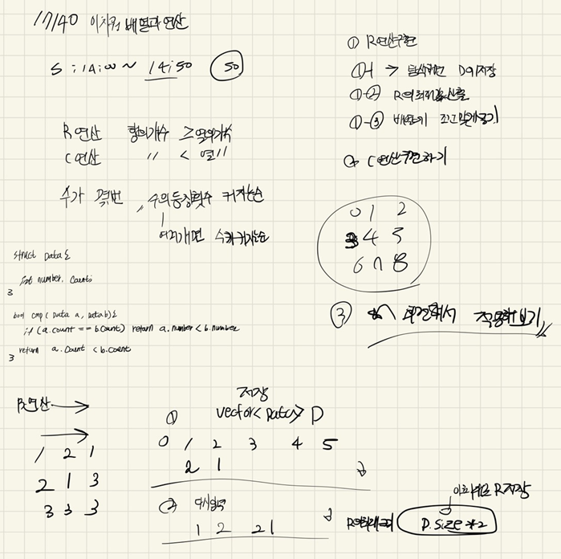

## 2022-04-23-17140-이차원배열과연산

## 목차

> 01.R연산
>
> 02.C연산
>
> 03.전체소스



## 01.R연산

```c++
void R_cal() {
	for (int i = 0; i < R; i++) {
		Data D[101] = { 0, };
		vector<Data>DD;
		for (int j = 0; j < C; j++) {
			if (A[i][j] != 0) {
				D[A[i][j]].number = A[i][j];
				D[A[i][j]].count++;
				A[i][j] = 0;
			}
		}
		for (int j = 0; j <= 100; j++) {
			if (D[j].count != 0) {
				DD.push_back({ j,D[j].count });
			}
		}
		C = C < DD.size() * 2 ? DD.size() * 2 : C;
		sort(DD.begin(), DD.end(), cmp);
		int idx = 0;
		for (int j = 0, idx = 0; j < DD.size(); j++, idx += 2) {
			A[i][idx] = DD[j].number;
			A[i][idx + 1] = DD[j].count;
		}
	}
}
```

## 02.C연산

```c++
void C_cal() {
	for (int j = 0; j < C; j++) {
		Data D[101] = { 0, };
		vector<Data>DD;
		for (int i = 0; i < R; i++) {
			if (A[i][j] != 0) {
				D[A[i][j]].number = A[i][j];
				D[A[i][j]].count++;
				A[i][j] = 0;
			}
		}
		for (int i = 0; i <= 100; i++) {
			if (D[i].count != 0) {
				DD.push_back({ i,D[i].count });
			}
		}
		R = R < DD.size() * 2 ? DD.size() * 2 : R;
		sort(DD.begin(), DD.end(), cmp);
		int idx = 0;
		for (int i = 0, idx = 0; i < DD.size(); i++, idx += 2) {
			A[idx][j] = DD[i].number;
			A[idx + 1][j] = DD[i].count;
		}
	}
}
```

## 03.전체소스

```c++
#include<stdio.h>
#include<iostream>
#include<vector>
#include<algorithm>
#define NS 104
using namespace std;
int r, c, k;
int A[NS][NS];
int R, C;
int time;
struct Data {
	int number, count;
};
bool cmp(Data a, Data b) {
	if (a.count == b.count)return a.number < b.number;
	return a.count < b.count;
}
void init() {
	r = c = k = 0;
	R = C = 3;
	scanf("%d %d %d ", &r, &c, &k);
	for (int i = 0; i < 3; i++) {
		for (int j = 0; j < 3; j++) {
			scanf("%d", &A[i][j]);
		}
	}
}
void R_cal() {
	for (int i = 0; i < R; i++) {
		Data D[101] = { 0, };
		vector<Data>DD;
		for (int j = 0; j < C; j++) {
			if (A[i][j] != 0) {
				D[A[i][j]].number = A[i][j];
				D[A[i][j]].count++;
				A[i][j] = 0;
			}
		}
		for (int j = 0; j <= 100; j++) {
			if (D[j].count != 0) {
				DD.push_back({ j,D[j].count });
			}
		}
		C = C < DD.size() * 2 ? DD.size() * 2 : C;
		sort(DD.begin(), DD.end(), cmp);
		int idx = 0;
		for (int j = 0, idx = 0; j < DD.size(); j++, idx += 2) {
			A[i][idx] = DD[j].number;
			A[i][idx + 1] = DD[j].count;
		}
	}
}
void C_cal() {
	for (int j = 0; j < C; j++) {
		Data D[101] = { 0, };
		vector<Data>DD;
		for (int i = 0; i < R; i++) {
			if (A[i][j] != 0) {
				D[A[i][j]].number = A[i][j];
				D[A[i][j]].count++;
				A[i][j] = 0;
			}
		}
		for (int i = 0; i <= 100; i++) {
			if (D[i].count != 0) {
				DD.push_back({ i,D[i].count });
			}
		}
		R = R < DD.size() * 2 ? DD.size() * 2 : R;
		sort(DD.begin(), DD.end(), cmp);
		int idx = 0;
		for (int i = 0, idx = 0; i < DD.size(); i++, idx += 2) {
			A[idx][j] = DD[i].number;
			A[idx + 1][j] = DD[i].count;
		}
	}
}
void play() {
	while (1) {
		if (A[r - 1][c - 1] == k)break;
		if (time == 100) {
			time = -1; break;
		}
		if (R >= C) {
			R_cal();
		}
		else if (C > R) {
			C_cal();
		}
		time++;
	}
}
int main(void) {
	init();
	play();
	printf("%d\n", time);
	return 0;
}
```


