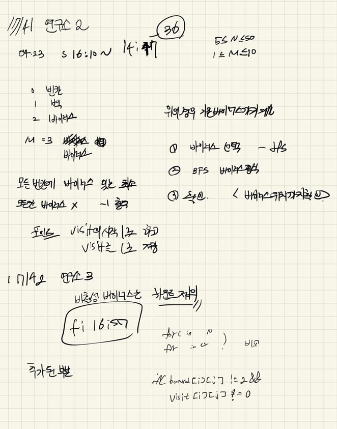

## 2022-04-23-17141-연구소2,17142연구소3

## 목차

> 01.[공통] dfs - 바이러스 선택
>
> 02.[공통] bfs - 바이러스 확산
>
> 03.바이러스 확산 속도에 대한 차이
>
> > 03.1 17141 연구소2 
> >
> > 03.2 17142 연구소3
> >
> > 03.3 차이 
>
> 04.전체소스



## 01.[공통] dfs - 바이러스 선택

```c++
void dfs(int idx, int cnt) {
	if (idx > virus.size())return;
	if (cnt == M) {
		BFS();
		return;
	}
	D.push_back(idx);
	dfs(idx+1, cnt + 1);
	D.pop_back();
	dfs(idx + 1, cnt);
}
```

## 02. [공통] bfs - 바이러스 확산

```c++
queue<Data>q;
int visit[NS][NS] = { 0, };
for (int i = 0; i < M; i++) {
    q.push(virus[D[i]]);
    visit[virus[D[i]].y][virus[D[i]].x] = 1;
}
while (!q.empty()) {
    Data c = q.front(); q.pop();
    for (int dir = 0; dir < 4; dir++) {
        Data n;
        n.y = c.y + dy[dir];
        n.x = c.x + dx[dir];
        n.count = c.count + 1;
        if (safeZone(n.y, n.x) && visit[n.y][n.x] == 0 && board[n.y][n.x] !=1) {
            visit[n.y][n.x] = n.count;
            q.push(n);
        }
    }
}
```

## 03.바이러스 확산 속도에 대한 차이

### 03.1 17141 연구소2 

```c++
int maxNumber = 0x80000000;
for (int i = 0; i < N; i++) {//17141
    for (int j = 0; j < N; j++) {
        if (board[i][j] == 0 && visit[i][j] == 0)return;
        maxNumber = maxNumber < visit[i][j] ? visit[i][j] : maxNumber;
    }
}
```

### 03.2 17142 연구소3

```c++
int maxNumber = 0x80000000;
for (int i = 0; i < N; i++) {//17142
    for (int j = 0; j < N; j++) {
        if (board[i][j] == 0 && visit[i][j] == 0)return;
        if(board[i][j]!=2&&visit[i][j]!=0)maxNumber = maxNumber < visit[i][j] ? visit[i][j] : maxNumber;
    }
}
```

### 03.3 차이 

- `maxNumber = maxNumber < visit[i][j] ? visit[i][j] : maxNumber;`
- `if(board[i][j]!=2&&visit[i][j]!=0)maxNumber = maxNumber < visit[i][j] ? visit[i][j] : maxNumber;`
  - 연구소 3의 경우 바이러스의 위치의 카운터는 세면 안되고 방문한곳이어야함 그말은 방문한곳이 있을수 있으니 포함되어야하는것 
  - 그렇게 하지 않으면 -1이 나오게된다.

## 04.전체소스

```c++
#include<stdio.h>
#include<iostream>
#include<vector>
#include<string.h>
#include<queue>
#define NS 54
using namespace std;
int N, M, ret;
int board[NS][NS];
int dy[] = { 0,1,0,-1 };
int dx[] = { 1,0,-1,0 };
struct Data {
	int y, x, count;
};
bool safeZone(int y, int x) {
	return 0 <= y && y < N && 0 <= x && x < N;
}
vector<Data>virus;
vector<int>D;

void BFS() {
	queue<Data>q;
	int visit[NS][NS] = { 0, };
	for (int i = 0; i < M; i++) {
		q.push(virus[D[i]]);
		visit[virus[D[i]].y][virus[D[i]].x] = 1;
	}
	while (!q.empty()) {
		Data c = q.front(); q.pop();
		for (int dir = 0; dir < 4; dir++) {
			Data n;
			n.y = c.y + dy[dir];
			n.x = c.x + dx[dir];
			n.count = c.count + 1;
			if (safeZone(n.y, n.x) && visit[n.y][n.x] == 0 && board[n.y][n.x] !=1) {
				visit[n.y][n.x] = n.count;
				q.push(n);
			}
		}
	}
	int maxNumber = 0x80000000;
	//for (int i = 0; i < N; i++) {//17141
	//	for (int j = 0; j < N; j++) {
	//		if (board[i][j] == 0 && visit[i][j] == 0)return;
	//		maxNumber = maxNumber < visit[i][j] ? visit[i][j] : maxNumber;
	//	}
	//}
	for (int i = 0; i < N; i++) {//17142
		for (int j = 0; j < N; j++) {
			if (board[i][j] == 0 && visit[i][j] == 0)return;
			if(board[i][j]!=2&&visit[i][j]!=0)maxNumber = maxNumber < visit[i][j] ? visit[i][j] : maxNumber;
		}
	}
	ret = ret > maxNumber ? maxNumber : ret;
}
void dfs(int idx, int cnt) {
	if (idx > virus.size())return;
	if (cnt == M) {
		BFS();
		return;
	}
	D.push_back(idx);
	dfs(idx+1, cnt + 1);
	D.pop_back();
	dfs(idx + 1, cnt);
}
void init() {
	ret = 0x7fffffff;
	scanf("%d %d", &N, &M);
	for (int i = 0; i < N; i++) {
		for (int j = 0; j < N; j++) {
			scanf("%d", &board[i][j]);
			if (board[i][j] == 2) {
				virus.push_back({ i,j,1 });
			}
		}
	}
}
int main(void)
{
	init();
	dfs(0, 0);
	if (ret == 0x80000000)ret = 1;
	printf("%d\n", ret==0x7fffffff?-1:ret-1);
	return 0;
}
```

- 이런 bfs할때 무조건 출발 부분도 방문체크를 해서 진행하기 무조건 그리고나서 나중에 -1을 빼더라도 그것이 더 정확함

