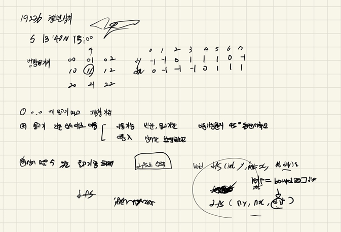

## 2022-04-24-19236-청소년-상어

## 목차

> 01.물고기 이동
>
> 02.상어이동
>
> 03.상어 물고기 먹기
>
> 04.전체소스



## 01.물고기 이동

```c++
void fishMove(int y, int x) {
	for (int i = 1; i <= 16; i++) {
		if (fish[i].y == -1) continue;
		Data c = fish[i];
		Data n = c; n.dir = c.dir;
		n.y = c.y + dy[c.dir]; n.x = c.x + dx[c.dir];
		while (!safeZone(n.y, n.x) || (y == n.y&&x == n.x)) {
			n.dir++;
			if (n.dir == 8)n.dir = 0;
			n.y = c.y + dy[n.dir]; n.x = c.x + dx[n.dir];
		}
		if (board[n.y][n.x] != -1) {
			int t = board[n.y][n.x];
			fish[t].y = c.y; fish[t].x = c.x; //fish[t].dir = c.dir;
			fish[i].y = n.y; fish[i].x = n.x; fish[i].dir = n.dir;
			board[c.y][c.x] = t;
			board[n.y][n.x] = i;
		}
		else {
			fish[i].y = n.y; fish[i].x = n.x; fish[i].dir = n.dir;
			board[c.y][c.x] = -1;
			board[n.y][n.x] = i;
		}
	}
}
```

## 02.상어이동

```c++
void dfs(int y, int x, int sum) {
	int dir = fish[board[y][x]].dir;
	sum += eat(y, x);
	ret = max(ret, sum);
	fishMove(y, x);

	for (int cnt = 1; cnt <= 3; cnt++) {
		Data n;
		n.y = y + (dy[dir] * cnt); n.x = x + (dx[dir] * cnt);
		if (safeZone(n.y, n.x) && board[n.y][n.x] != -1) {
			int copyBoard[NS][NS] = { 0, };
			Data copyFish[FISHES_SIZE] = { 0, };
			copyB(copyBoard, board);
			copyF(copyFish, fish);
			dfs(n.y, n.x, sum);
			copyB(board,copyBoard);
			copyF(fish,copyFish);
		}
	}
}
```

## 03.상어 물고기 먹기

```c++
int eat(int y, int x) {
	int eatFish = board[y][x];
	fish[board[y][x]].dir = -1;
	fish[board[y][x]].x = -1;
	fish[board[y][x]].y = -1;
	board[y][x] = -1;
	return eatFish;
}
```

## 04.전체소스

```c++
#include<stdio.h>
#include<iostream>
#include<vector>
#include<string.h>
#include<algorithm>
# define NS 4
# define FISHES_SIZE 17
using namespace std;
struct Data {
	int y, x,dir;
};
int dy[] = { -1,-1,0,1,1,1,0,-1 };
int dx[] = { 0,-1,-1,-1,0,1,1,1 };
int ret;
int board[NS][NS];
Data fish[FISHES_SIZE];
bool safeZone(int y, int x)
{
	return 0 <= y && y < 4 && 0 <= x && x < 4;
}
int eat(int y, int x) {
	int eatFish = board[y][x];
	fish[board[y][x]].dir = -1;
	fish[board[y][x]].x = -1;
	fish[board[y][x]].y = -1;
	board[y][x] = -1;
	return eatFish;
}
void fishMove(int y, int x) {
	for (int i = 1; i <= 16; i++) {
		if (fish[i].y == -1) continue;
		Data c = fish[i];
		Data n = c; n.dir = c.dir;
		n.y = c.y + dy[c.dir]; n.x = c.x + dx[c.dir];
		while (!safeZone(n.y, n.x) || (y == n.y&&x == n.x)) {
			n.dir++;
			if (n.dir == 8)n.dir = 0;
			n.y = c.y + dy[n.dir]; n.x = c.x + dx[n.dir];
		}
		if (board[n.y][n.x] != -1) {
			int t = board[n.y][n.x];
			fish[t].y = c.y; fish[t].x = c.x; //fish[t].dir = c.dir;
			fish[i].y = n.y; fish[i].x = n.x; fish[i].dir = n.dir;
			board[c.y][c.x] = t;
			board[n.y][n.x] = i;
		}
		else {
			fish[i].y = n.y; fish[i].x = n.x; fish[i].dir = n.dir;
			board[c.y][c.x] = -1;
			board[n.y][n.x] = i;
		}
	}
}
void copyB(int a[NS][NS], int b[NS][NS]) {
	for (int i = 0; i < 4; i++) {
		for (int j = 0; j < 4; j++) {
			a[i][j] = b[i][j];
		}
	}
}
void copyF(Data a[FISHES_SIZE], Data b[FISHES_SIZE]) {
	for (int i = 1; i <= 16; i++) {
		a[i] = b[i];
	}
}
void dfs(int y, int x, int sum) {
	int dir = fish[board[y][x]].dir;
	sum += eat(y, x);
	ret = max(ret, sum);
	fishMove(y, x);

	for (int cnt = 1; cnt <= 3; cnt++) {
		Data n;
		n.y = y + (dy[dir] * cnt); n.x = x + (dx[dir] * cnt);
		if (safeZone(n.y, n.x) && board[n.y][n.x] != -1) {
			int copyBoard[NS][NS] = { 0, };
			Data copyFish[FISHES_SIZE] = { 0, };
			copyB(copyBoard, board);
			copyF(copyFish, fish);
			dfs(n.y, n.x, sum);
			copyB(board,copyBoard);
			copyF(fish,copyFish);
		}
	}
}
void init()
{
	int a, b;
	int ret = 0x80000000;
	memset(board, 0, sizeof(board));
	memset(fish, 0, sizeof(fish));
	for (int i = 0; i < 4; i++) {
		for (int j = 0; j < 4; j++) {
			scanf("%d %d",&a,&b);
			board[i][j] = a;
			fish[a].y = i;
			fish[a].x = j;
			fish[a].dir = b - 1;
		}
	}
}

int main(void)
{
	init();
	dfs(0, 0, 0);
	printf("%d\n", ret);
	return 0;
}
```


