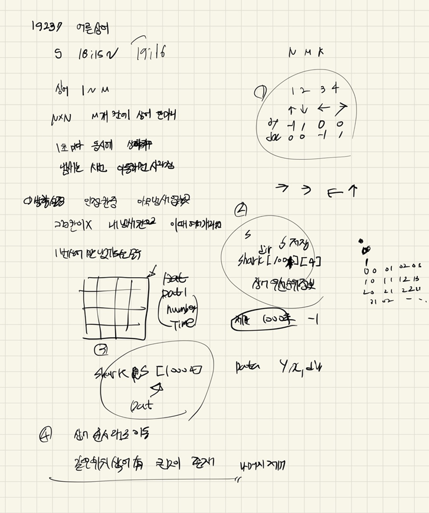

## 2022-04-24-19237-어른상어

## 목차

> 01.상어 이동
>
> 02.냄새제거
>
> 03.상어같은 위치 제거
>
> 04.전체소스



## 01.상어 이동

```c++
void sharkMove(int number,Data c) {
	int flag = 0;
	int d = c.dir-1;
	for (int dir = 0; dir < 4; dir++) {
		Data n;
		n.dir = sharkDir[number][d][dir] - 1;
		n.y = c.y + dy[n.dir];
		n.x = c.x + dx[n.dir];

		if (0 <= n.y&&n.y < N && 0 <= n.x&&n.x < N) {

			if (boardInfo[n.y][n.x].number == 0) {//아무냄새 없는 칸
				board[c.y][c.x] = 0;
				board[n.y][n.x] = number;
				boardInfo[c.y][c.x].number = number;
				boardInfo[c.y][c.x].time = K;
				shark[number] = n;
				shark[number].dir++;
				flag = 1;
				break;
			}
		}//if
	}//for
	if (flag == 0) {//방향 다 냄새 있는 곳중 선택 후 이동
		d = c.dir - 1;
		for (int dir = 0; dir < 4; dir++) {
			Data n;
			n.dir = sharkDir[number][d][dir] - 1;
			n.y = c.y + dy[n.dir];  n.x = c.x + dx[n.dir];
			if (0 <= n.y&&n.y < N && 0 <= n.x&&n.x < N &&boardInfo[n.y][n.x].number == number) {
				board[c.y][c.x] = 0;
				board[n.y][n.x] = number;
				boardInfo[c.y][c.x].number = number;
				boardInfo[c.y][c.x].time = K;;
				shark[number] = n;
				shark[number].dir++;
				break;
			}
		}
	}
}
```

##  02.냄새 제거

```c++
void smellRemove() {
	for (int i = 0; i < N; i++) {
		for (int j = 0; j < N; j++) {
			if (boardInfo[i][j].time != 0)
			{
				boardInfo[i][j].time--;
				if (boardInfo[i][j].time == 0)boardInfo[i][j].number = 0;
			}
		}
	}
}
```

## 03.상어같은 위치 제거

```c++
void sharkEat() {
	for (int i = 1; i <= M - 1; i++) {
		for (int j = i + 1; j <= M; j++) {
			if (shark[j].dir != -1 && shark[i].y == shark[j].y&&shark[i].x == shark[j].x) {
				board[shark[j].y][shark[j].x] = 0;
				shark[j] = { -1,-1,-1,-1 };
			}
		}
	}
	for (int i = 1; i <= M; i++) {
		if (boardInfo[shark[i].y][shark[i].x].time != -1) {
			boardInfo[shark[i].y][shark[i].x].time = M;
			boardInfo[shark[i].y][shark[i].x].number = i;
		}
	}
}
```

## 04.전체소스

```c++
#include<iostream>
#include<vector>
#include<string.h>
#include<stdio.h>
#include<algorithm>
#define NS 24
using namespace std;
int N, M, K;
int dy[] = { -1,1,0,0 };
int dx[] = { 0,0,-1,1 };
struct Data {
	int y, x, dir, k;
};
struct Data1 {
	int number, time;
}boardInfo[NS][NS];
int board[NS][NS];
Data shark[1004];
int sharkDir[1004][5][5];
void init() {
	scanf("%d %d %d", &N, &M, &K);
	for (int i = 0; i < N; i++) {
		for (int j = 0; j < N; j++) {
			scanf("%d", &boardInfo[i][j].number);
			if (boardInfo[i][j].number != 0) {
				shark[boardInfo[i][j].number].y = i;
				shark[boardInfo[i][j].number].x = j;
				shark[boardInfo[i][j].number].k = K;
				board[i][j] = boardInfo[i][j].number;
				board[i][j] = 0;

			}
		}
	}
	for (int i = 0; i < M; i++) {
		int dir;
		scanf("%d", &dir);
		shark[i + 1].dir = dir;
	}
	for (int i = 0; i < M; i++) {
		for (int j = 0; j < 4; j++) {
			scanf("%d %d %d %d", &sharkDir[i + 1][j][0], &sharkDir[i + 1][j][1], &sharkDir[i + 1][j][2], &sharkDir[i + 1][j][3]);
		}
	}
}

void sharkMove(int number,Data c) {
	int flag = 0;
	int d = c.dir-1;
	for (int dir = 0; dir < 4; dir++) {
		Data n;
		n.dir = sharkDir[number][d][dir] - 1;
		n.y = c.y + dy[n.dir];
		n.x = c.x + dx[n.dir];

		if (0 <= n.y&&n.y < N && 0 <= n.x&&n.x < N) {

			if (boardInfo[n.y][n.x].number == 0) {//아무냄새 없는 칸
				board[c.y][c.x] = 0;
				board[n.y][n.x] = number;
				boardInfo[c.y][c.x].number = number;
				boardInfo[c.y][c.x].time = K;
				shark[number] = n;
				shark[number].dir++;
				flag = 1;
				break;
			}
		}//if
	}//for
	if (flag == 0) {//방향 다 냄새 있는 곳중 선택 후 이동
		d = c.dir - 1;
		for (int dir = 0; dir < 4; dir++) {
			Data n;
			n.dir = sharkDir[number][d][dir] - 1;
			n.y = c.y + dy[n.dir];  n.x = c.x + dx[n.dir];
			if (0 <= n.y&&n.y < N && 0 <= n.x&&n.x < N &&boardInfo[n.y][n.x].number == number) {
				board[c.y][c.x] = 0;
				board[n.y][n.x] = number;
				boardInfo[c.y][c.x].number = number;
				boardInfo[c.y][c.x].time = K;;
				shark[number] = n;
				shark[number].dir++;
				break;
			}
		}
	}
}
void smellRemove() {
	for (int i = 0; i < N; i++) {
		for (int j = 0; j < N; j++) {
			if (boardInfo[i][j].time != 0)
			{
				boardInfo[i][j].time--;
				if (boardInfo[i][j].time == 0)boardInfo[i][j].number = 0;
			}
		}
	}
}
void sharkEat() {
	for (int i = 1; i <= M - 1; i++) {
		for (int j = i + 1; j <= M; j++) {
			if (shark[j].dir != -1 && shark[i].y == shark[j].y&&shark[i].x == shark[j].x) {
				board[shark[j].y][shark[j].x] = 0;
				shark[j] = { -1,-1,-1,-1 };
			}
		}
	}
	for (int i = 1; i <= M; i++) {
		if (boardInfo[shark[i].y][shark[i].x].time != -1) {
			boardInfo[shark[i].y][shark[i].x].time = M;
			boardInfo[shark[i].y][shark[i].x].number = i;
		}
	}
}
void play() {
	int time = 0;
	while (time != 1001) {
		if (time != 0) {//향수 깍기
			smellRemove();
		}
		int count = 0;
		for (int num = 1; num <= M; num++) {
			if (shark[num].y == -1) continue;
			sharkMove(num,shark[num]);
			count++;
		}
		if (count == 1) break;//탈출

		sharkEat();//상어끼리 잡아먹기

		time++;
	}
	if (time == 1001) printf("%d\n", -1);
	else printf("%d\n", time);
}
int main(void)
{
	init();
	play();
	return 0;
}
```

