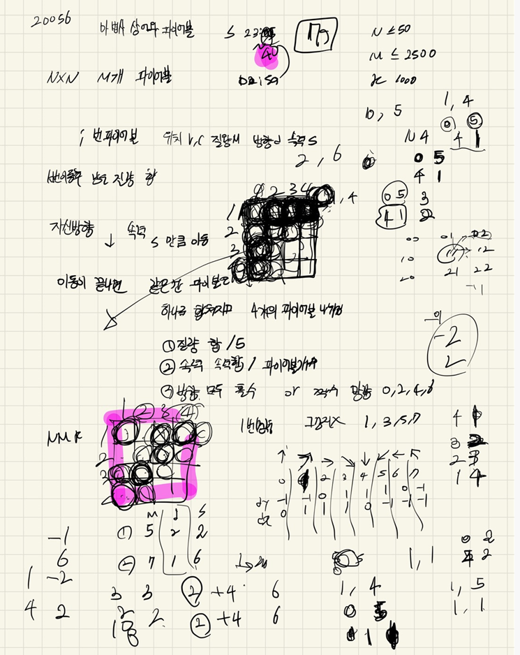

## 2022-04-25-20056-마법사와파이어볼

## 목차

> 01.방향이동
>
> 02.전부 짝수 이거나 전부 홀수 인 경우
>
> 03.전체소스



## 01.방향이동

- 가장 중요

  - before

    ```c++
    for (int f = 0; f < fireBall.size(); f++) {
        Data c = fireBall[f];
        Data n = c;
        for (int s = 0; s < fireBall[f].s; s++) {
            n.y = c.y + dy[c.d];
            n.x = c.x + dx[c.d];
    
            if (n.y == -1)n.y = N - 1;
            else if (n.y == N)n.y = 0;
            if (n.x == -1) n.x = N - 1;
            else if (n.x == N) n.x = 0;
            c.y = n.y;
            c.x = n.x;
        }
        fireBall[f] = n;//다시 재저장
    }
    ```

  - after

    ```c++
    for (int i = 0; i < fireBall.size(); i++) {//파이어볼 이동
        Data c = fireBall[i];
        Data n = c;
        n.y = (c.y + (dy[c.d] * c.s%N) + N) % N;
        n.x = (c.x + (dx[c.d] * c.s%N) + N) % N;
        fireBall[i] = n;
    }
    ```

## 02.전부 짝수 이거나 전부 홀수 인경우

```c++
bool even=true, odd =true;
if (fireBall[fireBalls[i][j][f]].d % 2 == 0) {
    even = false;
}
else {
    odd = false;
}
if (even||odd ) {//0 2 4 6 
    ...
}
else{
}
```

## 03.전체소스

```c++
#include<iostream>
#include<stdio.h>
#include<vector>
using namespace std;
#define NS 54
struct Data {
	int y, x, m, s, d;
};
int N, M, K, ret;
int dy[] = { -1,-1,0,1,1,1,0,-1 };
int dx[] = { 0,1,1,1,0,-1,-1,-1,-1 };
vector<Data>fireBall;

void init() {
	scanf("%d %d %d", &N, &M, &K);
	for (int i = 0; i < M; i++) {
		Data c;
		scanf("%d %d %d %d %d", &c.y, &c.x, &c.m, &c.s, &c.d);
		c.y--;
		c.x--;
		fireBall.push_back(c);
	}
}
void fireBallMove() {
	while (K--) {
		for (int i = 0; i < fireBall.size(); i++) {//파이어볼 이동
			Data c = fireBall[i];
			Data n = c;
			n.y = (c.y + (dy[c.d] * c.s%N) + N) % N;
			n.x = (c.x + (dx[c.d] * c.s%N) + N) % N;
			fireBall[i] = n;
		}
		vector<int>fireBalls[NS][NS];
		for (int f = 0; f < fireBall.size(); f++) {
			Data c = fireBall[f];
			fireBalls[c.y][c.x].push_back(f);
		}

		vector<Data>savefireBalls;
		for (int i = 0; i < N; i++) {
			for (int j = 0; j < N; j++) {
				if (fireBalls[i][j].size() == 0)continue;
				int index = fireBalls[i][j][0];
				if (fireBalls[i][j].size() == 1) savefireBalls.push_back(fireBall[index]);
				if (fireBalls[i][j].size() >= 2) {
					int sum_m = 0, sum_s = 0;
					bool odd = true,
						even = true;				
					for (int f = 0; f < fireBalls[i][j].size(); f++) {
						sum_m += fireBall[fireBalls[i][j][f]].m;
						sum_s+= fireBall[fireBalls[i][j][f]].s;
						if (fireBall[fireBalls[i][j][f]].d % 2 == 0) {
							odd = false;
						}
						else {
							even = false;
						}
					}
					sum_m  = sum_m / 5;
					sum_s = sum_s / fireBalls[i][j].size();
					if (sum_m == 0) continue;
					if (even||odd ) {//0 2 4 6 
						for (int dir = 0; dir <= 6; dir += 2) {
							savefireBalls.push_back({ i,j,sum_m,sum_s,dir });
						}
					}
					else {// 1 3 5 7
						for (int dir = 1; dir <= 7; dir += 2) {
							savefireBalls.push_back({ i,j,sum_m,sum_s,dir });
						}
					}

				}
			}//for j
		}//for i

		fireBall.clear();
		for (int f = 0; f < savefireBalls.size(); f++) {
			fireBall.push_back(savefireBalls[f]);
		}
	}

	for (int f = 0; f < fireBall.size(); f++) {
		ret += fireBall[f].m;
	}
}
int main(void) {
	init();
	fireBallMove();
	printf("%d\n", ret);
}
```