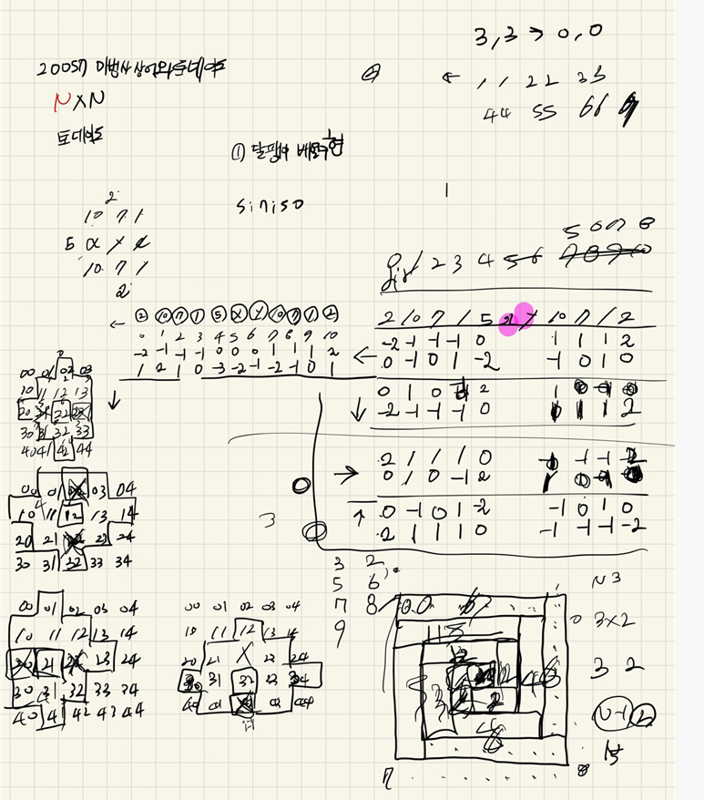
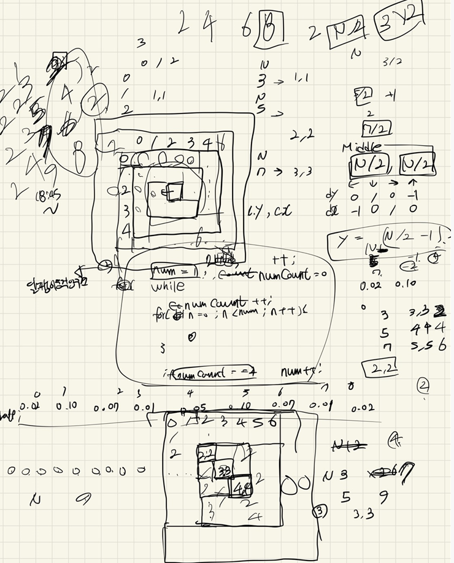

## 2022-04-25-20057-마법사상어와토네이도

## 목차

> 01.달팽이 배열 움직임
>
> 02.벗어나는 지역 체크 후 계산
>
> 03.방향
>
> 04.전체소스





## 01.달팽이 배열 움직임

```c++
while (1) {
    if (y == 2 && x == 2)break;
    if (N - 1 == num) cnt = 3;
    for (int c = 0; c < cnt; c++) {
        for (int n = 0; n < num; n++) {
            int ny = y + dy[dir];
            int nx = x + dx[dir];
            int sum = 0;

            for (int i = 0; i < 9; i++) {
                int nny = ny + dy_rate[dir][i];
                int nnx = nx + dx_rate[dir][i];
                int sand = board[ny][nx] * rate[i];
                board[nny][nnx] += sand;
                sum += sand;
            }
            board[ny][nx] -= sum;
            board[ny + dy[dir]][nx + dx[dir]] += board[ny][nx];
            board[ny][nx] = 0;
            y = ny;
            x = nx;
        }
        dir++;
        if (dir == 4) dir = 0;
    }
    num++;
}
```

- 움직이는 것이 1 1, 2,2, 3,3,4,4,4
  - 마지막만 3번 움직이게 하면됨

## 02.벗어나는 지역 체크 후 계산

```c++
for (int i = 0; i <= N + 3; i++) {
    for (int j = 0; j <= N + 3; j++) {
        if (1 != safeBoard[i][j]) {
            ret += board[i][j];
        }
    }
}
```

- 입력을 받을때 미리 1로 다른 배열에 체크 해놓고
- 전체를 검사를 하면서 1이 아닌곳에 값을 더하면 답을 얻을 수 있음

## 03.방향

```c++
int dy[] = { 0,1,0,-1 };
int dx[] = { -1,0,1,0 };
int dy_rate[4][9] = {
	{-2,-1,-1,-1,0,1,1,1,2},
	{0,1,0,-1,2,1,0,-1,0},
	{2,1,1,1,0,-1,-1,-1,-2},
	{0,-1,0,1,-2,-1,0,1,0}
};
int dx_rate[4][9] = {
	{0,-1,0,1,-2,-1,0,1,0},
	{-2,-1,-1,-1,0,1,1,1,2},
	{0,1,0,-1,2,1,0,-1,0},
	{2,1,1,1,0,-1,-1,-1,-2}
};
double rate[9] = { 0.02,0.10,0.07,0.01,0.05,0.10,0.07,0.01,0.02 };
```

- 방향에 대한 것 
  - 어느 순간 이렇게 여러 방향에 대해서도 전체 탐색을 고려하게 문제가 출제됨

## 04.전체소스

```c++
#include<stdio.h>
#include<iostream>
#include<vector>
#define NS 1004
using namespace std;
int dy[] = { 0,1,0,-1 };
int dx[] = { -1,0,1,0 };
int dy_rate[4][9] = {
	{-2,-1,-1,-1,0,1,1,1,2},
	{0,1,0,-1,2,1,0,-1,0},
	{2,1,1,1,0,-1,-1,-1,-2},
	{0,-1,0,1,-2,-1,0,1,0}
};
int dx_rate[4][9] = {
	{0,-1,0,1,-2,-1,0,1,0},
	{-2,-1,-1,-1,0,1,1,1,2},
	{0,1,0,-1,2,1,0,-1,0},
	{2,1,1,1,0,-1,-1,-1,-2}
};
double rate[9] = { 0.02,0.10,0.07,0.01,0.05,0.10,0.07,0.01,0.02 };
int ret;
int board[NS][NS];
int safeBoard[NS][NS];
int N = 5;
void init() {
	scanf("%d", &N);
	for (int i = 2; i < N+2; i++) {
		for (int j = 2; j < N+2; j++) {
			scanf("%d", &board[i][j]);
			safeBoard[i][j] = 1;
		}
	}
}
bool safeZone(int y, int x) {
	return 0 <= y && y < N && 0 <= x && x < N;
}
void snailArr() {
	int y = N - ((N / 2) - 1);
	int x = N - ((N / 2) - 1);
	int dir = 0;
	int cnt = 2;
	int num = 1;

	while (1) {
		if (y == 2 && x == 2)break;
		if (N - 1 == num) cnt = 3;
		for (int c = 0; c < cnt; c++) {
			for (int n = 0; n < num; n++) {
				int ny = y + dy[dir];
				int nx = x + dx[dir];
				int sum = 0;

				for (int i = 0; i < 9; i++) {
					int nny = ny + dy_rate[dir][i];
					int nnx = nx + dx_rate[dir][i];
					int sand = board[ny][nx] * rate[i];
					board[nny][nnx] += sand;
					sum += sand;
				}
				board[ny][nx] -= sum;
				board[ny + dy[dir]][nx + dx[dir]] += board[ny][nx];
				board[ny][nx] = 0;
				y = ny;
				x = nx;
			}
			dir++;
			if (dir == 4) dir = 0;
		}
		num++;
	}

	for (int i = 0; i <= N + 3; i++) {
		for (int j = 0; j <= N + 3; j++) {
			if (1 != safeBoard[i][j]) {
				ret += board[i][j];
				//printf("%2d ", board[i][j]);
			}
			//sum += board[i][j];
			//else printf("%2d",0);
		}
		//printf("\n");
	}

}
int main() {
	init();
	snailArr();
	printf("%d\n", ret);
	return 0;
}
```

