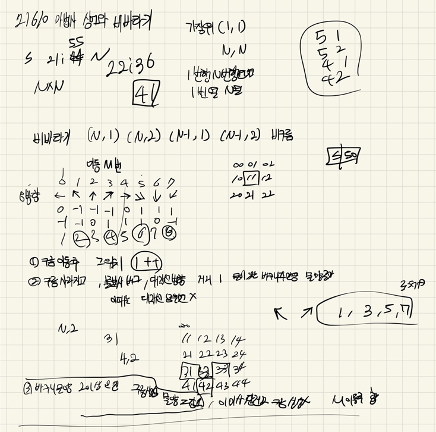

## 2022-04-25-21610-마법사상어와비바라기

## 목차

> 01.구름이동
>
> 02.구름 위치에 비 1씩 증가
>
> 03.대각선 영역에 물 증가
>
> 04.물2이상인 곳에 구름생성
>
> 05.전체소스



## 01.구름이동

```c++
int dir, S;
scanf("%d %d", &dir, &S);
S = S % N;
for (int c = 0; c < cloud.size(); c++) {// 구름이동
    for (int s = 0; s < S; s++) {
        Data n;
        n.y = cloud[c].y + dy[dir];
        n.x = cloud[c].x + dx[dir];
        if (n.y == 0) n.y = N;
        else if (n.y == N + 1)n.y = 1;
        if (n.x == 0) n.x = N;
        else if (n.x == N + 1)n.x = 1;
        cloud[c].y = n.y;
        cloud[c].x = n.x;
    }
}
```

## 02.구름 위치에 비1씩 증가

```c++
int visit[NS][NS] = { 0 };// 사라지는 구름 체크
for (int c = 0; c < cloud.size(); c++) {//비 1씩 증가 후 구름 삭제
    Data n = cloud[c];
    board[n.y][n.x]++;
    visit[n.y][n.x] = 1;
}
```

## 03.대각선 영역에 물 증가

```c++
for (int c = 0; c < cloud.size(); c++) {//대각선 확인후 물 증가 시키기
    Data n = cloud[c];
    int cnt = 0;
    for (int cdir = 2; cdir <= 8; cdir += 2) {
        Data nn;
        nn.y = n.y + dy[cdir];
        nn.x = n.x + dx[cdir];
        if (safeZone(nn.y, nn.x)&&board[nn.y][nn.x]!=0) {
            cnt++;
        }
    }
    board[n.y][n.x] += cnt;// 대각선 물있는것 만큼 증가 시키기
}
```

## 04.물2이상인 곳에 구름생성

```c++
for (int i = 1; i <= N; i++) {
    for (int j = 1; j <= N; j++) {
        if (board[i][j] >= 2 && visit[i][j] == 0) {
            cloud.push_back({ i,j });
            board[i][j] -= 2;
        }
    }
}
```

## 05.전체소스

```c++
#include<stdio.h>
#include<iostream>
#include<vector>
#include<string.h>
#define NS 54
using namespace std;
int N, M;
int ret;
int board[NS][NS];
//int cloud[NS][NS];
int dy[] = {0,0,-1,-1,-1,0,1,1,1 };
int dx[] = {0, -1,-1,0,1,1,1,0,-1 };
struct Data {
    int y, x;
};
bool safeZone(int y, int x) {
    return 1 <= y && y <= N && 1 <= x && x <= N;
}
void init() {
    scanf("%d %d", &N, &M);
    for (int i = 1; i <= N; i++) {
        for (int j = 1; j <= N; j++) {
            scanf("%d", &board[i][j]);
        }
    }
}
void play() {
    vector<Data>cloud;
    cloud.push_back({ N,1 });
    cloud.push_back({ N,2 });
    cloud.push_back({ N - 1,1 });
    cloud.push_back({ N - 1,2 });
    //cloud[N][1] =
    //cloud[N][2] = 
    //cloud[N - 1][1]=
    //cloud[N - 1][2] = 1;
    while (M--) {
        int dir, S;
        scanf("%d %d", &dir, &S);
        S = S % N;
        for (int c = 0; c < cloud.size(); c++) {// 구름이동
            for (int s = 0; s < S; s++) {
                Data n;
                n.y = cloud[c].y + dy[dir];
                n.x = cloud[c].x + dx[dir];
                if (n.y == 0) n.y = N;
                else if (n.y == N + 1)n.y = 1;
                if (n.x == 0) n.x = N;
                else if (n.x == N + 1)n.x = 1;
                cloud[c].y = n.y;
                cloud[c].x = n.x;
            }
        }

        int visit[NS][NS] = { 0 };// 사라지는 구름 체크
        for (int c = 0; c < cloud.size(); c++) {//비 1씩 증가 후 구름 삭제
            Data n = cloud[c];
            board[n.y][n.x]++;
            visit[n.y][n.x] = 1;
        }

        for (int c = 0; c < cloud.size(); c++) {//대각선 확인후 물 증가 시키기
            Data n = cloud[c];
            int cnt = 0;
            for (int cdir = 2; cdir <= 8; cdir += 2) {
                Data nn;
                nn.y = n.y + dy[cdir];
                nn.x = n.x + dx[cdir];
                if (safeZone(nn.y, nn.x)&&board[nn.y][nn.x]!=0) {
                    cnt++;
                }
            }
            board[n.y][n.x] += cnt;// 대각선 물있는것 만큼 증가 시키기
        }
        cloud.clear();

        for (int i = 1; i <= N; i++) {
            for (int j = 1; j <= N; j++) {
                if (board[i][j] >= 2 && visit[i][j] == 0) {
                    cloud.push_back({ i,j });
                    board[i][j] -= 2;
                }
            }
        }
    }

    for (int i = 1; i <= N; i++) {// 남은 물의 양 저장
        for (int j = 1; j <= N; j++) {
            ret += board[i][j];
        }
    }
}
int main(void) {
    init();
    play();
    printf("%d\n", ret);
    return 0;
}
```

