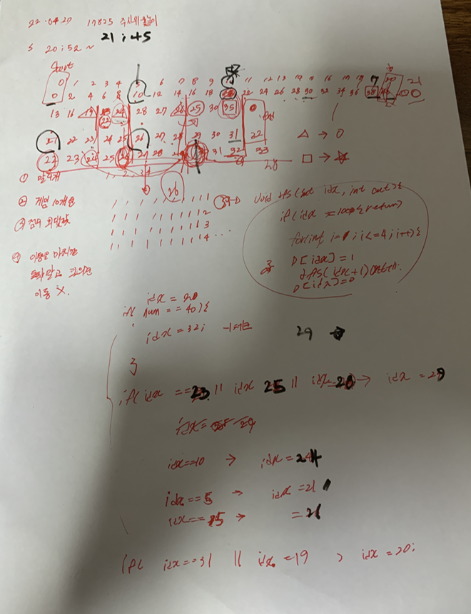

## 2022-04-27-17825-주사위윷놀이

## 목차

>  01.말의 순서 뽑기
>
>  02.말의 이동
>
>  03.전체소스



## 01.말의 순서 뽑기

```c++
void dfs(int idx)
{
    if (idx == 10) {
        int num = play();
        if (num == 0) return;
        ret = ret < num ? num : ret;
        return;
    }
    for (int i = 1; i <= 4; i++ ) {
        D[idx] = i;
        dfs(idx + 1);
        D[idx] = 0;
    }
}
```

## 02.말의 이동

```c++
int play() {
	Data horse[5] = { 0, };
	int sum = 0;
	for (int i = 0; i < 10; i++) {
		int num = D[i];
		for (int j = 0; j < cube[i]; j++) {
			if (horse[num].pidx == -1)continue;
			if (horse[num].pidx != 0) {//특수칸으로 이동
				horse[num].idx = horse[num].pidx;
				horse[num].pidx = 0;
			}
			else if (horse[num].pidx != -1) {
				horse[num].idx++;
			}

			if (horse[num].idx == 24 || horse[num].idx == 26) {//19->25  24->25
				horse[num].pidx = 30;
			}
			else if (horse[num].idx == 32)horse[num].pidx = 20;//35->40
			else if (horse[num].idx == 21)horse[num].pidx = -1;//40->도착
		}
		for (int j = 1; j <= 4; j++) {// 가는 위치에 말 있는 경우 전체 경우 리턴
			if (num == j) continue;
			if (horse[num].idx != 0 && horse[num].pidx != -1 && horse[num].idx == horse[j].idx) {
				return 0;
			}
		}

		if (horse[num].pidx != -1) sum += board[horse[num].idx];//점수 저장

		if (horse[num].idx == 5)horse[num].pidx = 22;//10->13
		else if (horse[num].idx == 10)horse[num].pidx = 25;//20->22
		else if (horse[num].idx == 15)horse[num].pidx = 27;//30->28


	}
	return sum;
}
```

## 03.전체소스

```c++
#include<stdio.h>
#include<iostream>
#include<vector>
#include<string.h>
#define NS 33
using namespace std;
int board[NS] = { 0,2,4,6,8,10,12,14,16,18,20,22,24,26,28,30,32,34,36,38,40,-1,13,16,19,22,24,28,27,26,25,30,35 };
int D[10];
int ret;
int cube[10];
struct Data {
    int pidx, idx;
};
void init() {
    ret = 0x80000000;
    for (int i = 0; i < 10; i++) {
        scanf("%d", &cube[i]);
    }
}
int play() {
    Data horse[5] = { 0, };
    int sum = 0;
    for (int i = 0; i < 10; i++) {
        int num = D[i];
        for (int j = 0; j < cube[i]; j++) {
            if (horse[num].pidx == -1)continue;
            if (horse[num].pidx != 0) {//특수칸으로 이동
                horse[num].idx = horse[num].pidx;
                horse[num].pidx = 0;
            }
            else if (horse[num].pidx != -1) {
                horse[num].idx++;
            }

            if (horse[num].idx == 24 || horse[num].idx == 26) {//19->25  24->25
                horse[num].pidx = 30;
            }
            else if (horse[num].idx == 32)horse[num].pidx = 20;//35->40
            else if (horse[num].idx == 21)horse[num].pidx = -1;//40->도착
        }
        for (int j = 1; j <= 4; j++) {// 가는 위치에 말 있는 경우 전체 경우 리턴
            if (num == j) continue;
            if (horse[num].idx != 0 && horse[num].pidx != -1 && horse[num].idx == horse[j].idx) {
                return 0;
            }
        }

        if (horse[num].pidx != -1) sum += board[horse[num].idx];//점수 저장

        if (horse[num].idx == 5)horse[num].pidx = 22;//10->13
        else if (horse[num].idx == 10)horse[num].pidx = 25;//20->22
        else if (horse[num].idx == 15)horse[num].pidx = 27;//30->28


    }
    return sum;
}
void dfs(int idx)
{
    if (idx == 10) {
        int num = play();
        if (num == 0) return;
        ret = ret < num ? num : ret;
        return;
    }
    for (int i = 1; i <= 4; i++ ) {
        D[idx] = i;
        dfs(idx + 1);
        D[idx] = 0;
    }
}
int main(void)
{
    init();
    dfs(0);
    printf("%d\n", ret);
    return 0;
}
```

