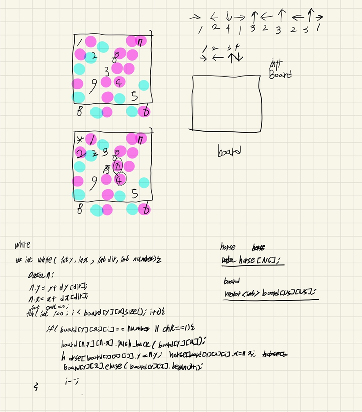
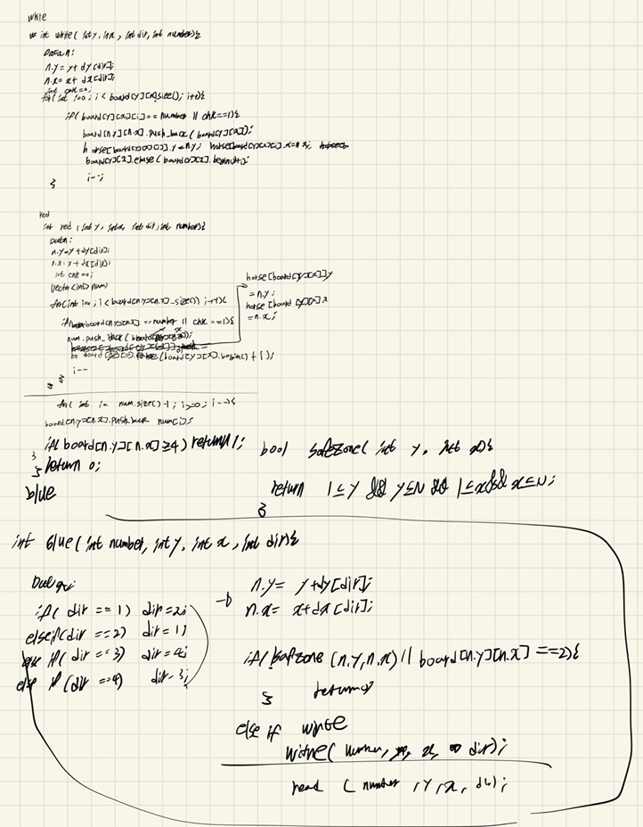

## 2022-04-27-17837-새로운게임2

## 목차

>  01.white이동
>
>  02.red이동
>
>  03.blue이동
>
>  04.4개 이상 말 체크
>
>  05.전체소스





## 01.white이동

```c++
int white(int number, int y, int x, int dir) {
    Data n;
    n.num = number;

    n.y = y + dy[dir];
    n.x = x + dx[dir];
    int chk = 0;
    for (int i = 0; i < board[y][x].size(); i++) {
        if (board[y][x][i] == number || chk) {
            chk = 1;
            board[n.y][n.x].push_back(board[y][x][i]);//변경
            horse[board[y][x][i]].y = n.y;
            horse[board[y][x][i]].x = n.x;
            board[y][x].erase(board[y][x].begin() + i); //삭제
            i--;
        }
    }
    if (board[n.y][n.x].size() >= 4)return 1;
    return 0;
}
```

## 02.red이동

```c++
int red(int number, int y, int x, int dir) {
    Data n;
    n.num = number;
    n.y = y + dy[dir];
    n.x = x + dx[dir];
    n.dir = dir;
    int chk = 0;
    vector<int>num;
    for (int i = 0; i < board[y][x].size(); i++) {
        if (board[y][x][i] == number || chk) {
            chk = 1;
            num.push_back(board[y][x][i]);//번호저장
            horse[board[y][x][i]].y = n.y;
            horse[board[y][x][i]].x = n.x;
            board[y][x].erase(board[y][x].begin() + i); //삭제
            i--;
        }
    }
    for (int i = num.size() - 1; i >= 0; i--) {
        board[n.y][n.x].push_back(num[i]);//변경
    }
    if (board[n.y][n.x].size() >= 4)return 1;
    return 0;
}
```

## 03.blue이동

```c++
int blue(int number, int y, int x, int dir) {
    Data n;
    n.num = number;
    if (1 == dir)dir = 2;
    else if (2 == dir)dir = 1;
    else if (3 == dir)dir = 4;
    else if (4 == dir) dir = 3;
    n.y = y + dy[dir];
    n.x = x + dx[dir];
    horse[number].dir = dir;//방향 변경
    if (!safeZone(n.y, n.x) || initBoard[n.y][n.x] == 2) {
        return 0;
    }
    else if (initBoard[n.y][n.x] == 1) {
        red(number, y, x, dir);
    }
    else if (initBoard[n.y][n.x] == 0) {
        white(number, y, x, dir);
    }
    return 0;
}
```

## 04.4개 이상 말 체크

```c++
int chk() {
	for (int i = 1; i <= N; i++) {
		for (int j = 1; j <= N; j++) {
			if (board[i][j].size() >= 4) {
				return 1;
			}
		}
	}
	return 0;
}
```

## 05.전체소스

```c++
#include<stdio.h>
#include<iostream>
#include<vector>
#define NS 14
using namespace std;
int N, K, ret;
int flag;
int dy[] = { 0,0,0,-1,1 };
int dx[] = { 0,1,-1,0,0 };
bool safeZone(int y, int x) {
    return 1 <= y && y <= N && 1 <= x && x <= N;
}
struct Data {
    int y, x, dir, num;
};
int initBoard[NS][NS];//색깔이 입력된 배열
vector<int>board[NS][NS];//말이 입력된 배열
Data horse[NS];//말의 위치가 저장된 배열

int white(int number, int y, int x, int dir) {
    Data n;
    n.num = number;

    n.y = y + dy[dir];
    n.x = x + dx[dir];
    int chk = 0;
    for (int i = 0; i < board[y][x].size(); i++) {
        if (board[y][x][i] == number || chk) {
            chk = 1;
            board[n.y][n.x].push_back(board[y][x][i]);//변경
            horse[board[y][x][i]].y = n.y;
            horse[board[y][x][i]].x = n.x;
            board[y][x].erase(board[y][x].begin() + i); //삭제
            i--;
        }
    }
    if (board[n.y][n.x].size() >= 4)return 1;
    return 0;
}
int red(int number, int y, int x, int dir) {
    Data n;
    n.num = number;
    n.y = y + dy[dir];
    n.x = x + dx[dir];
    n.dir = dir;
    int chk = 0;
    vector<int>num;
    for (int i = 0; i < board[y][x].size(); i++) {
        if (board[y][x][i] == number || chk) {
            chk = 1;
            num.push_back(board[y][x][i]);//번호저장
            horse[board[y][x][i]].y = n.y;
            horse[board[y][x][i]].x = n.x;
            board[y][x].erase(board[y][x].begin() + i); //삭제
            i--;
        }
    }
    for (int i = num.size() - 1; i >= 0; i--) {
        board[n.y][n.x].push_back(num[i]);//변경
    }
    if (board[n.y][n.x].size() >= 4)return 1;
    return 0;
}
int blue(int number, int y, int x, int dir) {
    Data n;
    n.num = number;
    if (1 == dir)dir = 2;
    else if (2 == dir)dir = 1;
    else if (3 == dir)dir = 4;
    else if (4 == dir) dir = 3;
    n.y = y + dy[dir];
    n.x = x + dx[dir];
    horse[number].dir = dir;//방향 변경
    if (!safeZone(n.y, n.x) || initBoard[n.y][n.x] == 2) {
        return 0;
    }
    else if (initBoard[n.y][n.x] == 1) {
        red(number, y, x, dir);
    }
    else if (initBoard[n.y][n.x] == 0) {
        white(number, y, x, dir);
    }
    return 0;
}

int chk() {
    for (int i = 1; i <= N; i++) {
        for (int j = 1; j <= N; j++) {
            if (board[i][j].size() >= 4) {
                return 1;
            }
        }
    }
    return 0;
}
void newGame() {
    for (int k = 1; k <= K; k++) {//말 정보 입력
        Data c;
        scanf("%d %d %d", &c.y, &c.x, &c.dir);
        horse[k] = c;
        board[c.y][c.x].push_back(k);
    }
    while (ret != 1001) {
        for (int k = 1; k <= K; k++) {
            Data c = horse[k];
            Data n = c;
            n.y = c.y + dy[c.dir]; n.x = c.x + dx[c.dir];
            if (!safeZone(n.y, n.x) || initBoard[n.y][n.x] == 2) {
                if (blue(k, horse[k].y, horse[k].x, horse[k].dir)) {
                    flag = 1;
                    break;
                }
            }
            else if (initBoard[n.y][n.x] == 0) {
                if(white(k,horse[k].y,horse[k].x,horse[k].dir)) {
                    flag = 1;
                    break;
                }
            }
            else if (initBoard[n.y][n.x] == 1) {
                if(red(k, horse[k].y, horse[k].x, horse[k].dir)) {
                    flag = 1;
                    break;
                }
            }
            if (chk()) break;
        }
        if (chk()) break;
        ret++;
    }
}

void init() {
    scanf("%d %d", &N, &K);
    for (int i = 1; i <= N; i++) {
        for (int j = 1; j <= N; j++) {
            scanf("%d", &initBoard[i][j]);
        }
    }
}
int main(void)
{
    init();
    newGame();
    printf("%d\n", ret == 1001 ? -1 : ret+1);
    return 0;
}
```

