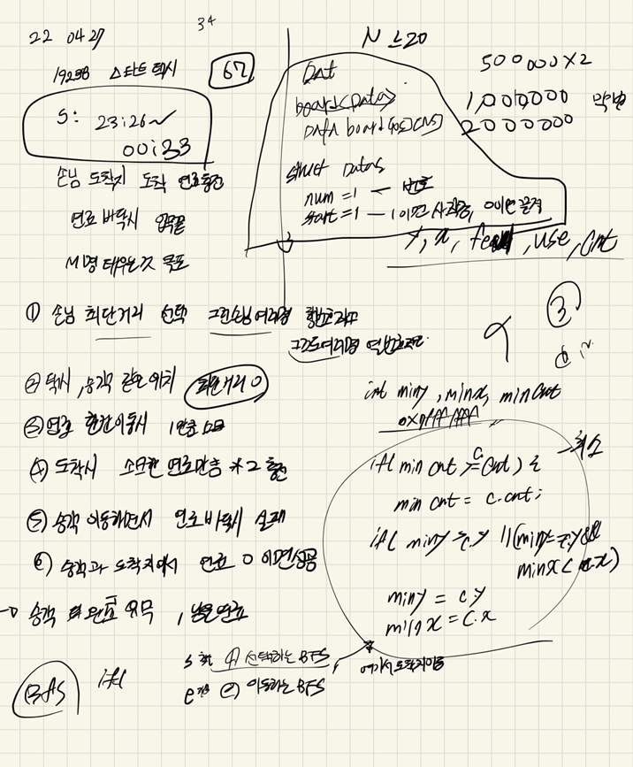

## 2022-04-28-19238-스타트택시

## 목차

>  01.택시 승하차
>
>  >  01.1 손님 탐색
>  >
>  >  01.2 손님 하차
>
>  02.주의 할점
>
>  03.전체소스



## 01.택시 승하차

### 01.1 손님 탐색

```c++
int visit[NS][NS] = { 0, };
queue<Pos>t;
Taxi.feul = F;
t.push(Taxi);
int minY, minX, minCnt;
minY = minX = minCnt = 0x7fffffff;
int fuel, used;
visit[Taxi.y][Taxi.x] = 0;
int number = 0;
while (!t.empty()) {
    Pos c = t.front(); t.pop();
    //if (c.feul == 0 && startBoard[c.y][c.x].isStart != 1) return -1;
    if (startBoard[c.y][c.x].isStart == 1) { // 최소값 뽑는 부분
        if (minCnt >= c.cnt) {
            minCnt = c.cnt;
            if (minY > c.y || (minY == c.y&&minX > c.x)) {
                number = startBoard[c.y][c.x].number;
                minY = c.y;
                minX = c.x;
                fuel = c.feul;
                used = c.used;
            }
        }
    }//if(peopleBoard
    for (int dir = 0; dir < 4; dir++) {
        Pos n;
        n.y = c.y + dy[dir]; n.x = c.x + dx[dir]; n.cnt = c.cnt + 1;
        n.feul = c.feul - 1;; n.used = c.used;
        if (safeZone(n.y, n.x) && visit[n.y][n.x] == 0 && board[n.y][n.x] == 0) {
            visit[n.y][n.x] = 1;
            t.push(n);
        }
    }
}
if (minCnt == 0x7fffffff)return -1;
```

### 01.2 손님 하차

```c++
while (!t.empty())t.pop();
F = F - minCnt;//남은것
//used = minCnt;
t.push({ minY,minX,0,F,used });
visit[minY][minX] = 0;
startBoard[minY][minX].number = 0;
startBoard[minY][minX].isStart = 0;
int flag = 0;
while (!t.empty()) {
    Pos c = t.front(); t.pop();
    if (c.feul < 0)return -1;
    if (endBoard[number][c.y][c.x].number == number) {
        flag = 1;
        F = F - c.cnt;
        used += c.cnt;
        F += used * 2;
        endBoard[number][c.y][c.x].number = 0;
        endBoard[number][c.y][c.x].isStart = 0;
        Taxi.y = c.y; Taxi.x = c.x;
        break;
    }
    for (int dir = 0; dir < 4; dir++) {
        Pos n;
        n.y = c.y + dy[dir]; n.x = c.x + dx[dir]; n.cnt = c.cnt + 1;
        n.feul = c.feul - 1; n.used = c.used;
        if (safeZone(n.y, n.x) && board[n.y][n.x] == 0 && visit[n.y][n.x] == 0) {
            visit[n.y][n.x] = 1;
            t.push(n);
        }
    }
}
```

## 02.주의 할점

- 이문제는 택시위치에서 바로 손님이 있을 수 있는 경우가 있고,

  ```markdown
  6 1 2
  0 0 0 0 0 0
  0 0 0 0 0 0
  0 0 0 0 0 0
  0 0 0 0 0 0
  0 0 0 0 0 0
  0 0 0 0 0 0
  3 4
  3 4 2 5
  
  정답: 4
  ```

- 전체를 도는데 도착지점을 못만날 수 있는 경우 (기름이 떨어졌는데 도착지를 못찾는다.)

  ```markdown
  6 1 19
  1 0 0 0 1 0
  1 0 1 0 1 1
  1 0 1 0 1 0
  1 0 1 0 1 0
  1 0 1 0 1 0
  0 0 1 0 0 0
  1 3
  4 2 1 6
  
  정답: -1
  ```

- 그리고 이것은 혹시 몰라서 한것인데 같은 지역에 여러 도착지를 가질 수있는 점도 생각해야함

## 03.전체소스

```c++
#include<stdio.h>
#include<iostream>
#include<vector>
#include<string.h>
#include<queue>
#define NS 24
using namespace std;
int N, M, F;
int board[NS][NS];
int dy[] = { 0,1,0,-1 };
int dx[] = { 1,0,-1,0 };
int ret;
struct Pos {
	int y, x, cnt, feul, used;
}Taxi;
struct Data {
	int number, isStart;
};
Data peopleBoard[NS][NS];
Data startBoard[NS][NS];
Data endBoard[402][NS][NS];
bool safeZone(int y, int x) {
	return 0 <= y && y < N && 0 <= x && x < N;
}
void init() {
	scanf("%d %d %d", &N, &M, &F);
	for (int i = 0; i < N; i++) {
		for (int j = 0; j < N; j++) {
			scanf("%d", &board[i][j]);
		}
	}
	scanf("%d %d", &Taxi.y, &Taxi.x);
	Taxi.y--; Taxi.x--;
	for (int m = 1; m <= M; m++) {// 승객의 정보 입력
		int sy, sx, ey, ex;
		scanf("%d %d %d %d", &sy, &sx, &ey, &ex);
		sy--; sx--; ey--; ex--;
		startBoard[sy][sx].isStart = 1;
		startBoard[sy][sx].number = m;
		endBoard[m][ey][ex].number = m;
	}
}
int BFS() {
	// 승객 탐색 하는 큐
	int cnt = 0;
	while (1) {
		if (cnt == M)break;
		int visit[NS][NS] = { 0, };
		queue<Pos>t;
		Taxi.feul = F;
		t.push(Taxi);
		int minY, minX, minCnt;
		minY = minX = minCnt = 0x7fffffff;
		int fuel, used;
		visit[Taxi.y][Taxi.x] = 0;
		int number = 0;
		while (!t.empty()) {
			Pos c = t.front(); t.pop();
			//if (c.feul == 0 && startBoard[c.y][c.x].isStart != 1) return -1;
			if (startBoard[c.y][c.x].isStart == 1) { // 최소값 뽑는 부분
				if (minCnt >= c.cnt) {
					minCnt = c.cnt;
					if (minY > c.y || (minY == c.y&&minX > c.x)) {
						number = startBoard[c.y][c.x].number;
						minY = c.y;
						minX = c.x;
						fuel = c.feul;
						used = c.used;
					}
				}
			}//if(peopleBoard
			for (int dir = 0; dir < 4; dir++) {
				Pos n;
				n.y = c.y + dy[dir]; n.x = c.x + dx[dir]; n.cnt = c.cnt + 1;
				n.feul = c.feul - 1;; n.used = c.used;
				if (safeZone(n.y, n.x) && visit[n.y][n.x] == 0 && board[n.y][n.x] == 0) {
					visit[n.y][n.x] = 1;
					t.push(n);
				}
			}
		}
		memset(visit, 0, sizeof(visit));

		//승객 이동 하는 큐
		if (minCnt == 0x7fffffff)return -1;
		while (!t.empty())t.pop();
		F = F - minCnt;//남은것
		//used = minCnt;
		t.push({ minY,minX,0,F,used });
		visit[minY][minX] = 0;
		startBoard[minY][minX].number = 0;
		startBoard[minY][minX].isStart = 0;
		int flag = 0;
		while (!t.empty()) {
			Pos c = t.front(); t.pop();
			if (c.feul < 0)return -1;
			if (endBoard[number][c.y][c.x].number == number) {
				flag = 1;
				F = F - c.cnt;
				used += c.cnt;
				F += used * 2;
				endBoard[number][c.y][c.x].number = 0;
				endBoard[number][c.y][c.x].isStart = 0;
				Taxi.y = c.y; Taxi.x = c.x;
				break;
			}
			for (int dir = 0; dir < 4; dir++) {
				Pos n;
				n.y = c.y + dy[dir]; n.x = c.x + dx[dir]; n.cnt = c.cnt + 1;
				n.feul = c.feul - 1; n.used = c.used;
				if (safeZone(n.y, n.x) && board[n.y][n.x] == 0 && visit[n.y][n.x] == 0) {
					visit[n.y][n.x] = 1;
					t.push(n);
				}
			}
		}
		if (flag == 0)return -1;
		cnt++;

	}
	ret = F;
	return ret;
}
int main(void) {
	init();
	printf("%d", BFS());

	return 0;
}
```

