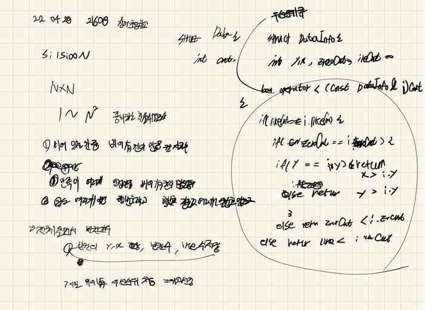

## 2022-04-28-21608-상어초등학교

## 목차

>  01.우선순위큐를 이용한 조건 정렬
>
>  02.자리선정
>
>  03.만족도 조사
>
>  04.전체소스



## 01.우선순위큐를 이용한 조건 정렬

- 비어있는 칸 중에서 좋아하는 학생이 인접한 칸에 가장 많은 칸으로 자리를 정한다.

- 1을 만족하는 칸이 여러 개이면, 인접한 칸 중에서 비어있는 칸이 가장 많은 칸으로 자리를 정한다.

- 2를 만족하는 칸도 여러 개인 경우에는 행의 번호가 가장 작은 칸으로, 그러한 칸도 여러 개이면 열의 번호가 가장 작은 칸으로 자리를 정한다.

  ```sql
  struct DataInfo {
  	int y, x, zeroCnt, likeCnt;
  	bool operator<(const DataInfo & i)const {
  		if (likeCnt == i.likeCnt) {
  			if (zeroCnt == i.zeroCnt) {
  				if (y == i.y)return x > i.x;
  				else return y > i.y;
  			}
  			return zeroCnt < i.zeroCnt;
  		}
  		return likeCnt < i.likeCnt;
  	}
  };
  ```

## 02.자리선정

```c++
void seat() {
	for (int s = 1; s <= N*N; s++) {
		priority_queue<DataInfo>pq;
		for (int i = 1; i <= N; i++) {
			for (int j = 1; j <= N; j++) {
				if (board[i][j] == 0) {
					int zeroCnt = 0, likeCnt = 0;
					for (int dir = 0; dir < 4; dir++) {
						Data n;
						n.y = i + dy[dir]; n.x = j + dx[dir];
						if (!safeZone(n.y, n.x))continue;
						if (board[n.y][n.x] == 0)zeroCnt++;
						else {
							for (int k = 1; k <= 4; k++) {
								if (board[n.y][n.x] == people[s][k]) {
									likeCnt++;
									break;
								}
							}
						}//else
					}//for( int dir
					pq.push({ i,j,zeroCnt,likeCnt });
				}// board[i][j]==0
			}// for int j
		}// for int i
		if (!pq.empty()) {
			DataInfo c = pq.top();
			board[c.y][c.x] = people[s][0];
	}
	}// for int s
}
```

## 03.만족도 조사

```c++
void solve() {
	for (int i = 1; i <= N; i++) {
		for (int j = 1; j <= N; j++) {
			int likeCnt = 0;
			for (int dir = 0; dir < 4; dir++) {
				Data n;
				n.y = i + dy[dir]; n.x = j + dx[dir];
				if (safeZone(n.y, n.x)) {
					for (int k = 1; k <= 4; k++) {
						if (board[n.y][n.x] == people1[board[i][j]][k]) {
							likeCnt++;
							break;
						}
					}
				}
			}
			ret += fine[likeCnt];
		}
	}
}
```

## 04.전체소스

```c++
#include<stdio.h>
#include<iostream>
#include<vector>
#include<queue>
#define NS 24
#define SIZE 404
using namespace std;
int N;
int people[SIZE][5];
int people1[SIZE][5];
int board[SIZE][SIZE];
int dy[] = { 0,1,0,-1 };
int dx[] = { 1,0,-1,0 };
int fine[] = { 0,1,10,100,1000 };
int ret;
bool safeZone(int y, int x) {
	return 1 <= y && y <= N && 1 <= x && x <= N;
}
struct Data {
	int y, x;
};
struct DataInfo {
	int y, x, zeroCnt, likeCnt;
	bool operator<(const DataInfo & i)const {
		if (likeCnt == i.likeCnt) {
			if (zeroCnt == i.zeroCnt) {
				if (y == i.y)return x > i.x;
				else return y > i.y;
			}
			return zeroCnt < i.zeroCnt;
		}
		return likeCnt < i.likeCnt;
	}
};
void init() {
	scanf("%d", &N);
	for (int i = 1; i <= N*N; i++) {
		int num, one, two, three, four;
		scanf("%d %d %d %d %d", &num, &one, &two, &three, &four);
		people[i][0] = num; people[i][1] = one; people[i][2] = two; people[i][3] = three; people[i][4] = four;
		people1[num][1] = one, people1[num][2] = two, people1[num][3] = three, people1[num][4] = four;

	}
}
void seat() {
	for (int s = 1; s <= N*N; s++) {
		priority_queue<DataInfo>pq;
		for (int i = 1; i <= N; i++) {
			for (int j = 1; j <= N; j++) {
				if (board[i][j] == 0) {
					int zeroCnt = 0, likeCnt = 0;
					for (int dir = 0; dir < 4; dir++) {
						Data n;
						n.y = i + dy[dir]; n.x = j + dx[dir];
						if (!safeZone(n.y, n.x))continue;
						if (board[n.y][n.x] == 0)zeroCnt++;
						else {
							for (int k = 1; k <= 4; k++) {
								if (board[n.y][n.x] == people[s][k]) {
									likeCnt++;
									break;
								}
							}
						}//else
					}//for( int dir
					pq.push({ i,j,zeroCnt,likeCnt });
				}// board[i][j]==0
			}// for int j
		}// for int i
		if (!pq.empty()) {
			DataInfo c = pq.top();
			board[c.y][c.x] = people[s][0];
	}
	}// for int s
}
void solve() {
	for (int i = 1; i <= N; i++) {
		for (int j = 1; j <= N; j++) {
			int likeCnt = 0;
			for (int dir = 0; dir < 4; dir++) {
				Data n;
				n.y = i + dy[dir]; n.x = j + dx[dir];
				if (safeZone(n.y, n.x)) {
					for (int k = 1; k <= 4; k++) {
						if (board[n.y][n.x] == people1[board[i][j]][k]) {
							likeCnt++;
							break;
						}
					}
				}
			}
			ret += fine[likeCnt];
		}
	}
}
int main(void) {
	init();
	seat();
	solve();
	printf("%d\n", ret);
	return 0;
}
```

