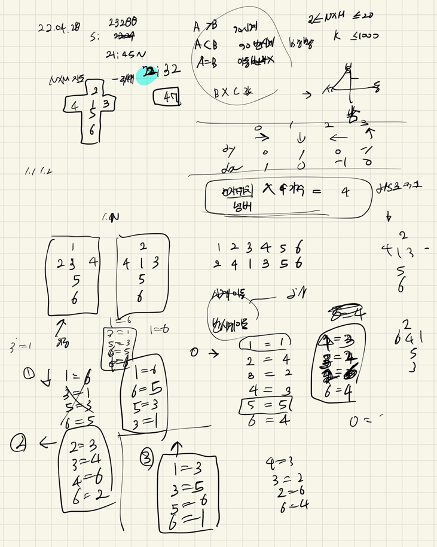

## 2022-04-28-23288-주사위굴리기2

## 목차

>  01.주사위 이동하기
>
>  02.현재 위치의 같은 숫자 개수 파악
>
>  03.방향 전환과 전체 로직 들어간 부분
>
>  04.전체 소스



 ## 01.주사위 이동하기

```c++
void moveCube(int dir) {
	if (dir == 0) {
		int copy = cube[4];
		cube[4] = cube[3];
		cube[3] = cube[2];
		cube[2] = cube[6];
		cube[6] = copy;
	}
	else if (dir == 1) {
		int copy = cube[1];
		cube[1] = cube[6];
		cube[6] = cube[5];
		cube[5] = cube[3];
		cube[3] = copy;
	}
	else if (dir == 2) {
		int copy = cube[2];
		cube[2] = cube[3];
		cube[3] = cube[4];
		cube[4] = cube[6];
		cube[6] = copy;
	}
	else if (dir == 3) {
		int copy = cube[1];
		cube[1] = cube[3];
		cube[3] = cube[5];
		cube[5] = cube[6];
		cube[6] = copy;
	}
}
```

## 02.현재 위치의 같은 숫자 개수 파악

```c++
void dfs(int y, int x, int num) {
	for (int dir = 0; dir < 4; dir++) {
		int ny = y + dy[dir]; int nx = x + dx[dir];
		if (visit[ny][nx] == 0 && safeZone(ny, nx) && board[ny][nx] == num) {
			visit[ny][nx] = 1;
			cnt++;
			dfs(ny, nx,num);
		}
	}
}
```

## 03.방향 전환과 전체 로직 들어간 부분

```c++
void play() {
	int dir = 0;//동쪽
	int y = 1; int x = 1;
	for (int k = 1; k <= K; k++) {
		int ny = y + dy[dir]; int nx = x + dx[dir];
		if (safeZone(ny, nx)) {
			moveCube(dir);
			visit[ny][nx] = 1;
			dfs(ny, nx, board[ny][nx]);
			y = ny; x = nx;
			ret += (board[ny][nx]*cnt);
			memset(visit, 0, sizeof(visit));
			cnt = 1;
			if (cube[6] > board[ny][nx]) {//시계방향
				dir = (dir + 1)%4;
			}
			else if (cube[6] < board[ny][nx]) {//반시계 방향
				dir = ((dir - 1) + 4)%4;
			}
		}
		else {
			if (dir == 0) dir = 2;
			else if (dir == 2) dir = 0;
			else if (dir == 1) dir = 3;
			else if (dir == 3) dir = 1;
			 ny = y + dy[dir]; nx = x + dx[dir];
			moveCube(dir);
			visit[ny][nx] = 1;
			dfs(ny, nx, board[ny][nx]);
			y = ny; x = nx;
			ret += (board[ny][nx] * cnt);
			memset(visit, 0, sizeof(visit));
			cnt = 1;
			if (cube[6] > board[ny][nx]) {//시계방향
				dir = (dir + 1) % 4;
			}
			else if (cube[6] < board[ny][nx]) {//반시계 방향
				dir = ((dir - 1) + 4) % 4;
			}
		}
	}
}
```

## 04.전체 소스

```c++
#include<stdio.h>
#include<iostream>
#include<vector>
#include<string.h>
#define NS 24
using namespace std;
int N, M, K;
int ret;
int cube[] = { 0,2,4,1,3,5,6 };
int dy[] = { 0,1,0,-1 };
int dx[] = { 1,0,-1,0 };
int board[NS][NS];
bool safeZone(int y, int x) {
	return 1 <= y && y <= N && 1 <= x && x <= M;
}

void init() {
	scanf("%d %d %d", &N, &M, &K);
	for (int i = 1; i <= N; i++) {
		for (int j = 1; j <= M; j++) {
			scanf("%d", &board[i][j]);
		}
	}
}
void moveCube(int dir) {
	if (dir == 0) {
		int copy = cube[4];
		cube[4] = cube[3];
		cube[3] = cube[2];
		cube[2] = cube[6];
		cube[6] = copy;
	}
	else if (dir == 1) {
		int copy = cube[1];
		cube[1] = cube[6];
		cube[6] = cube[5];
		cube[5] = cube[3];
		cube[3] = copy;
	}
	else if (dir == 2) {
		int copy = cube[2];
		cube[2] = cube[3];
		cube[3] = cube[4];
		cube[4] = cube[6];
		cube[6] = copy;
	}
	else if (dir == 3) {
		int copy = cube[1];
		cube[1] = cube[3];
		cube[3] = cube[5];
		cube[5] = cube[6];
		cube[6] = copy;
	}
}
int visit[NS][NS];
int cnt = 1;
void dfs(int y, int x, int num) {

	for (int dir = 0; dir < 4; dir++) {
		int ny = y + dy[dir]; int nx = x + dx[dir];
		if (visit[ny][nx] == 0 && safeZone(ny, nx) && board[ny][nx] == num) {
			visit[ny][nx] = 1;
			cnt++;
			dfs(ny, nx,num);
		}
	}
}
void play() {
	int dir = 0;//동쪽
	int y = 1; int x = 1;
	for (int k = 1; k <= K; k++) {
		int ny = y + dy[dir]; int nx = x + dx[dir];
		if (safeZone(ny, nx)) {
			moveCube(dir);
			visit[ny][nx] = 1;
			dfs(ny, nx, board[ny][nx]);
			y = ny; x = nx;
			ret += (board[ny][nx]*cnt);
			memset(visit, 0, sizeof(visit));
			cnt = 1;
			if (cube[6] > board[ny][nx]) {//시계방향
				dir = (dir + 1)%4;
			}
			else if (cube[6] < board[ny][nx]) {//반시계 방향
				dir = ((dir - 1) + 4)%4;
			}
		}
		else {
			if (dir == 0) dir = 2;
			else if (dir == 2) dir = 0;
			else if (dir == 1) dir = 3;
			else if (dir == 3) dir = 1;
			 ny = y + dy[dir]; nx = x + dx[dir];
			moveCube(dir);
			visit[ny][nx] = 1;
			dfs(ny, nx, board[ny][nx]);
			y = ny; x = nx;
			ret += (board[ny][nx] * cnt);
			memset(visit, 0, sizeof(visit));
			cnt = 1;
			if (cube[6] > board[ny][nx]) {//시계방향
				dir = (dir + 1) % 4;
			}
			else if (cube[6] < board[ny][nx]) {//반시계 방향
				dir = ((dir - 1) + 4) % 4;
			}
		}
	}
}
int main(void) {
	init();
	play();
	printf("%d\n", ret);
	return 0;
}
```

