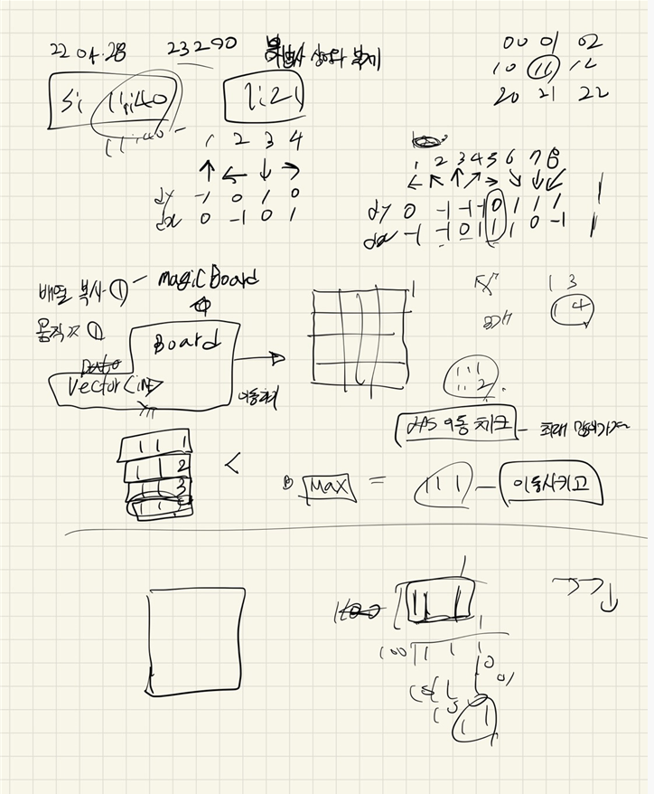

## 2022-04-29-23290-마법사상어와복제

## 목차

>  01.주사위 이동하기
>
>  02.현재 위치의 같은 숫자 개수 파악
>
>  03.방향 전환과 전체 로직 들어간 부분
>
>  04.전체 소스



## 01.물고기이동

```c++
void moveFish() {
	vector<fish> tempMap[NS][NS];

	for (int i = 1; i <= 4; i++) {
		for (int j = 1; j <= 4; j++) {
			for (int k = 0; k < fishMap[i][j].size(); k++) {
				int y = fishMap[i][j][k].y;
				int x = fishMap[i][j][k].x;
				int dir = fishMap[i][j][k].dir;
				int ny = y;
				int nx = x;
				bool Flag = false;
				for (int l = 1; l <= 8; l++) {
					ny = y + fdy[dir];
					nx = x + fdx[dir];
					if (1 <= ny && ny <= 4 && 1 <= nx && nx <= 4) {
						if ((ny != shark.first || nx != shark.second) && smellMap[ny][nx] == 0) {
							Flag = true;
							break;
						}
					}
					dir = changeDir(dir);
				}
				if (Flag == true) {
					fish f = { ny,nx,dir };
					tempMap[ny][nx].push_back(f);
				}
				else {
					fish f = { y,x,dir };
					tempMap[y][x].push_back(f);
				}
			}
		}
	}
	copyMap(fishMap, tempMap);
}
```

## 02.상어이동 시뮬레이션

```c++
int routeSimulation() {
	bool visit[NS][NS] = { false,};
	int y = shark.first;
	int x = shark.second;
	int eat = 0;
	for (int i = 0; i < 3; i++) {
		int dir = tempRoute[i];
		int ny = y + sdy[dir];
		int nx = x + sdx[dir];
		if (ny < 1|| ny>4 || nx < 1 || nx>4) {
			return -1;
		}
		if (visit[ny][nx] == false) {
			visit[ny][nx] = true;
			eat += fishMap[ny][nx].size();
		}
		y = ny;
		x = nx;
	}
	return eat;
}
```

## 03.상어이동 경로 순열 조합

```c++void findRoute(int cnt) {
void findRoute(int cnt) {
	if(cnt == 3)
	{
		int eatNum = routeSimulation();
		if (eatNum > ret) {
			for (int i = 0; i < 3; i++) {
				route[i] = tempRoute[i];
			}
			ret = eatNum;
		}
		return;
	}
	for (int i = 1; i <= 4; i++) {
		tempRoute[cnt] = i;
		findRoute(cnt + 1);
		tempRoute[cnt] = 0;
	}
}
```

## 04.상어이동

```c++
void moveShark(int time) {
	vector<fish> tempMap[NS][NS];
	copyMap(tempMap, fishMap);

	int y = shark.first;
	int x = shark.second;
	for (int i = 0; i < 3; i++) {
		int dir = route[i];
		int ny = y + sdy[dir];
		int nx = x + sdx[dir];
		if (tempMap[ny][nx].size() != 0) {
			smellMap[ny][nx] = 3;
			tempMap[ny][nx].clear();
		}
		y = ny;
		x = nx;
		shark.first = y;
		shark.second = x;
	}
	copyMap(fishMap, tempMap);
}
```

## 05.냄새 제거

```c++
void bornFish() {
    for (int i = 1; i <= 4; i++) {
        for (int j = 1; j <= 4; j++) {
            for (int k = 0; k < cMap[i][j].size(); k++) {
                fishMap[i][j].push_back(cMap[i][j][k]);
            }
        }
    }
}
```

## 06.전체소스

```c++
#include<stdio.h>
#include<iostream>
#include<vector>
#define NS 5
using namespace std;
int M, S, ret;
int tempRoute[3], route[3];
int smellMap[NS][NS];
struct fish {
	int y, x, dir;
};
vector<fish> fishMap[NS][NS], cMap[NS][NS];
pair<int, int>shark;

int fdy[] = { 0,0,-1,-1,-1,0,1,1,1 };
int fdx[] = { 0,-1,-1,0,1,1,1,0,-1 };

int sdy[] = { 0,-1,0,1,0 };
int sdx[] = { 0,0,-1,0,1 };
void input()
{
	scanf("%d %d", &M, &S);
	for (int i = 0; i < M; i++) {
		int y, x, d;
		scanf("%d %d %d", &y, &x, &d);
		fish f = { y,x,d };
		fishMap[y][x].push_back(f);
	}
	scanf("%d %d", &shark.first, &shark.second);
}

void copyMap(vector<fish> A[][NS], vector<fish>B[][NS]) {
	for (int i = 1; i <= 4; i++) {
		for (int j = 1; j <= 4; j++) {
			A[i][j] = B[i][j];
		}
	}
}

void copyFish() {
	copyMap(cMap, fishMap);
}

int changeDir(int dir) {
	switch (dir) {
	case 1:
		return 8;
	case 2:
		return 1;
	case 3:
		return 2;
	case 4:
		return 3;
	case 5:
		return 4;
	case 6:
		return 5;
	case 7:
		return 6;
	case 8:
		return 7;
	}
}

void moveFish() {
	vector<fish> tempMap[NS][NS];

	for (int i = 1; i <= 4; i++) {
		for (int j = 1; j <= 4; j++) {
			for (int k = 0; k < fishMap[i][j].size(); k++) {
				int y = fishMap[i][j][k].y;
				int x = fishMap[i][j][k].x;
				int dir = fishMap[i][j][k].dir;
				int ny = y;
				int nx = x;
				bool Flag = false;
				for (int l = 1; l <= 8; l++) {
					ny = y + fdy[dir];
					nx = x + fdx[dir];
					if (1 <= ny && ny <= 4 && 1 <= nx && nx <= 4) {
						if ((ny != shark.first || nx != shark.second) && smellMap[ny][nx] == 0) {
							Flag = true;
							break;
						}
					}
					dir = changeDir(dir);
				}
				if (Flag == true) {
					fish f = { ny,nx,dir };
					tempMap[ny][nx].push_back(f);
				}
				else {
					fish f = { y,x,dir };
					tempMap[y][x].push_back(f);
				}
			}
		}
	}
	copyMap(fishMap, tempMap);
}

int routeSimulation() {
	bool visit[NS][NS] = { false,};
	int y = shark.first;
	int x = shark.second;
	int eat = 0;
	for (int i = 0; i < 3; i++) {
		int dir = tempRoute[i];
		int ny = y + sdy[dir];
		int nx = x + sdx[dir];
		if (ny < 1|| ny>4 || nx < 1 || nx>4) {
			return -1;
		}
		if (visit[ny][nx] == false) {
			visit[ny][nx] = true;
			eat += fishMap[ny][nx].size();
		}
		y = ny;
		x = nx;
	}
	return eat;
}
void findRoute(int cnt) {
	if(cnt == 3)
	{
		int eatNum = routeSimulation();
		if (eatNum > ret) {
			for (int i = 0; i < 3; i++) {
				route[i] = tempRoute[i];
			}
			ret = eatNum;
		}
		return;
	}
	for (int i = 1; i <= 4; i++) {
		tempRoute[cnt] = i;
		findRoute(cnt + 1);
		tempRoute[cnt] = 0;
	}
}

void moveShark(int time) {
	vector<fish> tempMap[NS][NS];
	copyMap(tempMap, fishMap);

	int y = shark.first;
	int x = shark.second;
	for (int i = 0; i < 3; i++) {
		int dir = route[i];
		int ny = y + sdy[dir];
		int nx = x + sdx[dir];
		if (tempMap[ny][nx].size() != 0) {
			smellMap[ny][nx] = 3;
			tempMap[ny][nx].clear();
		}
		y = ny;
		x = nx;
		shark.first = y;
		shark.second = x;
	}
	copyMap(fishMap, tempMap);
}
void aboutShark(int time) {
	ret = -1;
	findRoute(0);
	moveShark(time);
}
void removeSmell(int time) {
	for (int i = 1; i <= 4; i++) {
		for (int j = 1; j <= 4; j++) {
			if (smellMap[i][j] == 0) continue;
			
				smellMap[i][j]--;
			
		}
	}
}

void bornFish() {
	for (int i = 1; i <= 4; i++) {
		for (int j = 1; j <= 4; j++) {
			for (int k = 0; k < cMap[i][j].size(); k++) {
				fishMap[i][j].push_back(cMap[i][j][k]);
			}
		}
	}
}
int findAnswer() {
	int ret1 = 0;
	for (int i = 1; i <= 4; i++) {
		for (int j = 1; j <= 4; j++) {
			ret1 += fishMap[i][j].size();
		}
	}
	return ret1;
}

void solution() {
	for (int i = 1; i <= S; i++) {
		copyFish();
		moveFish();
		aboutShark(i);
		removeSmell(i);
		bornFish();
	}
	printf("%d\n", findAnswer());
}
void solve() {
	input();
	solution();
}
int main(void)
{
	ios::sync_with_stdio(false);
	cin.tie(NULL);
	cout.tie(NULL);

	solve();
	return 0;
}
```

