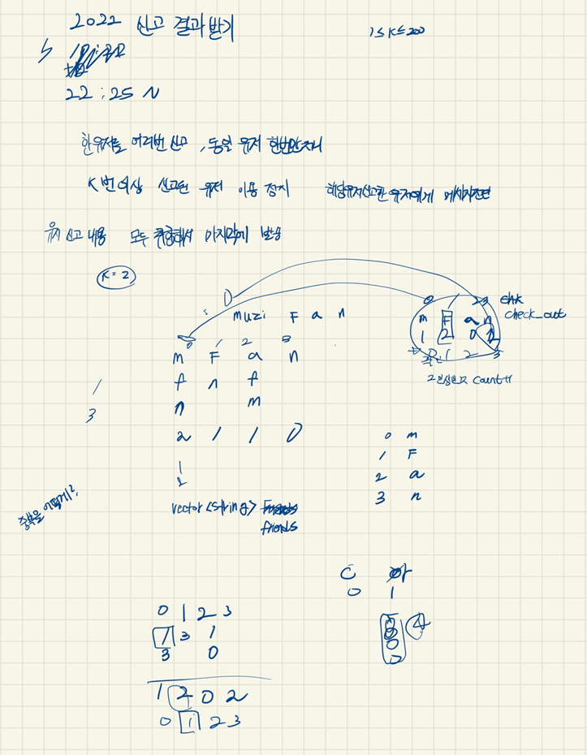

## 2022-05-11-카카오-신고-결과-받기

## 목차

> 01.설계
>
> 02.문자열 분리하기
>
> 03.제한 당하는 대상 고르기
>
> 04.소스코드


[문제 보기](https://programmers.co.kr/learn/courses/30/lessons/92334?language=cpp)

## 01.설계



- 설계라고 하기에는 웃기지만 대략 위와 같이 구성함
- 여기서 실수 했던건 한사람이 같은사람 여러번 신고해도 한번으로 인식하는 것을 빼먹고 구현했던것
- 그리고 너무 시간을 오래 잡아먹은것 물론 쉬엄쉬엄하다보니 그랬지만 집중해서 하면 30분안에 풀어도 사실 오래걸린것

## 02.문자열 분리하기

```c++
for (int i = 0; i < report.size(); i++) {
    string s1;
    string s2;
    int flag = 0;
    for (int j = 0; j < report[i].size(); j++) {
        if (report[i][j] == ' ') {
            flag = 1;
            continue;
        }
        if(flag==0)s1 += report[i][j];
        if (flag == 1)s2 += report[i][j];
    }
    if (friends_chk[s1][s2]==0) {
        friends_chk[s1][s2] = 1;
        friends[friends_num[s1]].push_back(friends_num[s2]);
        check_out[friends_num[s2]]++;

    }
}
```

## 03.제한 당하는 대상 고르기

```c++
for (int i = 0; i < id_list.size(); i++) {
    int count = 0;
    for (int j = 0; j < friends[i].size();j++){

        for (int ii= 0; ii < id_list.size(); ii++) {
            if (friends[i][j] == ii&& check_out[ii]>=k) {
                count++;
            }
        }
    }
    answer.push_back(count);
}
```

## 04.소스코드

```c++
#include <string>
#include <vector>
#include <map>
#include<iostream>
using namespace std;
struct Data {
	string name;
	int report_out;
};
vector<int> solution(vector<string> id_list, vector<string> report, int k) {
	vector<int> answer;
	vector<int>friends[5000];
	map<string, int>friends_num;
	
	map<string, map<string,int>>friends_chk;
	int check_out[5000] = { 0, };
	for (int i = 0; i < id_list.size(); i++)
	{
		friends_num[id_list[i]] = i;
	}
	for (int i = 0; i < report.size(); i++) {
		string s1;
		string s2;
		int flag = 0;
		for (int j = 0; j < report[i].size(); j++) {
			if (report[i][j] == ' ') {
				flag = 1;
				continue;
			}
			if(flag==0)s1 += report[i][j];
			if (flag == 1)s2 += report[i][j];
		}
		if (friends_chk[s1][s2]==0) {
			friends_chk[s1][s2] = 1;
			friends[friends_num[s1]].push_back(friends_num[s2]);
			check_out[friends_num[s2]]++;

		}
	}

	for (int i = 0; i < id_list.size(); i++) {
		int count = 0;
		for (int j = 0; j < friends[i].size();j++){
			
			for (int ii= 0; ii < id_list.size(); ii++) {
				if (friends[i][j] == ii&& check_out[ii]>=k) {
					count++;
				}
			}
		}
		answer.push_back(count);
	}

	return answer;
}

int main(void)
{
	//solution({ "muzi", "frodo", "apeach", "neo" }, { "muzi frodo","apeach frodo","frodo neo","muzi neo","apeach muzi" },2);
	solution({ "con", "ryan" }, { "ryan con", "ryan con", "ryan con", "ryan con" }, 3);

	return 0;
}
```

