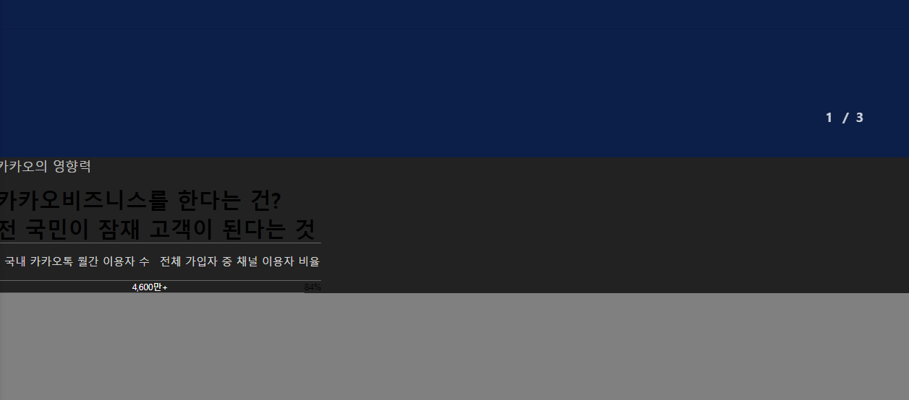

## 2022-11-11-1일차-복습

## 1.html 소스

```html
<!DOCTYPE html>
<html lang="en">

<head>
    <meta charset="UTF-8">
    <meta http-equiv="X-UA-Compatible" content="IE=edge">
    <meta name="viewport" content="width=device-width, initial-scale=1.0">
    <meta http-equiv="refresh" content="1">
    <title>1일차 숙제</title>
    <link href="./index.css" rel="stylesheet" />
</head>

<body>
    <div id="wrap">
        <div id="nav">
            <div class="nav-container">
                <span class="logo"><a href="https://www.naver.com" target="_blank"></a></span>
                <span>시작하기</span>
                <span>채널</span>
                <span>광고</span>
                <span>서비스/도구</span>
                <span>파트너 지원</span>
                <div class="btn-group">
                    <button class="button">로그인</button>
                </div>
            </div>
        </div>

        <div id="body">
            <div class="slider">
                <div class="slider-contents">
                    <div class="slider-item">
                        <div class="slider-item-contents" align="center">
                            <video src="https://t1.kakaocdn.net/kakao_biz_common/public/movies/main_visual_210525.mp4"
                                autoplay="autoplay" muted="muted" playsinline="playsinline" loop="loop">
                            </video>
                            <div class="slider-text">
                                비즈니스, 톡처럼 쉬워지다<br />
                                카카오비즈니스
                            </div>
                        </div>
                    </div>
                    <div class="slider-item"></div>
                    <div class="slider-item"></div>
                </div>
                <div class="slider-pager">
                    <div>
                        <span>1</span>
                        <span>/</span>
                        <sapn>3</sapn>
                    </div>
                </div>
            </div>

            <div class="contents">
                <div class="influence-contents">
                    <div>
                        <div class="title">카카오의 영향력</div>
                        <div class="sub-title">
                            카카오비즈니스를 한다는 건?<br />
                            전 국민이 잠재 고객이 된다는 것
                        </div>
                    </div>

                    <div>
                        <div class="table">
                            <div class="row table-header">
                                <div class="cell th-cell">국내 카카오톡 월간 이용자 수</div>
                                <div class="cell th-cell">전체 가입자 중 채널 이용자 비율							</div>
                            </div>
                            <div class="row">
                                <div class="cell data-cell">4,600만+</div>
                                <div clas="cell data-cell">84%</div>
                            </div>
                        </div>
                    </div>
                </div>
            </div>

            <div id="other-contents" class="contents"></div>
            <div></div>
            <div></div>
        </div>
        </div>
    </body>
    <script src="./index.js"></script>
</html>
```

## 02.CSS

```css
/* common */
/* common */
/* common */
html {
    overflow-x: hidden;
}
body {
    margin: 0;
    background-color: #222;
}

.button {
    display: inline-block;
    padding: 0 20px;
    font-size: 13px;
    line-height: 32px;
    border-radius: 5px;
    text-decoration: none;
    color: #222;
    font-family: NotoSans-medium, sans-serif;
    border: 1px solid rgba(2, 20, 63, 0.25);
    cursor: pointer;
}

/* Nva 메뉴바 */
/* Nva 메뉴바 */
/* Nva 메뉴바 */
#nav {
    top: 0px;
    z-index: 99;
    position: sticky;
    background-color: white;
    padding: 0px 20px;
}

#nav .logo-link {
    display: block;
    width: 130px;
    height: 15px;
    background: url(https://business.kakao.com/static/img/logo_biz.34693d3_1.16.10.png) no-repeat 0 0;
    background-size: contain;
}
#nav > .nav-container {
    margin: 0 auto;
    max-width: 1400px;
    padding: 25px 0px;
}
#nav > .nav-container > span {
    font-family: NotoSans-regular, sans-serif;
    font-size: 15px;
    color: #222;
    display: inline-block;
    margin-right: 20px;
    cursor: pointer;
}

#nav > .nav-container > .btn-group {
    display: inline-block;
    float: right;
    margin-top: -10px;
}
#nav > .nav-container > .btn-group > * {
    height: 100%;
    display: inline-block;
}

/* Body */
/* Body */
/* Body */

#body {
    height: 1000px;
}

/* Body - main slider */
/* Body - main slider */
/* Body - main slider */
.slider {
    height: calc(100vh - 50px);
    background: #f0f;
    position: relative;
}

.slider > .slider-contents {
    height: 100%;
    position: relative;
    transition: left 1s;
    left: 0%;
}
.slider > .slider-contents > .slider-item {
    height: 100%;
    position: absolute;
    width: 100%;
    background-color: antiquewhite;
    overflow: hidden;
}

.slider > .slider-contents > .slider-item:nth-child(1) {
    left: 0%;
}
.slider > .slider-contents > .slider-item:nth-child(2) {
    left: 100%;
    background: brown;
}
.slider > .slider-contents > .slider-item:nth-child(3) {
    left: 200%;
    background: gray;
}
.slider > .slider-contents > .slider-item > .slider-item-contents {
    position: relative;
    height: 100%;
}

.slider > .slider-contents > .slider-item video {
    height: 100%;
    width: 100%;
    position: absolute;
    top: 50%;
    bottom: auto;
    margin-top: -60px;
    transform: translate(-50%, -50%);
    padding: 60px 0 120px;
    background-color: #0c1f48;
}

.slider > .slider-contents > .slider-item .slider-text {
    color: white;
    position: absolute;
    top: 50%;
    width: 100%;
    font-size: 6em;
    font-size: 60px;
    line-height: 85px;
    font-family: NotoSans-Bold, sans-serif;
    font-weight: bold;
}

.slider > .slider-pager {
    position: absolute;
    bottom: 5%;
    right: 5%;
    color: hsla(0, 0%, 100%, 0.8);
    font-size: 24px;
    font-weight: bold;
}
.slider > .slider-pager span {
    margin: 0 5px;
}


.influence-contents{
    background: url("https://business.kakao.com/static/img/visual_cont1.0cb2c10_1.16.10.png") center center no-repeat;
    background-size: cover;
    background-color: #0000;
}
.influence-contents > .data-contents{
    height: 550px;
    max-width: 1240px;
    min-width: 1200px;
    margin: 0 auto;
    color: white;
    position: relative;
}

.influence-contents > .data-contents > div{
    display: inline-block;
    position: absolute;
    top: 30%;
}

.influence-contents > .data-contents > div:nth-child(1){
    left: 0px;
}
.influence-contents > .data-contents > div:nth-child(2){
    right: 0px;
}
.influence-contents  .table {
    max-width: 600px;
    width: 100%;
}

.influence-contents .title {
    color: hsla(0, 0%, 100%, 0.7);
    margin-bottom: 18px;
    font-size:24px;
 }

.influence-contents .sub-title {
    display: block;
    font-size: 40px;
    font-family: Notosans-Medium, sans-serif;
    word-break: keep-all;
    font-weight: bold;
 }

 .influence-contents .table-header {
    font-size: 20px !important;
    line-height: 29px;
    color: hsla(0, 0%, 100%, 0.8);
}

 .influence-contents .row {
    display: flex;
}

 .influence-contents .th-cell {
    padding: 20px 2px;
    border-bottom: 1px solid hsla(0, 0%, 100%, 0.3);
    border-top: 1px solid hsla(0, 0%, 100%, 0.3);
    color: hsla(0, 0%, 100%, 0.8) !important;
    font-weight: 400;
}

 .influence-contents .cell{
    flex: 1;
    text-align: center;
    color: #fff;
    font-family: Notosans-bold, sans-serif;
    border-bottom: 1px solid hsla(0,0%, 100%, 0.3);
 }
.influence-centents .cell:nth-child(1) {
    border-right: 1px solid hsla(0, 0%, 100%, 0.3);
}
 .influence-centents .data-cell {
    padding: 32px 0 39px;
    font-size: 57px;
    line-height: 74px;
    font-weight: bold;
}

 #other-contents {
    background: gray;
    height: 1500px;
}
```

## 03.복습시 문제 사항



- 두개로 분리 해야하는데 왜 제대로 적용이 안되어 있는지 확인이 필요하다.

