## 01.오른쪽의 `justify-content` 속성을 이용하여 개구리가 수련잎으로 이동할 수 있도록 도와주세요. 이 속성은 다음의 값들을 인자로 받아 요소들을 가로선 상에서 정렬합니다:

- `flex-start`: 요소들을 컨테이너의 왼쪽으로 정렬합니다.
- `flex-end`: 요소들을 컨테이너의 오른쪽으로 정렬합니다.
- `center`: 요소들을 컨테이너의 가운데로 정렬합니다.
- `space-between`: 요소들 사이에 동일한 간격을 둡니다.
- `space-around`: 요소들 주위에 동일한 간격을 둡니다.

예를 들어, `justify-content: flex-end;`는 개구리를 오른쪽으로 이동시킵니다.

```css
#pond {
  display: flex;
justify-content: flex-end;
}
```


## 02.`justify-content`를 한 번 더 사용하여 개구리들이 수련잎으로 이동하는 것을 도와주세요. 이 CSS 속성은 요소들을 가로선 상에서 정렬하며 다음의 값들을 인자로 받는다는 것을 기억하세요:

- `flex-start`: 요소들을 컨테이너의 왼쪽으로 정렬합니다.
- `flex-end`: 요소들을 컨테이너의 오른쪽으로 정렬합니다.
- `center`: 요소들을 컨테이너의 가운데로 정렬합니다.
- `space-between`: 요소들 사이에 동일한 간격을 둡니다.
- `space-around`: 요소들 주위에 동일한 간격을 둡니다.

```css
#pond {
  display: flex;
justify-content: center;
}
```

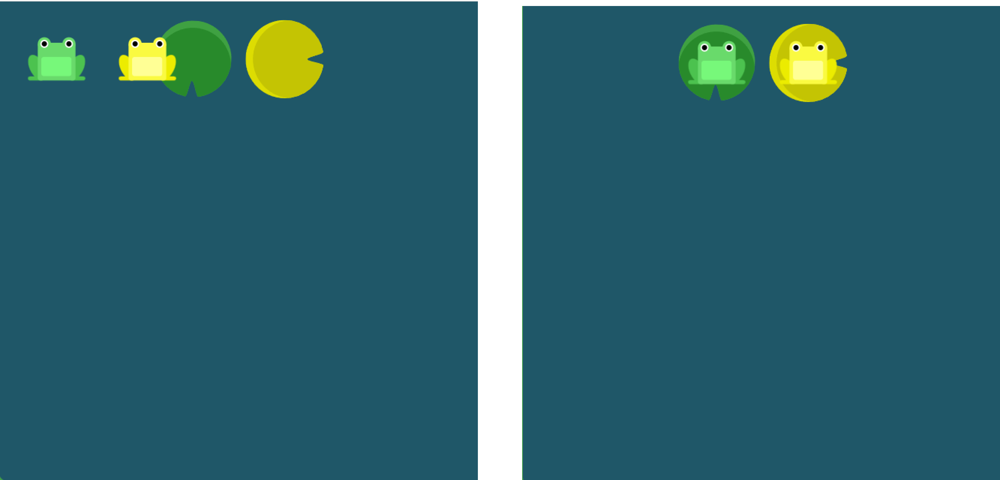

## 03.`justify-content`를 사용하여 세마리의 개구리가 모두 수련잎으로 이동할 수 있도록 도와주세요. 이번에는 수련잎 주위에 많은 간격이 있습니다.

만약 이 속성에서 사용 가능한 인자들이 기억나지 않는다면, 포인터를 속성 이름 위로 이동시키세요. `justify-content` 위로 포인터를 이동시켜 보세요.

```css
#pond {
  display: flex;
justify-content: space-around;
}
```

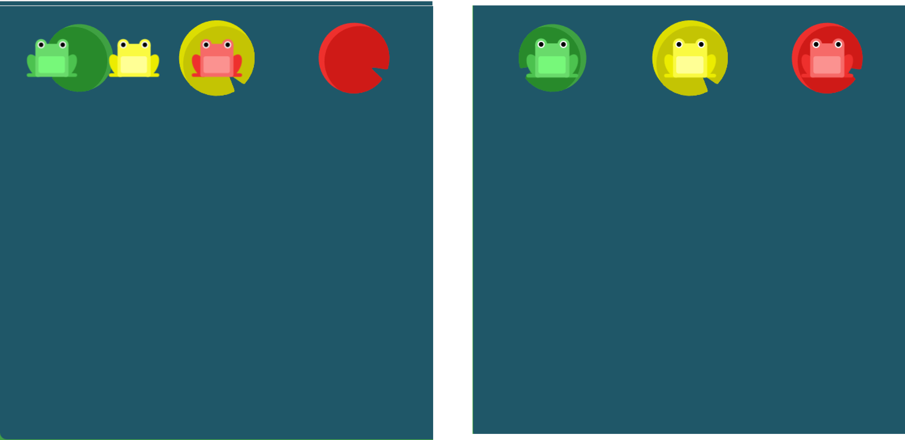

## 04.수련잎이 연못가로 떠내려가면서 수련잎 사이의 간격이 넓어졌습니다. `justify-content`를 사용하세요. 이번에는 수련잎 사이에 동일한 간격이 있습니다.

```css
#pond {
  display: flex;
justify-content: space-between;
}
```

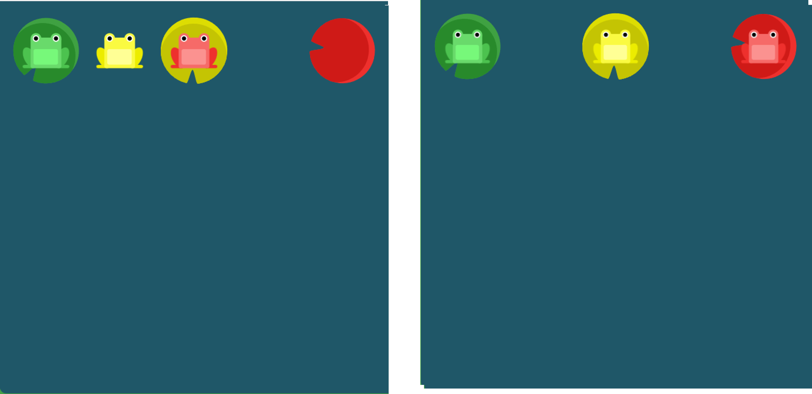

## 05.이제 `align-items`를 사용하여 개구리들이 연못의 아래쪽에 도착할 수 있도록 도와주세요. 이 CSS 속성은 다음의 값들을 인자로 받아 요소들을 세로선 상에서 정렬합니다:

- `flex-start`: 요소들을 컨테이너의 꼭대기로 정렬합니다.
- `flex-end`: 요소들을 컨테이너의 바닥으로 정렬합니다.
- `center`: 요소들을 컨테이너의 세로선 상의 가운데로 정렬합니다.
- `baseline`: 요소들을 컨테이너의 시작 위치에 정렬합니다.
- `stretch`: 요소들을 컨테이너에 맞도록 늘립니다.

```css
#pond {
  display: flex;
align-items: flex-end;
}
```

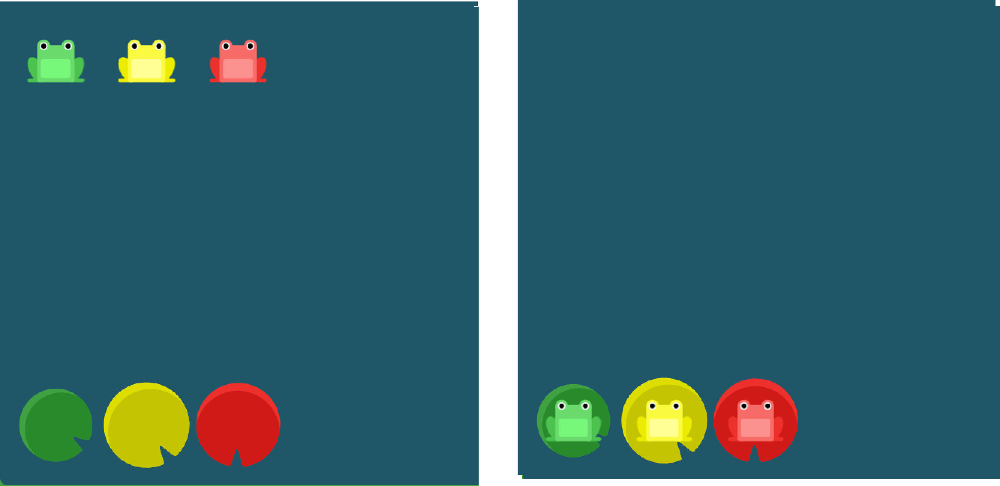

## 06.`justify-content`와 `align-items`를 함께 사용하여 개구리가 연못의 중앙으로 이동할 수 있도록 도와주세요.

```css
#pond {
  display: flex;
justify-content: center;
align-items: center;
}
```


## 07.개구리들이 연못을 다시 건너려고 하는데, 수련잎 주위에 간격이 있습니다. `justify-content`와 `align-items`를 함께 사용하세요.

``` css
#pond {
  display: flex;
justify-content: space-around;
align-items: flex-end;
}
```

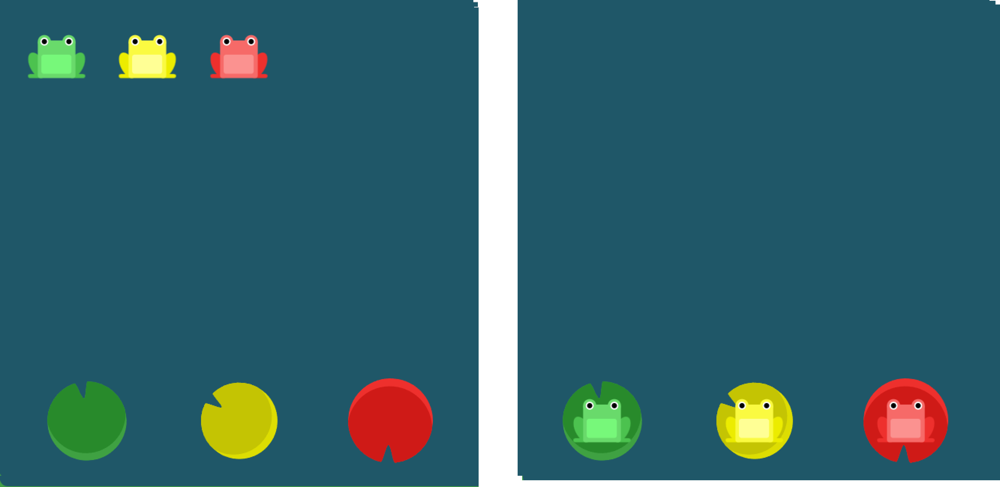

## 08.개구리들이 자기 색깔과 같은 수련잎 위로 이동할 수 있도록 도와주세요. 이번에는 `flex-direction`을 사용하세요. 이 CSS 속성은 다음의 값들을 인자로 받아 컨테이너 안에서 요소들이 정렬해야 할 방향을 지정합니다:

- `row`: 요소들을 텍스트의 방향과 동일하게 정렬합니다.
- `row-reverse`: 요소들을 텍스트의 반대 방향으로 정렬합니다.
- `column`: 요소들을 위에서 아래로 정렬합니다.
- `column-reverse`: 요소들을 아래에서 위로 정렬합니다.

```css
#pond {
  display: flex;
flex-direction: row-reverse;
}
```

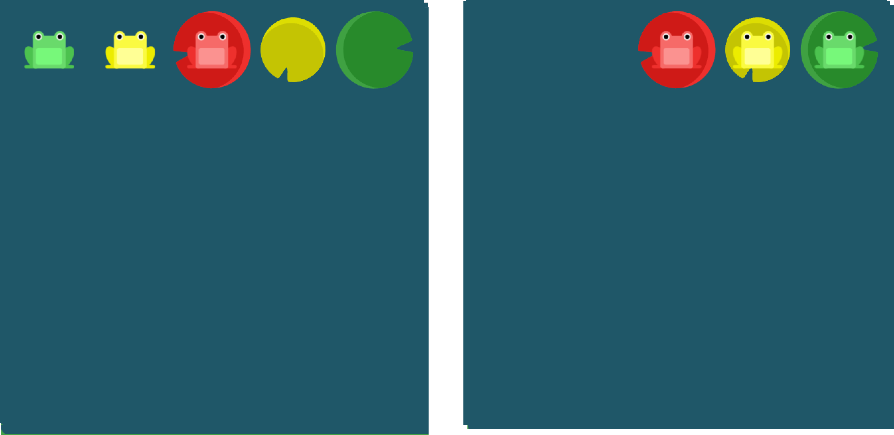

## 09.`flex-direction`을 사용하여 개구리들이 자기 색깔과 같은 수련잎 위로 이동할 수 있도록 도와주세요. 이 CSS 속성은 다음의 값들을 인자로 받아 컨테이너 안에서 요소들이 정렬해야 할 방향을 지정합니다:

- `row`: 요소들을 텍스트의 방향과 동일하게 정렬합니다.
- `row-reverse`: 요소들을 텍스트의 반대 방향으로 정렬합니다.
- `column`: 요소들을 위에서 아래로 정렬합니다.
- `column-reverse`: 요소들을 아래에서 위로 정렬합니다.

```css
#pond {
  display: flex;
flex-direction:column;
}
```

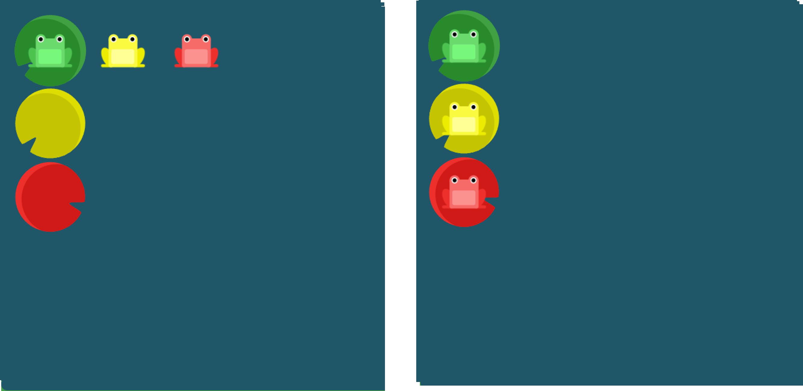

## 10.개구리들이 자기 색깔과 같은 수련잎 위로 이동할 수 있도록 도와주세요. `flex-direction`과 `justify-content`를 모두 사용해야 합니다.

column-reverse 또는 row-reverse를 사용하면 요소들의 start와 end의 순서도 뒤바뀝니다.

```css
#pond {
  display: flex;
flex-direction:  row-reverse;
justify-content: start;
}
```


## 11.개구리들이 자기 색깔과 같은 수련잎 위로 이동할 수 있도록 도와주세요. `flex-direction`과 `justify-content`를 모두 사용해야 합니다.

Flex의 방향이 column일 경우 `justify-content`의 방향이 세로로, `align-items`의 뱡향이 가로로 바뀝니다.

```css
#pond {
  display: flex;
flex-direction: column;
justify-content: end;
}
```

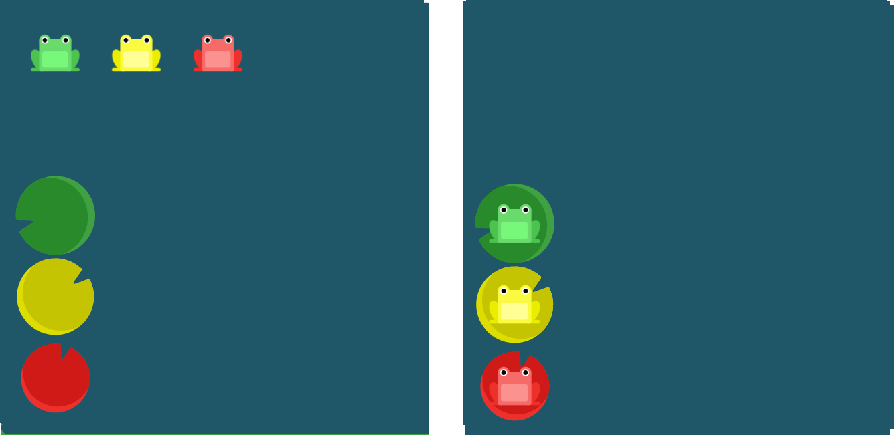

## 12.`flex-direction`과 `justify-content`를 사용하여 개구리들이 자기 색깔과 같은 수련잎 위로 이동할 수 있도록 도와주세요.

```css
#pond {
  display: flex;
flex-direction: column-reverse;
justify-content: space-between;
}
```

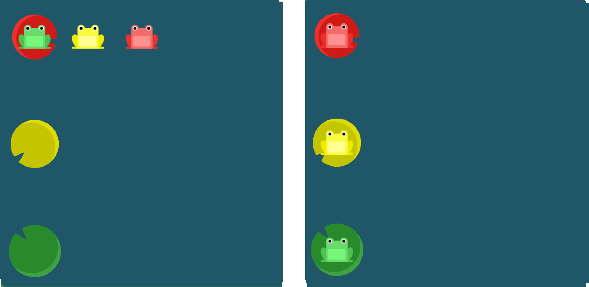

## 13.`flex-direction`, `justify-content`, 그리고 `align-items`를 사용하여 개구리들이 자기 색깔과 같은 수련잎 위로 이동할 수 있도록 도와주세요.

```css
#pond {
  display: flex;
flex-direction: row-reverse;
justify-content: center;
align-items:end;
}
```

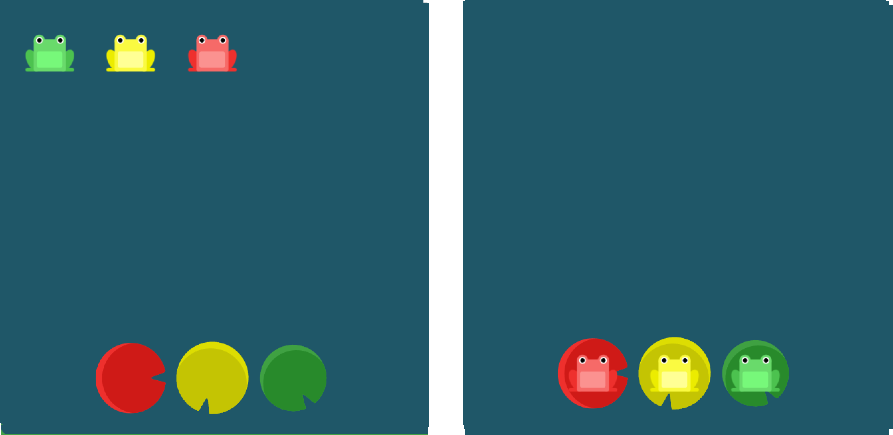

## 14.때때로 컨테이너의 row나 column의 순서를 역으로 바꾸는 것만으로는 충분하지 않습니다. 이러한 경우에는 `order` 속성을 각 요소에 적용할 수 있습니다. order의 기본 값은 0이며, 양수나 음수로 바꿀 수 있습니다.

`order` 속성을 이용하여 개구리들의 순서를 수련잎의 순서에 맞게 바꿔주세요.

```
#pond {
  display: flex;
}

.yellow {
order:3;
}
```

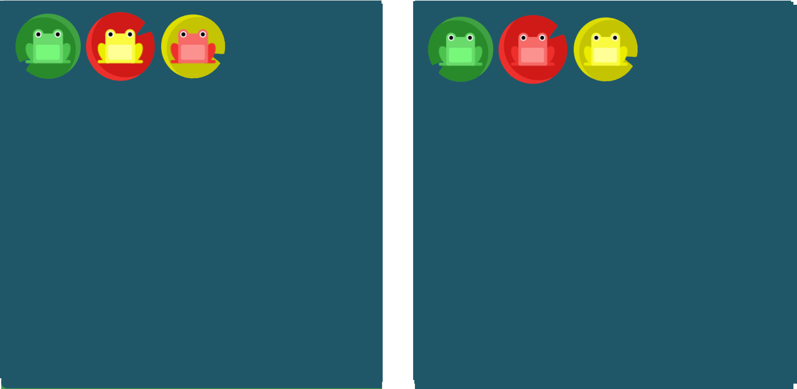

## 15.`order` 속성을 사용하여 빨간색 개구리를 빨간색 수련잎으로 보내주세요.

```css
#pond {
  display: flex;
}

.red {
order: -3;
}
```

## 16.`align-self`는 개별 요소에 적용할 수 있는 또 다른 속성입니다. 이 속성은 `align-items`가 사용하는 값들을 인자로 받으며, 그 값들은 지정한 요소에만 적용됩니다.

```css
#pond {
  display: flex;
  align-items: flex-start;
}

.yellow {
align-self:end;
}
```

## 17.`order`와 `align-self`를 사용하여 개구리들을 자기 색깔과 같은 수련잎 위로 보내주세요.

```css
#pond {
  display: flex;
  align-items: flex-start;
}

.yellow {
order:1;
align-self: end;
}	
```

## 18.오 이런! 개구리들이 한 줄 위에 비좁게 앉아있네요. 다음의 값들을 인자로 받는 `flex-wrap` 속성을 사용하여 개구리들이 넓게 앉을 수 있도록 해주세요:

- `nowrap`: 모든 요소들을 한 줄에 정렬합니다.
- `wrap`: 요소들을 여러 줄에 걸쳐 정렬합니다.
- `wrap-reverse`: 요소들을 여러 줄에 걸쳐 반대로 정렬합니다.

```css
#pond {
  display: flex;
flex-wrap:wrap;
}
```

### 19.`flex-direction`과 `flex-wrap`을 사용하여 개구리들이 세 column에 정렬할 수 있도록 도와주세요.

```css
#pond {
  display: flex;
flex-direction:column;
flex-wrap:wrap;
}
```

## 20.`flex-direction`과 `flex-wrap`이 자주 같이 사용되기 때문에, `flex-flow`가 이를 대신할 수 있습니다. 이 속성은 공백문자를 이용하여 두 속성의 값들을 인자로 받습니다.

예를 들어, 요소들을 가로선 상의 여러줄에 걸쳐 정렬하기 위해 `flex-flow: row wrap`을 사용할 수 있습니다.

`flex-flow`를 사용하여 이전 단계를 반복해보세요.

```css
#pond {
  display: flex;
flex-flow: column wrap;
}
```

## 21.개구리들이 연못의 사방에 퍼져있고, 수련잎은 연못의 위쪽에 모여있습니다. `align-content`를 사용하여 여러 줄 사이의 간격을 지정할 수 있습니다. 이 속성은 다음의 값들을 인자로 받습니다:

- `flex-start`: 여러 줄들을 컨테이너의 꼭대기에 정렬합니다.
- `flex-end`: 여러 줄들을 컨테이너의 바닥에 정렬합니다.
- `center`: 여러 줄들을 세로선 상의 가운데에 정렬합니다.
- `space-between`: 여러 줄들 사이에 동일한 간격을 둡니다.
- `space-around`: 여러 줄들 주위에 동일한 간격을 둡니다.
- `stretch`: 여러 줄들을 컨테이너에 맞도록 늘립니다.

이 속성을 사용하는 방법이 어려울 수 있습니다. `align-content`는 여러 줄들 사이의 간격을 지정하며, `align-items`는 컨테이너 안에서 어떻게 모든 요소들이 정렬하는지를 지정합니다. 한 줄만 있는 경우, `align-content`는 효과를 보이지 않습니다.

```css
#pond {
  display: flex;
  flex-wrap: wrap;
align-content: flex-start;
}
```

## 22.이제 연못의 조류에 의해 수련잎들이 연못의 아래쪽으로 떠내려 갔습니다. `align-content`를 사용하여 개구리들이 수련잎 위로 이동할 수 있도록 도와주세요.

```css
#pond {
  display: flex;
  flex-wrap: wrap;
align-content: flex-end;
}
```

## 23.개구리들이 신나는 파티를 가졌습니다. 이제는 집으로 돌아가야할 시간입니다. `flex-direction`과 `align-content`를 사용하여 개구리들이 자기 색깔과 같은 수련잎으로 돌아갈 수 있도록 도와주세요.

```css
#pond {
  display: flex;
  flex-wrap: wrap;
flex-direction: column-reverse;
align-content: center;
}
```

## 24.지금까지 배운 CSS 속성들을 사용하여 개구리들이 집으로 돌아갈 수 있도록 한번 더 도와주세요:

- `justify-content`
- `align-items`
- `flex-direction`
- `order`
- `align-self`
- `flex-wrap`
- `flex-flow`
- `align-content`

```css
#pond {
  display: flex;
flex-flow: wrap-reverse column-reverse;
align-content: space-between;
align-self: center;
justify-content:center;
}
```

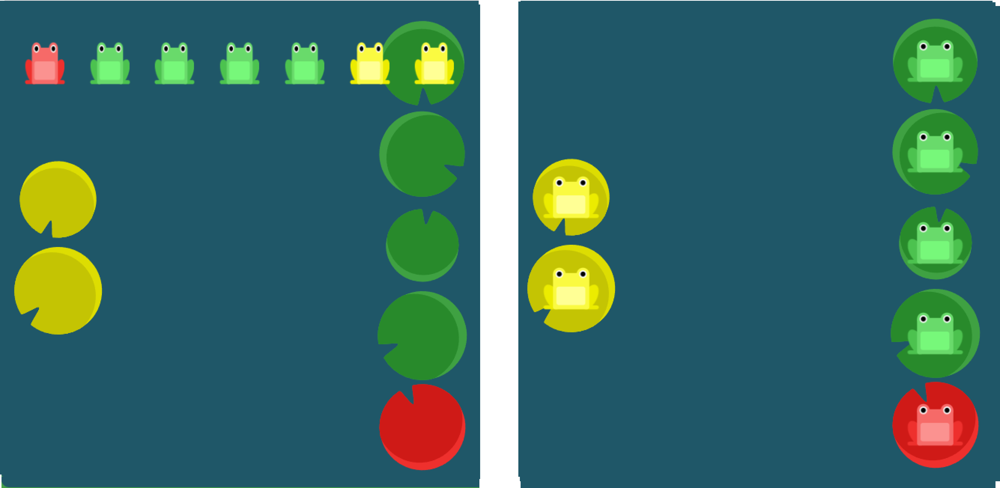

