## 2021.10.24_2.1-개발처음-시작하시는분-개발환경설정

- 스마트폰 어플
  - ios
    -  애플(아이폰)
  - android 
    - 삼성, 엘지
- 안드로이드 스튜디오 + java
  - 설치
  - 무엇을 만들지에 대해서 
- 샘플 -> apk -> 본인 설치 or 구글 스토어에 올리기 가능
- 비전공자, 일반, 앱개발을 처음 하시는분들도 가능

## 설치

[안드로이드스튜디오설치사이트](https://developer.android.com/studio?gclid=Cj0KCQjwiNSLBhCPARIsAKNS4_cn_eH5YIgC0B3SuUmvBZymQLYZArLt0NSLF8OmPUBXkNOGgO3aLtgaAg9KEALw_wcB&gclsrc=aw.ds)

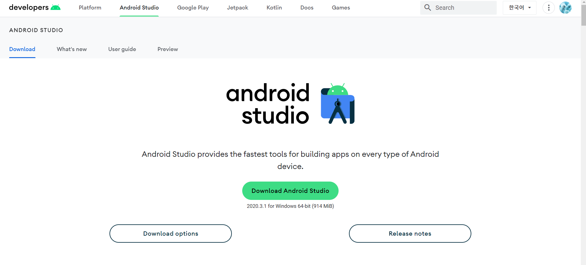

- Download Android Studio 녹색 버튼을 눌러서 일단 무조건설치함

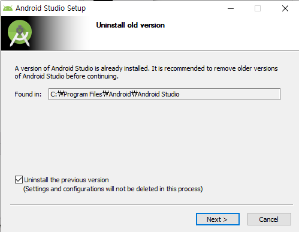

## 실행 하는법

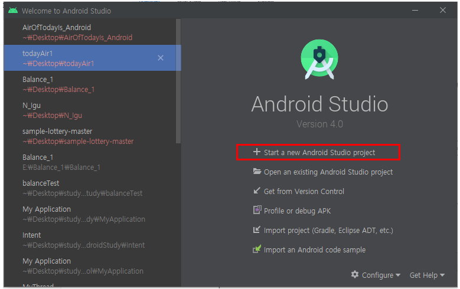

- Start a new Android Studio project 클릭

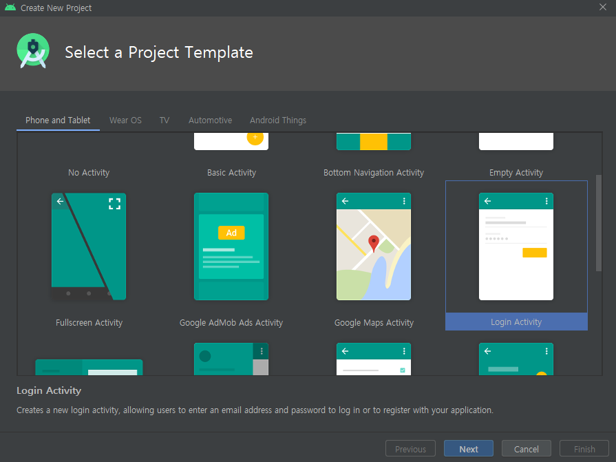

- Login Activity를 실행해보자

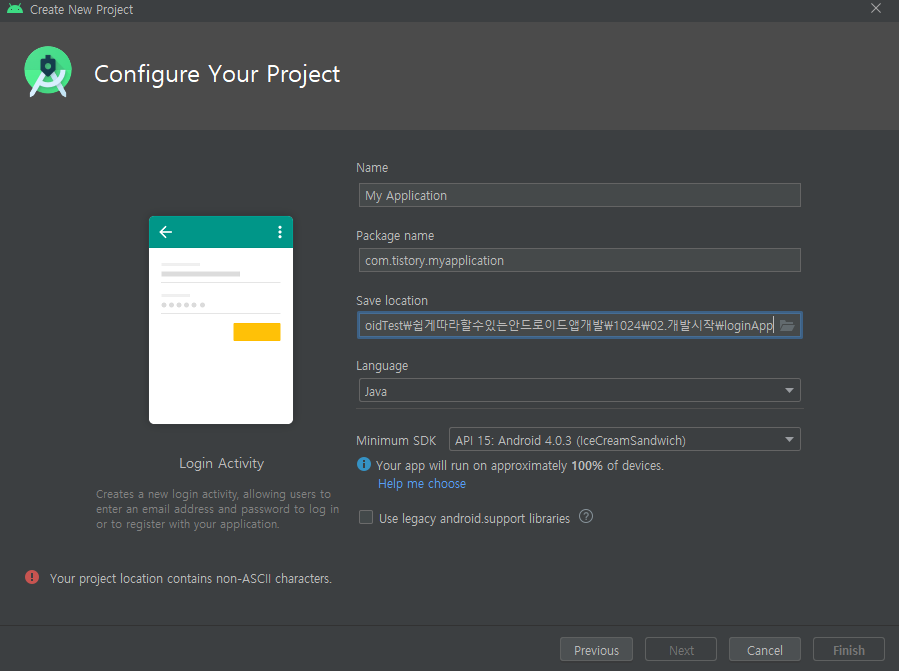

- 이게 그리고 중요한것이 디렉토리에 한글이 있으면 안된다.

## 구성

- 언어 - compile - 기계어
  - build - .apk ....

- apk를 직접 폰에 실행하는 법이 있고, 애뮬레이터에 실행할 수 있음

## 에뮬레이터로 실행하기 

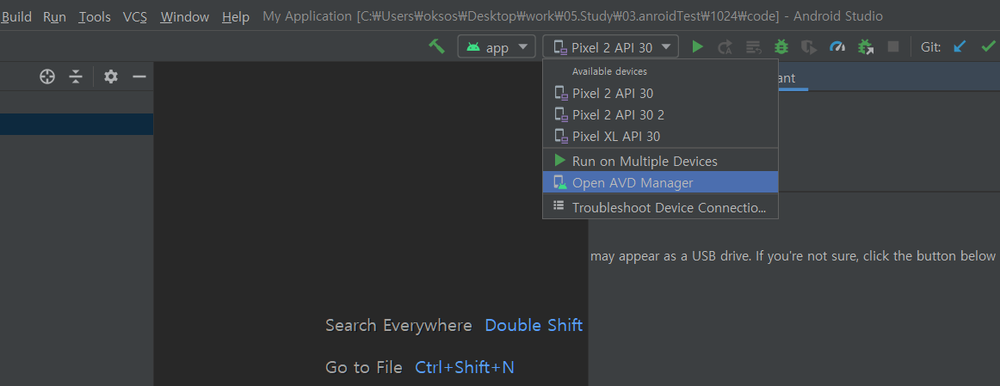

- 이전에 해놨던것이 있지만 새로 만드는 법
  - Open AVD Manager를 클릭

- create virtual Device 클릭

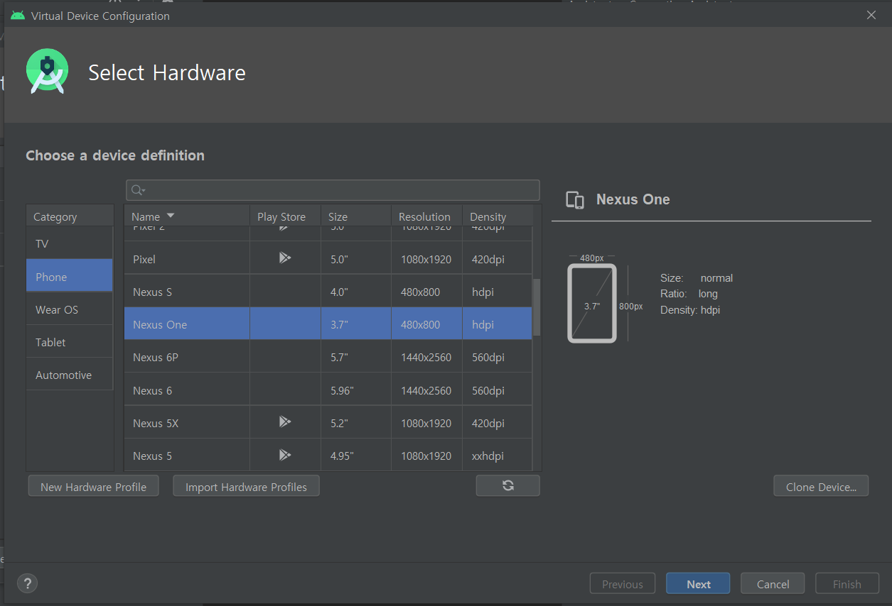

- 원하는 디바이스 클릭 

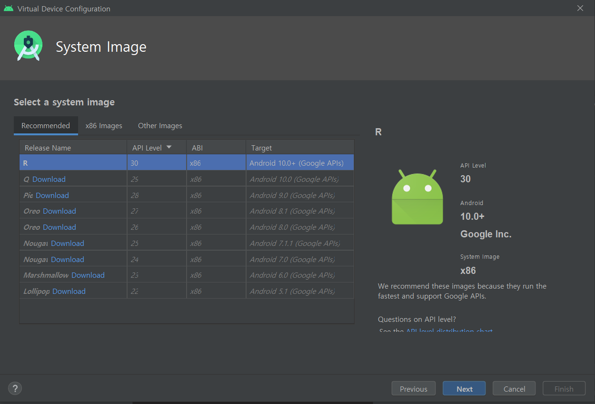

- 안에 들어가는 os라고 해야하나 구동되는 것 선택

- finish까지 해주면 완료됨

## 애뮬레이터 실행시 에러가 발생한다면

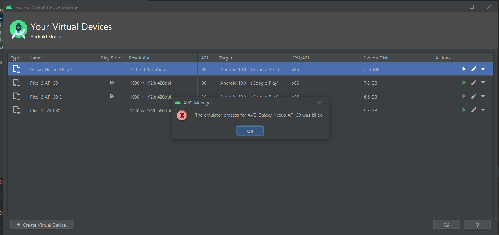

- 현재 위와 같은 에러 발생

#### Sdk manager

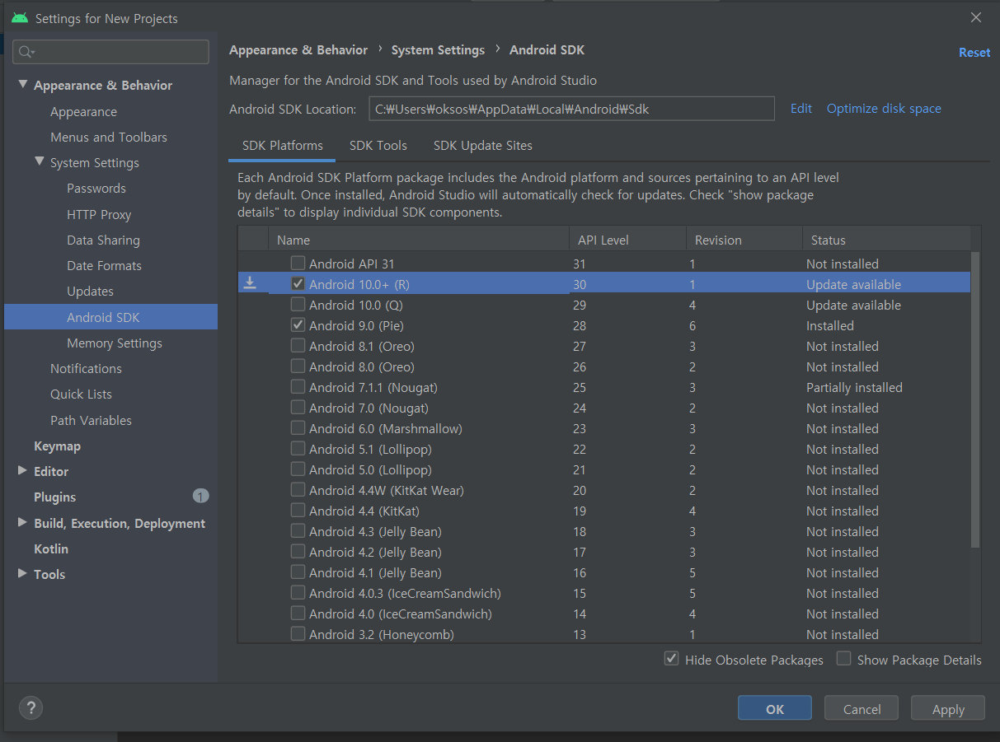

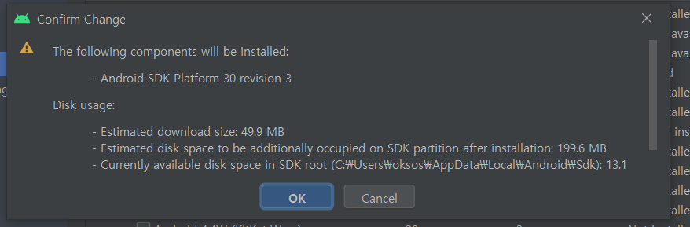

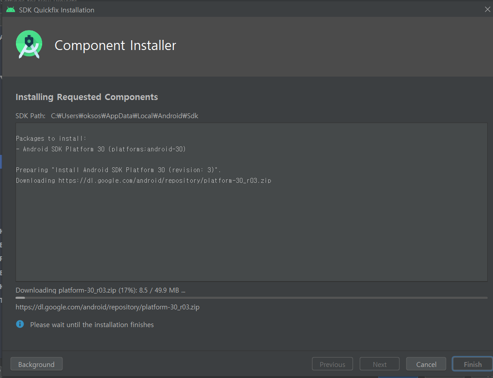

- sdk파일이 없는경우 문제가 생길 수 있으니 설치하자

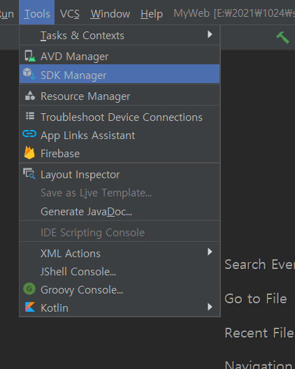

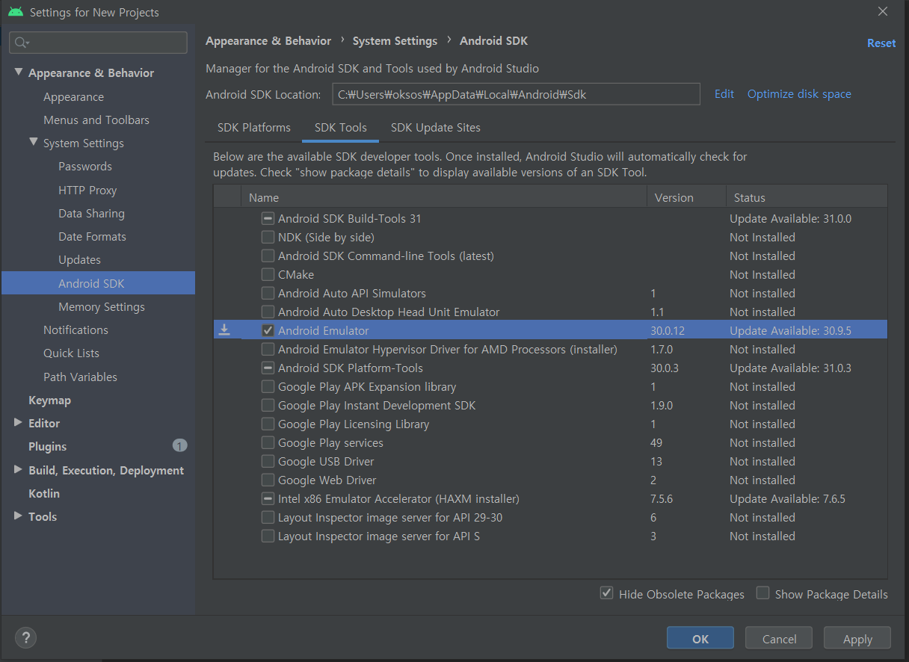

- sdk tools 에 android Emulator 업데이트해주기

- 이게 새로 설치하면 이런 작업은 필요 없음 하지만 예전에 설치했으면 버전이 올라가므로 이렇게 업데이트 필요

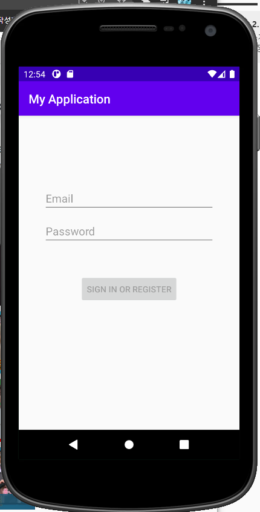

- 이런화면이 나오면 준비 완료

## 원본

