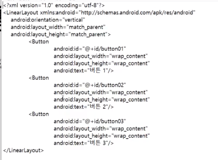
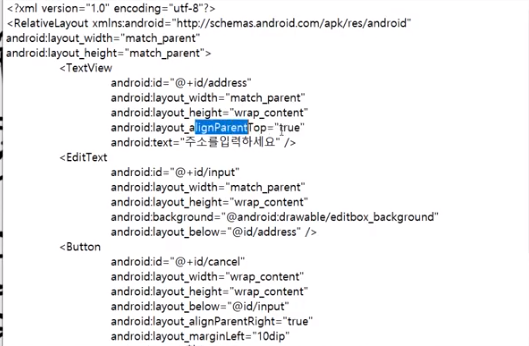

## 2021.10.24_2.2-안드로이드앱개발기초,2.3-안드로이드화면개발의핵심,2.3-안드로이드화면개발의핵심

## 안드로이드 앱 2가지

- 안드로이드 프로그래밍
  - 천인국 책
- layout에 관련된것
  - xml에 적혀있음
    - 버튼, 박스, 지도 이런것 있음 ,배치도가 있다고 생각하면됨
    - 배치도를 담은 파일, xml로 되어 있음 

- activity
  - xml가 매핑이 된다.
  - app은 xml의 합집합 모임 구성 이다.

- 이벤트
  - 버튼이 동작한다는 것이 이벤트이다.

## 안드로이드에 대한 이야기

- 먹고 살기가 힘들지 않음

- 다들 스마트폰을 잘쓰는데

  - 뭔가 앱을 만들기가 쉽지는 않음
  - 하지만 기존의 앱을 설치하면 광고자체가 너무 많다
  - 월 얼마정도하는 앱등이 있음
  - 너무 과하면 좋지 않음
  - 음성으로 검색하는것 .. 등등

- 중요한것 레이아웃

  - 어떻게 배치할것인가 그것이 레이아웃

- 화면 개발 어떻게 할것인가

  - linear layout
    - 순차적으로 가로나 세로로 해서 배열하는것

  - relative layout
    - 상대적으로 적용하는것

- layout-below 이런것 등으로 기준을 명시해서 배치하는 식으로 되어 있는 것