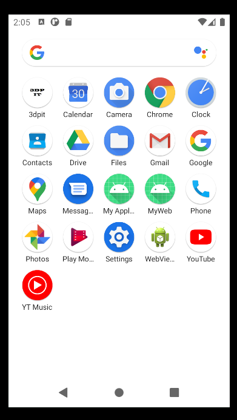
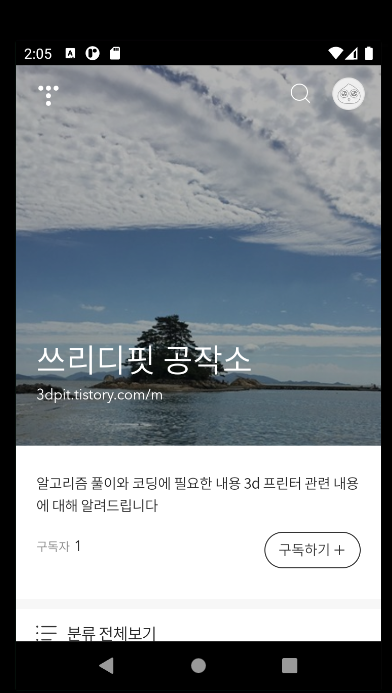
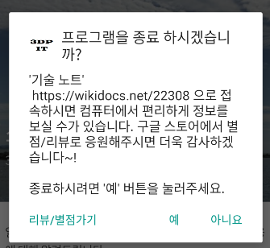

## 2021.10.30_4.1앱개발처음하시는분-간단한앱만들기

## 안드로이드 앱개발

- 웹 앱 만들기
- 네이티브 앱
  - 안드로이드 전용 앱
- 웹 앱
  - 웹의 형태를 가진것

[기술 노트 사이트](https://wikidocs.net/book/2184)

- 웹뷰를 이용해서 인터넷 주소만 사용해서 인터넷을 띄우는것

## BroswerActivity.java

```java
package com.hitouch.wikibook;

import java.net.URISyntaxException;
import java.util.HashMap;
import java.util.Locale;
import java.util.Map;

import com.hitouch.wikibook.R;
import com.hitouch.wikibook.BrowserActivity;
import com.hitouch.wikibook.HttpUrl;
import com.hitouch.wikibook.BrowserActivity.WebClient;

import android.support.v7.app.ActionBarActivity;
import android.app.Activity;
import android.app.AlertDialog;
import android.content.DialogInterface;
import android.content.Intent;
import android.net.Uri;
import android.net.http.SslError;
import android.os.Bundle;
import android.view.KeyEvent;
import android.view.Menu;
import android.view.MenuItem;
import android.view.View;
import android.webkit.SslErrorHandler;
import android.webkit.WebSettings;
import android.webkit.WebView;
import android.webkit.WebViewClient;

import android.webkit.WebChromeClient;
import android.webkit.WebView;
import android.webkit.WebViewClient;


public class BrowserActivity extends Activity {
    private final String TAG = "ITouch_WebActivity";
    private WebView mWeb = null;
    private boolean mBackPressed = false;

    //private ImageButton mVoiceBtn;;

    private static final int REQUEST_VOICE = 4;

    protected void onCreate(Bundle savedInstanceState) {
        super.onCreate(savedInstanceState);
        if (!checkRestart(savedInstanceState)) {
            //overridePendingTransition(R.anim.anim_right_in, R.anim.anim_stay);

            initLayout();
        }
    }

    @Override
    public boolean onKeyDown(int keyCode, KeyEvent event) {
        if ((keyCode == KeyEvent.KEYCODE_BACK) && mWeb.canGoBack()) {
            mWeb.goBack();
            return true;
        }

        //빽(취소)키가 눌렸을때 종료여부를 묻는 다이얼로그 띄움
        if ((keyCode == KeyEvent.KEYCODE_BACK)) {
            AlertDialog.Builder d = new AlertDialog.Builder(this);
            d.setTitle("프로그램을 종료 하시겠습니까?");
            d.setMessage("'3dpitTistory' \n https://3dpit.tistory.com 으로 접속하시면 컴퓨터에서 편리하게 정보를 보실 수가 있습니다. \n\n종료하시려면 '예' 버튼을 눌러주세요.");
            d.setIcon(R.drawable.ic_launcher);
            d.setPositiveButton("아니요", new DialogInterface.OnClickListener() {
                @Override
                public void onClick(DialogInterface dialog, int which) {
                    // TODO Auto-generated method stub
                    //onStop();
                    dialog.cancel();
                }
            });

            d.setNeutralButton("리뷰/별점가기", new DialogInterface.OnClickListener() {

                @Override
                public void onClick(DialogInterface dialog, int which) {
                    // TODO Auto-generated method stub
                    Intent intent = new Intent(Intent.ACTION_VIEW);
                    intent.setData(Uri.parse("market://details?id=com.hitouch.wikibook"));
                    startActivity(intent);
                }
            });

            d.setNegativeButton("예", new DialogInterface.OnClickListener() {
                @Override
                public void onClick(DialogInterface dialog, int which) {
                    // TODO Auto-generated method stub

                    android.os.Process.killProcess(android.os.Process.myPid());

                    //finish();
                }
            });

            d.show();
            return true;
        }
        return super.onKeyDown(keyCode, event);
    }

    private boolean checkRestart(Bundle savedInstanceState) {
        // TODO Auto-generated method stub
        if (savedInstanceState != null) {
            return true;
        }
        return false;
    }

    public void onBackPressed() {
        if (mWeb.canGoBack()) {
            mWeb.goBack();
        } else {
            super.onBackPressed();
        }
    }

    public void onDestroy() {
        super.onDestroy();
    }

    private void initLayout() {
        setContentView(R.layout.activity_browser);
        setTitle(getString(R.string.title_web_info));

        mWeb = (WebView) findViewById(com.hitouch.wikibook.R.id.webInfo);
        mWeb.setWebViewClient(new WebClient());
        WebSettings set = mWeb.getSettings();
        set.setJavaScriptEnabled(true);

        mWeb.getSettings().setDomStorageEnabled(true);
        //set.setCacheMode(WebSettings.LOAD_NO_CACHE);

        String url = null;

        url = String.format(HttpUrl.WEBURL);
        mWeb.loadUrl(url);
    }

    class WebClient extends WebViewClient {
        @Override
        public void onReceivedSslError(WebView view, final SslErrorHandler handler, SslError error) {
            super.onReceivedSslError(view, handler, error);

            final AlertDialog.Builder builder = new AlertDialog.Builder(BrowserActivity.this);
            String message = getString(R.string.msg_cert_error);

            switch (error.getPrimaryError()) {
                case SslError.SSL_UNTRUSTED:
                    message = getString(R.string.msg_cert_trust_error);
                    break;  // 이 사이트의 보안 인증서는 신뢰할 수 있습니다
                case SslError.SSL_EXPIRED:
                    message = getString(R.string.msg_cert_expired_error);
                    break;  // 보안 인증서가 만료되었습니다.
                case SslError.SSL_IDMISMATCH:
                    message = getString(R.string.msg_cert_mismatched_error);
                    break; // 보안 인증서가 ID 일치하지 않습니다.
                case SslError.SSL_NOTYETVALID:
                    message = getString(R.string.msg_cert_not_yet_error);
                    break;  // 보안 인증서가 아직 유효하지 않습니다.
            }

            handler.proceed();
        }

        public boolean shouldOverrideUrlLoading(WebView view, String url) {
            if (url.startsWith("intent:") || url.startsWith("market:") || url.startsWith("ispmobile:")) {
                Intent i;
                try {
                    i = Intent.parseUri(url, Intent.URI_INTENT_SCHEME);
                } catch (URISyntaxException e) {
                    e.printStackTrace();
                    return false;
                }

                if (getPackageManager().resolveActivity(i, 0) == null) {
                    String pkgName = i.getPackage();
                    if (pkgName != null) {
                        i = new Intent(Intent.ACTION_VIEW, Uri.parse("market://search?q=pname:" + pkgName));
                        i.addCategory(Intent.CATEGORY_BROWSABLE);
                        startActivity(i);
                        return true;
                    } else
                        return false;
                }

                try {
                    startActivity(i);
                } catch (Exception e) {

                }

            } else {
                view.loadUrl(url);
                return true;
            }
            return true;
        }
    }

    public void goAnother(View v) {
/*        Intent intent;

        intent = new Intent(this, com.google.zxing.client.android.CaptureActivity.class);
        startActivityForResult(intent, REQUEST_BARCODE);*/
    }

}
```

## HttpUrl.java

```java
package com.hitouch.wikibook;

public class HttpUrl {
    public static final String WEBURL = "https://3dpit.tistory.com/";
	//public static final String WEBURL = "http://www.naver.com";								 
}

```

## res/values/strings.xml

```xml
<?xml version="1.0" encoding="utf-8"?>
<resources>

    <string name="app_name">3dpit</string>
    <string name="hello_world">Hello world!</string>
    <string name="action_settings">Settings</string>
    
    <string name="title_web_info">3dpit</string>
    
    <color name="bg">#ffffff</color>
    <string name="guide_back_end">뒤로 버튼을 한 번 더 누르시면 종료됩니다.</string>
   
    
    <!-- msg_cert -->
    <string name="msg_cert_error">Certificate error.</string>
    <string name="msg_cert_trust_error">Certificate is untrusted.</string>
    <string name="msg_cert_expired_error">Certificate has expired.</string>
    <string name="msg_cert_mismatched_error">Certificate ID is mismatched.</string>
    <string name="msg_cert_not_yet_error">Certificate is not yet valid.</string>
    <string name="msg_cert_ssl_error">SSL Certificate Error</string>
    <string name="msg_cert_continue">Do you want to continue anyway?</string>
    <string name="msg_proceed">"보안 인증서가 발급됩니다."</string>
    
    <string name="button_cancel">Cancel</string>
    <string name="button_ok">OK</string>
    <string name="button_continue">Continue</string>
</resources>

```

## res/layout/activity_browser.xml

```xml
<RelativeLayout xmlns:android="http://schemas.android.com/apk/res/android"
    xmlns:tools="http://schemas.android.com/tools"
    android:layout_width="match_parent"
    android:layout_height="match_parent"
    android:background="@color/bg"
    tools:context="com.hitouch.wikibook.BrowserActivity" >
    
    <WebView
	    android:id="@+id/webInfo"
	    android:layout_width="match_parent"
	    android:layout_height="match_parent"
	    android:layout_alignParentLeft="true"
	    android:layout_alignParentTop="true"
	    android:focusable="true"
	    android:focusableInTouchMode="true" />

</RelativeLayout>
```

## 동작 화면







- 대략 위와 같이 나오게됨
- 간단한 웹앱이라고 함

## 원본
