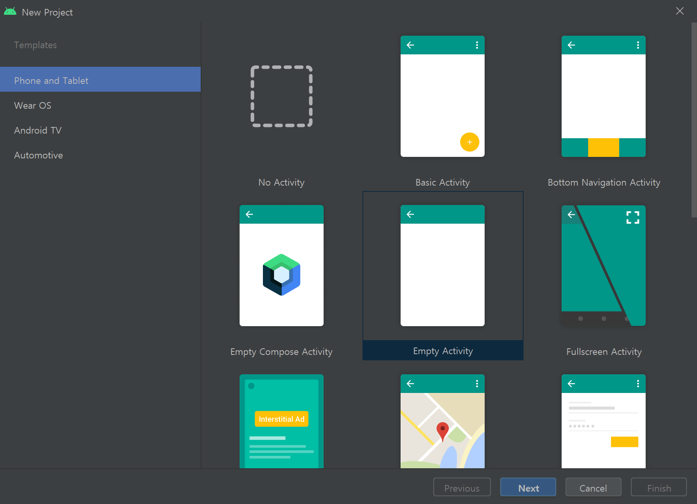
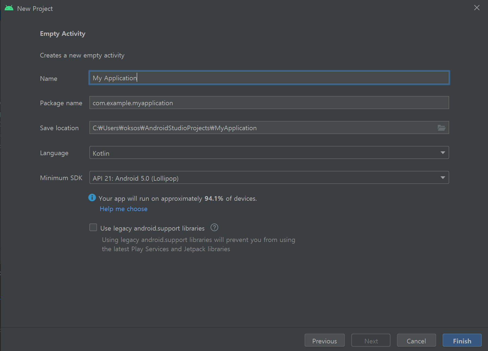
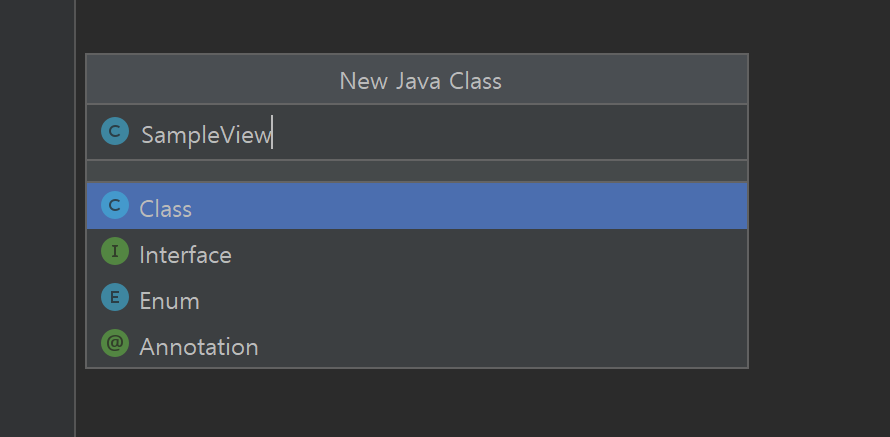
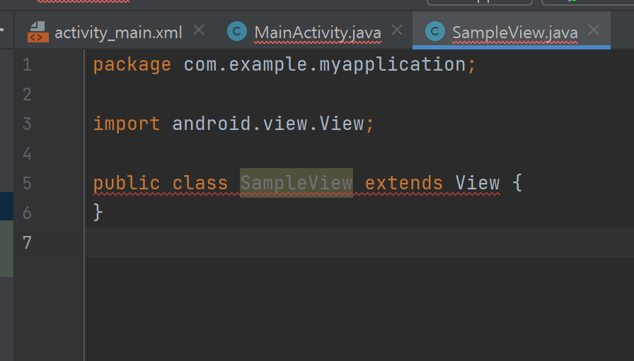
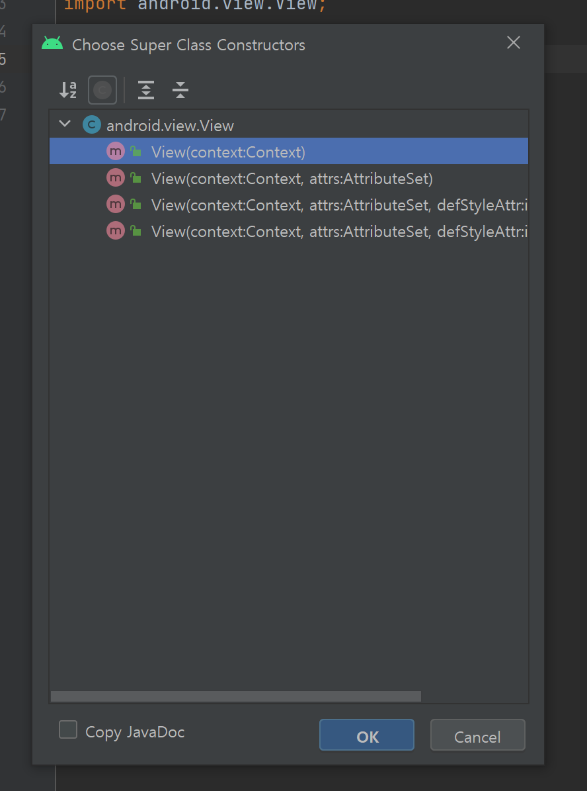
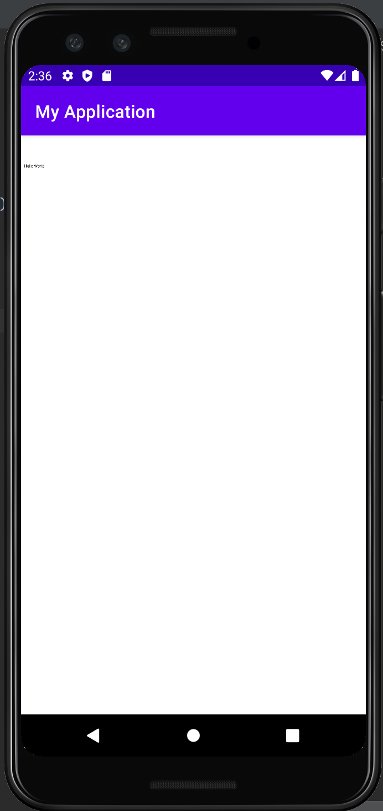
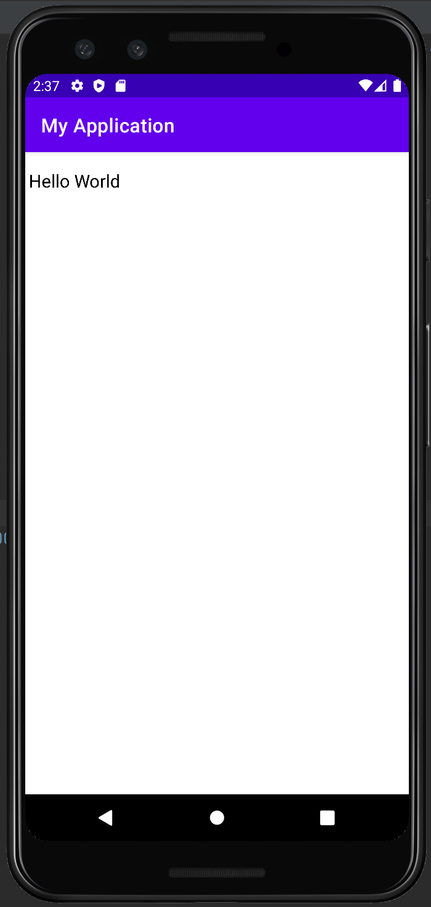

## 2021.10.31_4.2누구나5분이면따라하는앱만들기

### 애플리케이션 만들기



- Empty Activity 클릭



-  현재 상태로 나오게 되는데 그대로 일단 진행하면된다.
- 나중에 마켓에 올리는경우 수정해야하는 부분이 있지만 그것은 이후에 하면됨


- New -> Java Class를 클릭



- SampleView라는 클래스를 생성

```java
package com.example.myapplication;

public class SampleView {
}
```

- 처음 생성하게 되면 우리가 현재 View를 상속받아야하는데 그렇게 해서 만들지 않았기 때문에 뷰를 상속시켜야함

```java
package com.example.myapplication;

import android.view.View;

public class SampleView extends View {
}
```



- 저렇게 에러가 잡히는데 이게 생성자가 없어서 생기는 것이다.
- 그래서 생성자를 생성해야하는데 
  - 단축키는 alt+enter을 해주면됨


- Create constructor matching super 클릭



- 제일 위에 있는것으로 해서 ok를 해준다.

```java
package com.example.myapplication;

import android.content.Context;
import android.view.View;

public class SampleView extends View {
    public SampleView(Context context) {
        super(context);
    }
}
```

- 그러면 이렇게 된다. 여기까지 일단 완료된것이다.

```java
package com.example.myapplication;

import android.content.Context;
import android.graphics.Paint;
import android.view.View;

public class SampleView extends View {
    private Paint paint = new Paint(); //추가
    public SampleView(Context context) {
        super(context);
    }
}
```

- paint를 추가해준다. 이때도 import가 자동으로 안된다면 alt+enter해서 임폴트해줘야함

```java
package com.example.myapplication;

import android.content.Context;
import android.graphics.Canvas;
import android.graphics.Color;
import android.graphics.Paint;
import android.view.View;

public class SampleView extends View {
    private Paint paint = new Paint();
    public SampleView(Context context) {
        super(context);
        setBackgroundColor(Color.WHITE);
    }

    @Override
    protected void onDraw(Canvas canvas) {
        super.onDraw(canvas);
        canvas.drawText("Hello World",10,100,paint);
    }
}

```

- 현재 처럼 x좌표 10, y좌표 100의 위치에 Hello world를 그려라라는 의미

## MainActivity

```java
package com.example.myapplication;

import androidx.appcompat.app.AppCompatActivity;

import android.os.Bundle;

public class MainActivity extends AppCompatActivity {

    @Override
    protected void onCreate(Bundle savedInstanceState) {
        super.onCreate(savedInstanceState);
        //setContentView(R.layout.activity_main);
        setContentView(new SampleView(this));
    }
}
```

- 위와 같이 하면 액티비티가 실행될때 우리가 생성한 SampleView가 실행됨



- 글씨가 엄청 작게 나오는데 크게 하려면 SampleView에 하나를 추가해준다.

```java
package com.example.myapplication;

import android.content.Context;
import android.graphics.Canvas;
import android.graphics.Color;
import android.graphics.Paint;
import android.view.View;

public class SampleView extends View {
    private Paint paint = new Paint();
    public SampleView(Context context) {
        super(context);
        setBackgroundColor(Color.WHITE);
    }

    @Override
    protected void onDraw(Canvas canvas) {
        super.onDraw(canvas);
        paint.setTextSize(50);
        canvas.drawText("Hello World",10,100,paint);
    }
}

```

- `        paint.setTextSize(50);` 이것을 추가해서 글씨를 조절할 수 있음



## 원본

