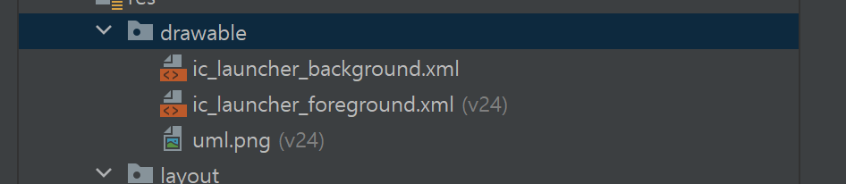
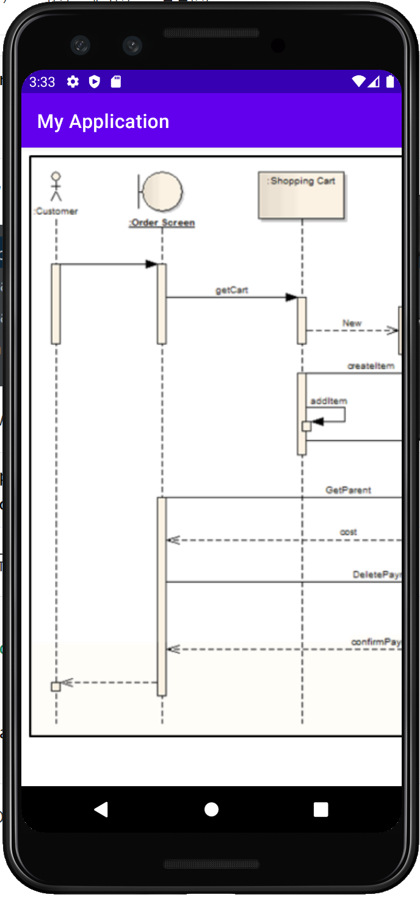
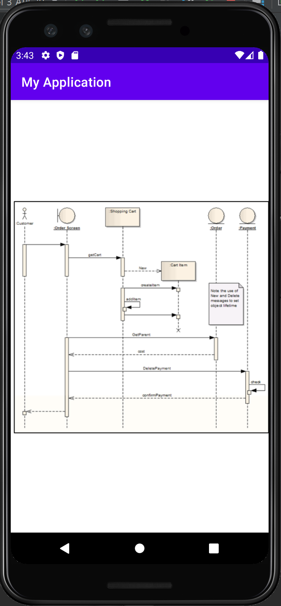

## 2021.10.31_4.3디지털액자완성앱만들기

## 파일 구성

```java
import android.content.res.Resources;

        Resources res = context.getResources();
```

- 위와 같이 import가 되어있어야 아래와 같이 선언할 수 있음



- 위와같이 res/drawable에 사진이 들어 있어야함

``` java
private Bitmap bmp;
 bmp = BitmapFactory.decodeResource(res, R.drawable.uml);
```

- 위와 같이 소스를 구성하면 됨 

```java
    @Override
    protected void onDraw(Canvas canvas) {
...

        canvas.drawBitmap(bmp,0,0,null);
    }
```

- 위와 같이 해주면 이미지를 그릴 수 있음



- 위와 같이 화면에 사진을 표시 할 수 있음

## xml로 이미지 불러오기

```xml
    <ImageView
    android:layout_width="match_parent"
    android:layout_height="match_parent"
    android:src="@drawable/uml" />
```

- xml을 이미지 불러오기 소스 



- 위와같이 화면이 나오게됨 대신 MainActivity에 이렇게 해줘야함

```java
package com.example.myapplication;

import androidx.appcompat.app.AppCompatActivity;

import android.os.Bundle;

public class MainActivity extends AppCompatActivity {

    @Override
    protected void onCreate(Bundle savedInstanceState) {
        super.onCreate(savedInstanceState);
        setContentView(R.layout.activity_main);
        //setContentView(new SampleView(this));

    }
}
```

## 원본

