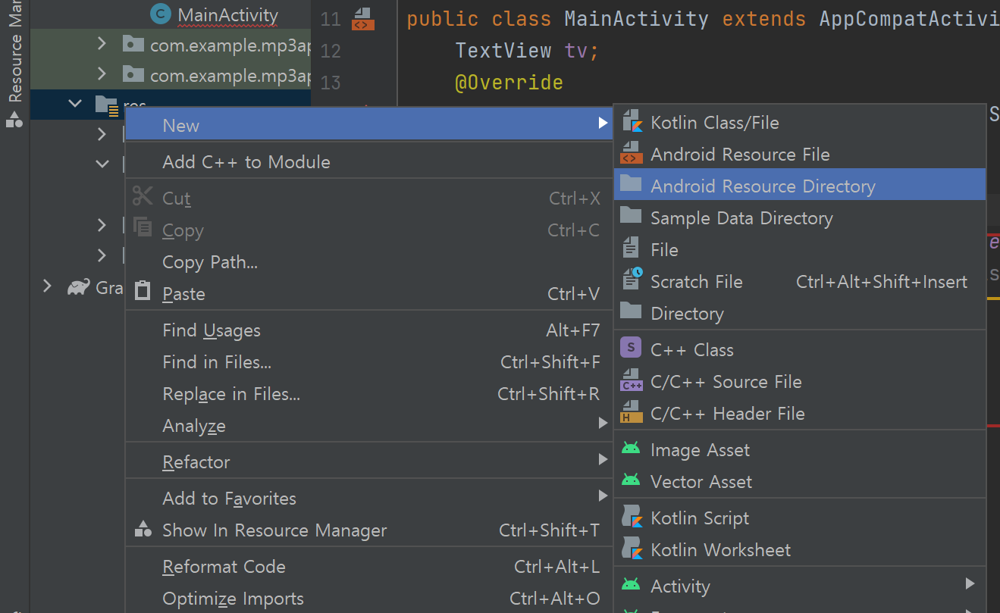
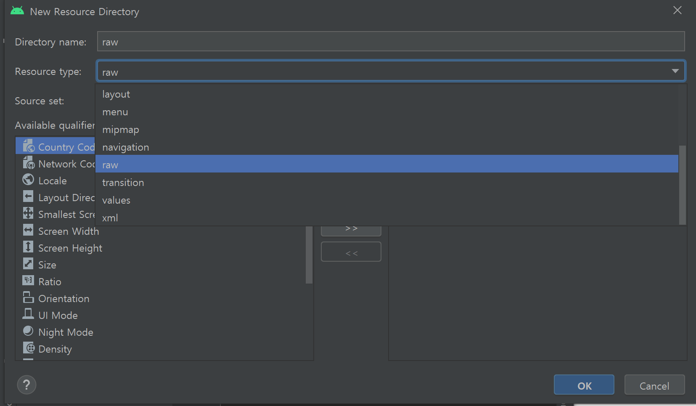
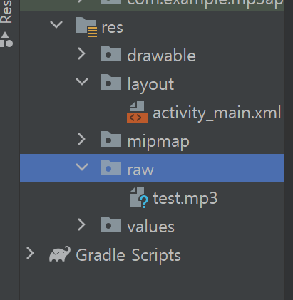
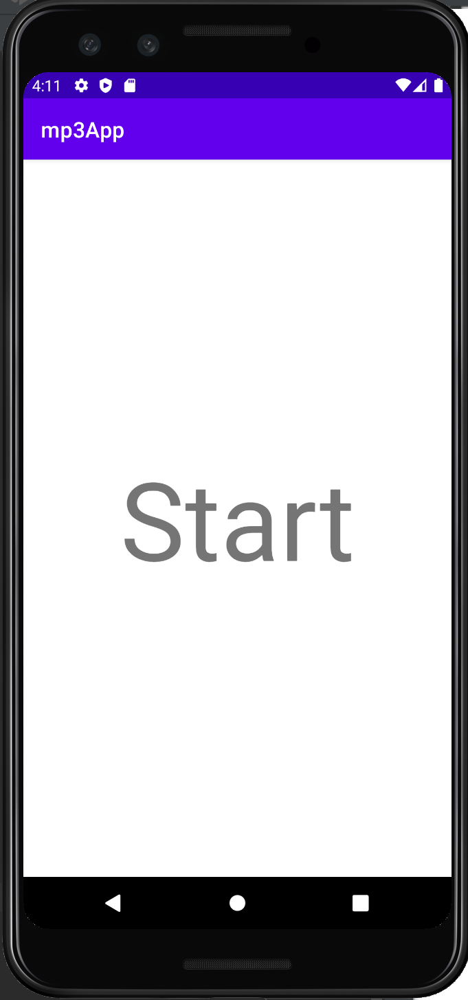
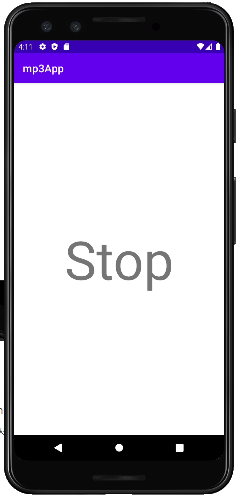

## 2021.10.31_4.4초보자도10분이면Mp3플레이어만들기

### 버튼 방식

- 버튼같이 구성 할 수 있는 방식에는
  - `<Button/>`
  - `<ImageButton/>`
  - `<TextView/>`
    - 텍스트 뷰에서 자체적으로 클릭할 수 있게도 가능함

#### TextView 클릭 방식으로 적용 하기

### Before

```xml
    <TextView
      android:layout_width="wrap_content"
      android:layout_height="wrap_content"
      android:text="Hello World!"
      app:layout_constraintBottom_toBottomOf="parent"
      app:layout_constraintLeft_toLeftOf="parent"
      app:layout_constraintRight_toRightOf="parent"
      app:layout_constraintTop_toTopOf="parent" />
```

### After

```xml
    <TextView
        android:id="@+id/helloButton"
      android:layout_width="wrap_content"
      android:layout_height="wrap_content"
      android:text="Play" 
        android:textSize="100dp"
      app:layout_constraintBottom_toBottomOf="parent"
      app:layout_constraintLeft_toLeftOf="parent"
      app:layout_constraintRight_toRightOf="parent"
      app:layout_constraintTop_toTopOf="parent" />
```

``` xml
        android:id="@+id/helloButton"
      android:text="Play" 
        android:textSize="100dp"
```

- 3개의 부분을 추가 및 수정을 해줌

## mp3파일 추가



- res 폴더에서 오른쪽 클릭 New -> Android Resource Directory클릭



- value를 raw로 변경

- 그렇게 하고 mp3파일을 생성된 raw넣는다.



- 위와 같은 상태가 되어야함



- 클릭전 상태


- 클릭 후 노래가 재생 되고 글씨가 바뀌는것이 확인 됨
- 물론 이게 완벽한 mp3앱은 아니지만 기본적으로 이렇게 되는것
  - 여기서 응용해서 발전하는게 베스트이다.  


## 원본

  

