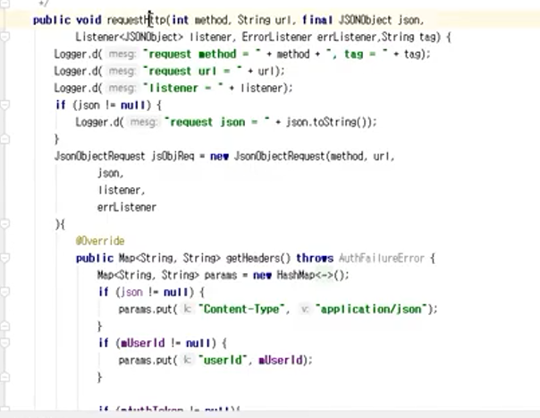

##  2021.11.01_5.1앱과서버와연동개발

### 앱과 서버

- 안드로이드 앱 
  - 서버 <-> 클라이언트 통신
- 클라이언트 <-> 서버
- 클라이언트 : 앱
- 서버 : api , web server
- Http로 정보 전달
- 클라이언트를 어떻게 만들것인가
  - 웹앱(웹에서 보여주는것)
    - 네이버앱
  - 네이티브앱 (하나하나 만드는 것)
    - 카카오앱
  - 하이브리드앱
    - 짬뽕 되어있는것
- 웹앱으로 접속시 모바일 전용을 만들거나
- 두가지 페이지 있는데 모바일인지 PC인지에 따라서 주는것
- 클라이언트 HTTP 호출할 수 있는 콘솔 호출하면됨

### API

- API는 {}JSON 형식 XML <> 형식 등등
  - OPEN하면 OPENAPI 이고 ,
    - 풀어쓰면 Restful API 이다.
- 공공 데이터 오픈하는것은 플랫폼 자체를 확장할 수있고 결국 비지니스 전략
  - RESTful은 기술적인 것
    - 사람이 이해하기 쉽게 표현한것
    - get
    - post
    - put
    - delete
- DB의 CRUD와 매칭됨
- 오픈 api 데이터를 제공하는 공공테이더 사이트도 있음

## 앱 호출

- http 매니저를 이용해서 사용

- 응답의 흐름
  - 앱에서 http로 sever로 호출
    - 우선 비동기로 진행됨
    - 대부분 비동기
    - 응답은 callback()으로 받음
      - 응답값 파싱해서 처리하거나 씀
  - httpmanager sample 소스를 확인하면 좋다.

## 원본

