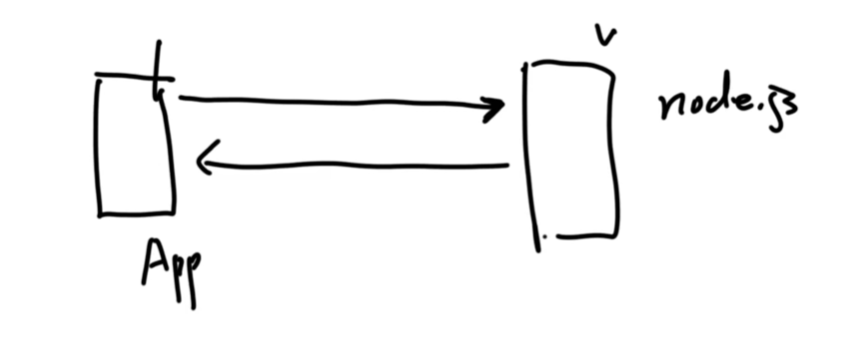
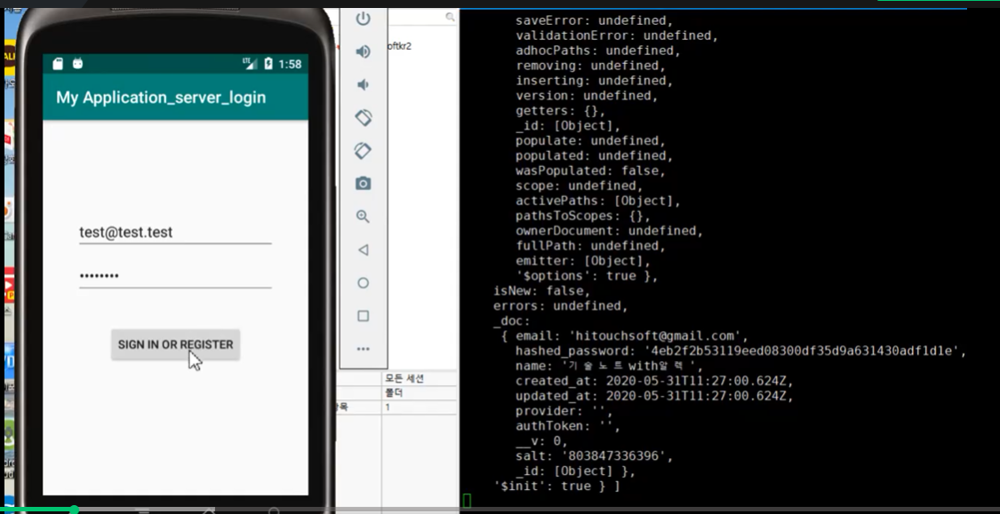
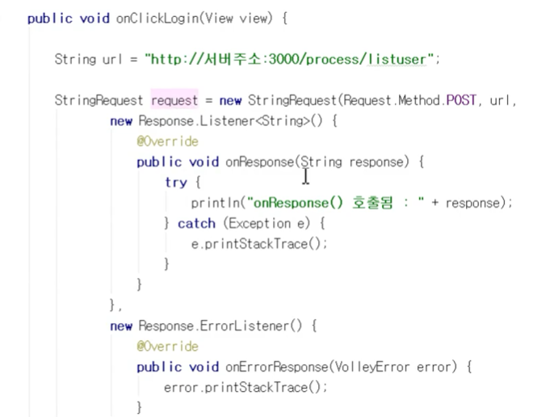
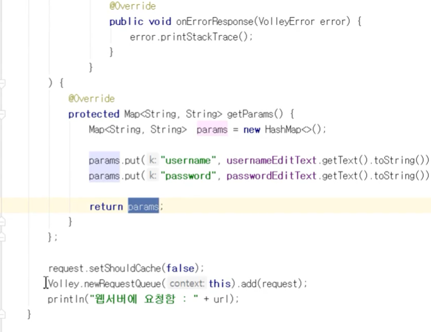
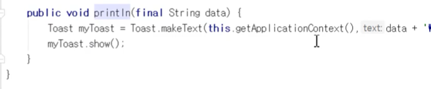

## 2021.11.01_5.2모바일용서버구축

- 이렇게 있음
- 정재곤 doit 의 node.js의 책에 mobileExample의 소스를 참고

## 클라이언트 호출 부분

- 버튼 눌렀을때 함수로 들어가고
- 호출할 url에 들어가고 그리고 맵에 유저와 비번 넣음

- 통신용 볼리로 해서 보내줌

- 이것은 어떻게 찍히는지 확인하는 부분
- 안드로이드 소스와 node.js 부분 소스가 있으니 참고 하기

## 원본

