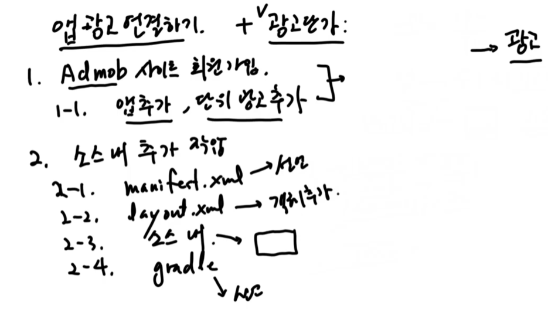
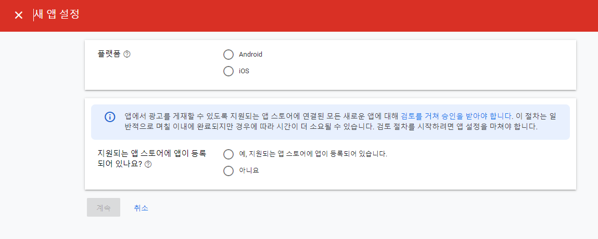
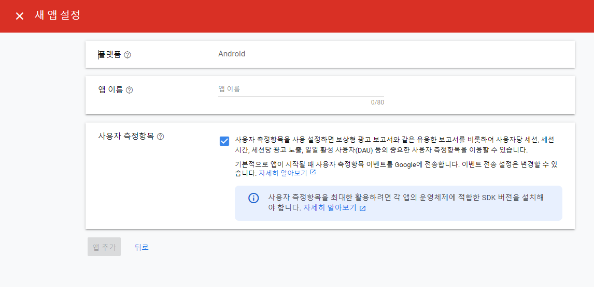
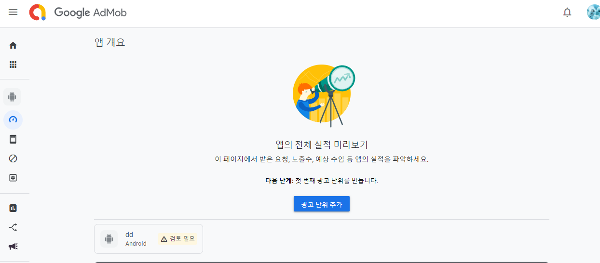
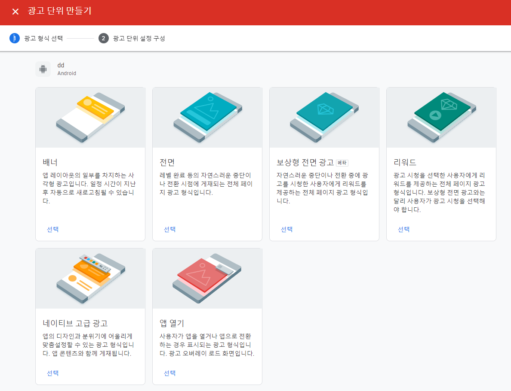
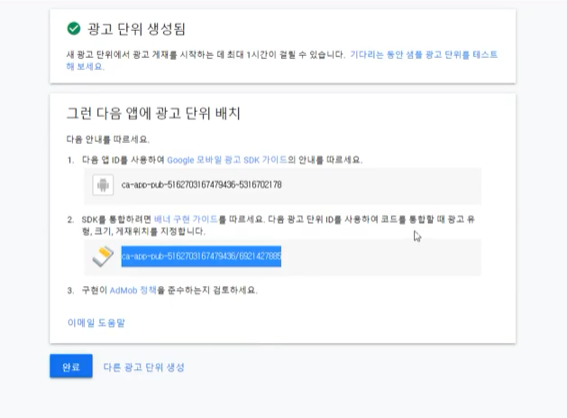
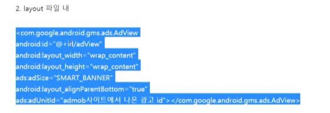

## 2021년11월04일_6.1어플수익을위한광고연결하기

- 수익화가 어렵다. 
- 사용자에게 불편하지만 우리에게는 좋음
- 구글에서도 대부분 수익 광고에서 난다.
- 과한 정도가 아니라면 적정선 맞춰서 하기에는 좋다고 생각함

## 광고 단가?

- 앱의 하단 배너가격
  - 0.55달러 /2 = 0.25달러 니까 대략 300원 정도
  - 300회 에서 2번 정도 클릭된것 잘 누르지 않기때문에 수익이 적다.
- 보상 광고 수익

- ADMOD에서 하는것

- 요새는 저런식으로 바뀜 위의 경우 앱이 등록되어 있는경우

- 앱이 없는 경우

 

- 광고 단위 추가 누르면 선택이 가능함

- 이렇게 선택가능함 예전에 배너 형식으로 만들었음

- 저걸 나중에 추가한다.
- 위치를 선언을 해주고 소스내에 클래스 생성해서 함수 호출해서 로딩하는것이 있고
- gradle에 sdk쓴다고 선언하면됨

- 이런 곳에 선언한다.

## 원본
