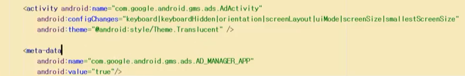
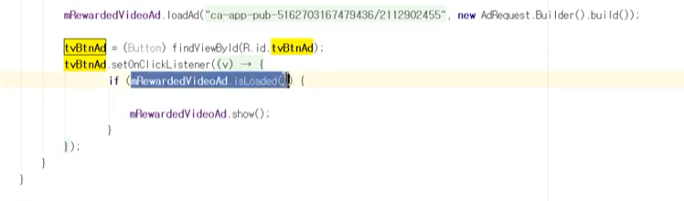
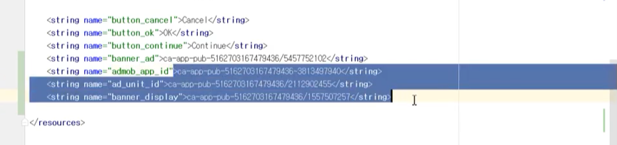
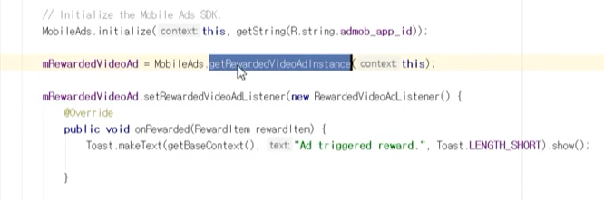

## 2021년11월05일_6.2앱전면광고소스및설명

- 전면광고르 위한 작업 설명

  - 버튼 클릭시 광고 넘어가는 식으로 구현

-  mainifest.xml부분의 해당 액티비티에

  
  - 이부분을 추가해야함

- 

- 이 아이디를 써야하기 때문에 중요하다.
- 

## 리워드 비디오 부분

​	

- 그리고 무작정 광고를 띄우면 경고를 받기 때문에 이점은 주의해야한다.

## 원본
