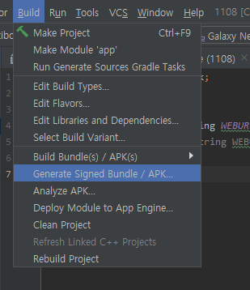
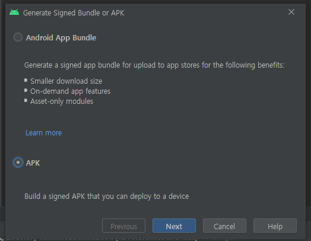
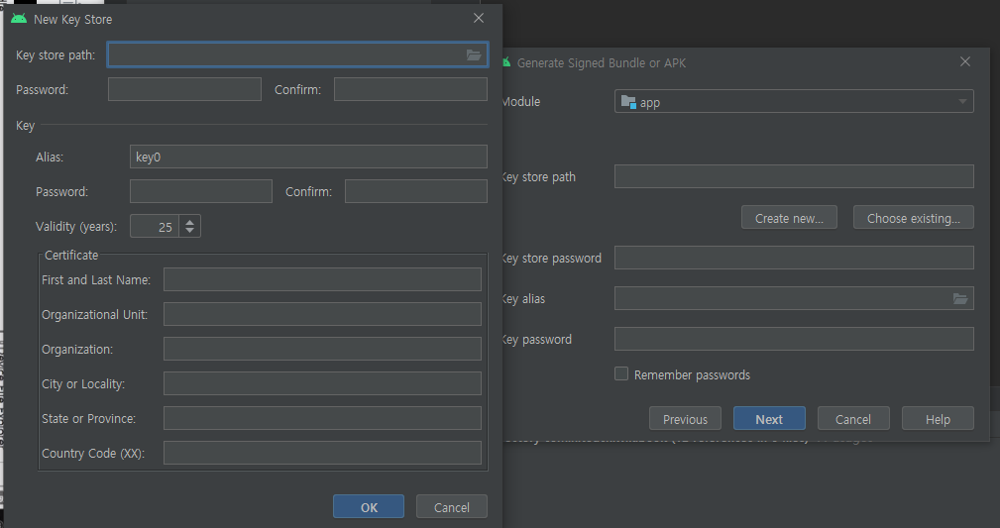
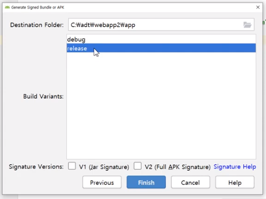
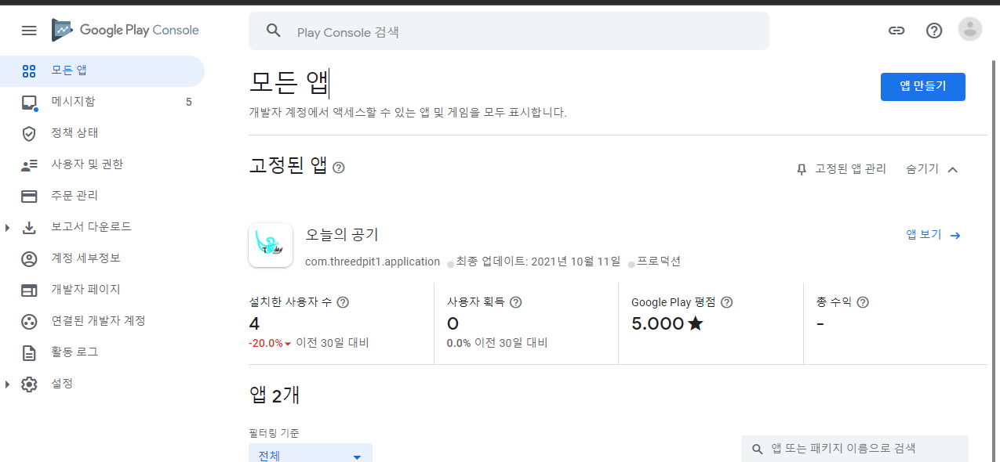
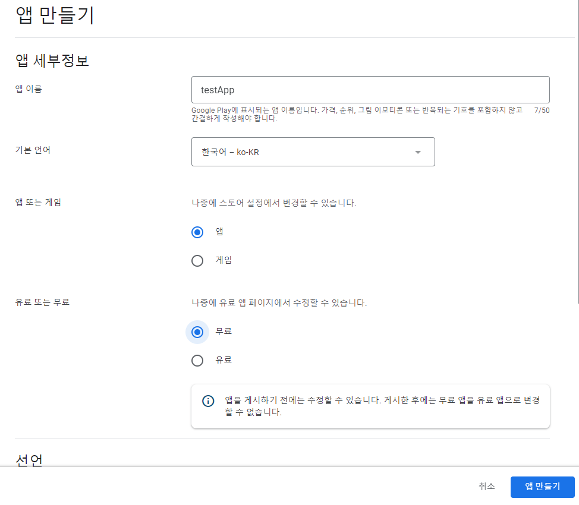
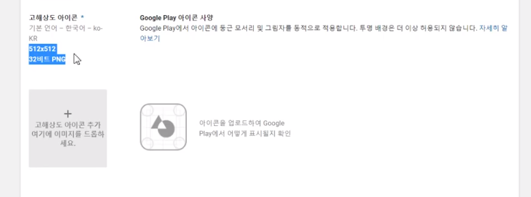

## 7.1구글스토어앱등록하기절차따라하기

- 어플 - 구글 플레이 스토어 등록
- Webview - URL
  - 이 앱을 스토어에 올리는 법
- release 정보만 올릴 수 있음
  - apk버전임
  - debug는 안됨

## 등록 전 절차

- 위의 곳을 클릭

- apk 클릭 next

key Store는 필수다 잘 적어놓으면됨

- v1, v2 전체 클릭해서 끝낸다.

## 사이트에 등록하기

[안드로이드 개발자 사이트](https://play.google.com/apps/publish)

- 앱만들기 클릭

- 이름 설정하고 앱만들기

- 이미지가 필요하다.
- 이미지 조절하는 사이트 들어가서 이미지 만들어서 조절해서 넣어주면됨

- 이런것 까지 입력하면 이제 한개 끝난것
- 일단 위의 경우는 이전 버전이라 추후에 새로운 것으로 변경 예정

## 원본

