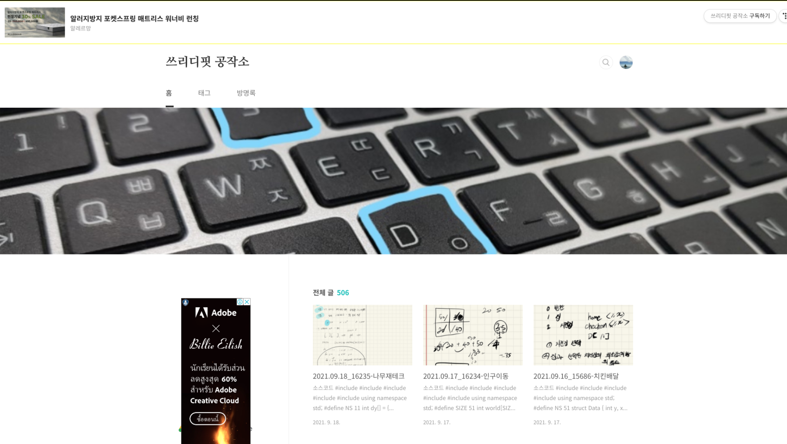
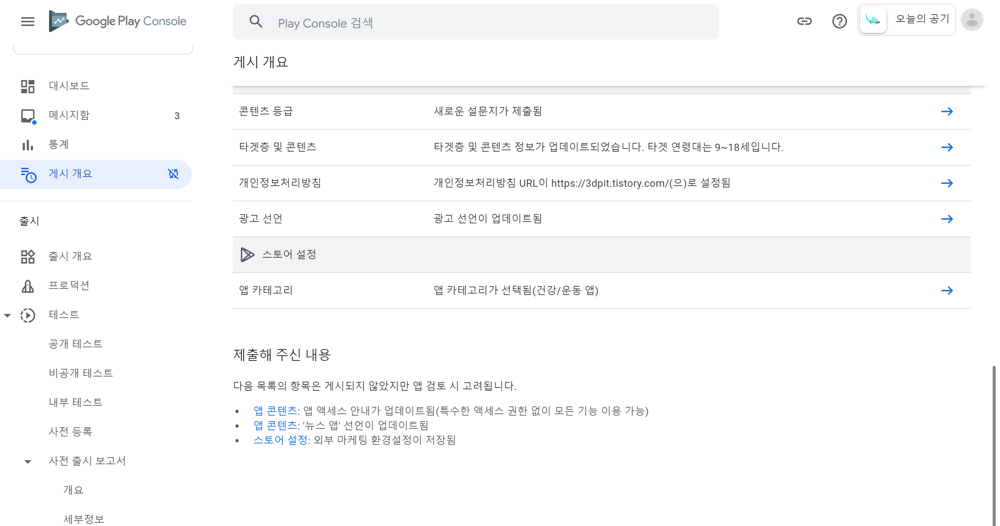
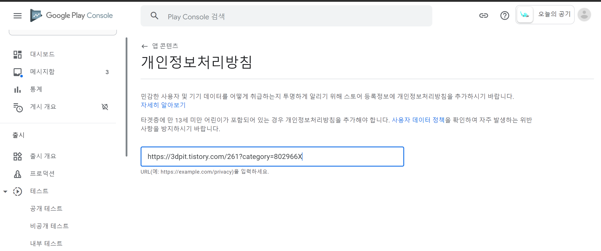

## 2021.09.20_안드로이드배포앱-정책문제

- 갑자기 어느순간 앱이 실행이 되지 않은 문제가 발생
- 어떤문제인지 찾다가 구글에서 보낸 메일 확인

- 메일을 보니 정확한것은 아니지만 앱을 배포하기전에 개인정보처리방침 문서 작성해서 어떤식으로 개인정보를 처리 보관 할것인지에 대한 링크를 걸었는데 그 링크가 제대로 나오지 않아서 생기는 문제인듯 싶음
- 구글에서 첨부한 이미지

- 저 화면이 나오면 안되는데 이화면이 링크에 보여서 문제된것 같음

- 블로그 홈으로 설정되어있는 문제 확인

- 이전에 만든 자료를 찾았음
- 이 개인정보처리 방침 부분을 링크를 다시 걸어줘야함

- 이렇게 링크를 걸어놓고 저장 진행

- 그리고 기다리면 결과를 알수 잇는데 1-3 일 정도 소요될수 있음

## 결과

- 결과에 대해서는 추후에 나오게 되면 저장하겠음
- 현재 안드로이드 상태

- 현재 이상태를 유지하고 켜지지 않다가 정지하는 현상임