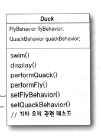

## 21.11.07_디자인패턴소개1-2

## 인터페이스는 어떨까요?

- 6개월 마다 제품을 갱신한다면?
- 매번 Duck의 서브클래스의 fly()와 quack() 메소드를 일일이 살펴봐야하고 상황에 따라 오버라이드 해야함


- 슈퍼 클래스에서 fly() 메소드가 들어있는 Flyable 인터페이스를 만듦

- 이 인터페이스를 구현해서 fly() 메소드를 집어넣을 수 있음

- Quackable 이라는 인터페이스를 만들어도 됨

  - 모든 서브 클래스에서 날거나, 꽥꽥 거리는 기능이 있어야하는 것은 아니므로
  - 상속하는것이 올바른 해결책이 아니라는 것을 알 수 있음

- 서브클래스에서 Flyable, Quackable을 구현하도록 하면, 기능적인 문제는 해결 

  - 대신 코드 재사용은 전혀 기대 못함
  - 코드 관리면에서도 별로임

- 관리 하는 면에서도 또다른 커다란 문제점이 생기게 됨 

- 날 수 있는 오리 중에서도 날아다니는 방식이 서로 다를수 있음 

- 구식이지만 객체지향 소프트웨어 디자인 원칙을 적용하는 방법으로 해법은 찾아보자. 

## 코드를 바꿔야 했던 이유 
- 고객이나 사용자가 다른 것을 요구하는 경우 , 또는 새로운 기능을 원하는 경우
- 회사에서 DB의 종류를 바꾸고, 데이터도 전과 다 른 데서 구입하기로 했는데, 새회사에서 다른 데이 티 형식을 사용하는 경우
- 상속의 문제점 - 무조건 상속으로 해결되지X 
- 인터페이스 문제점 - 자바 인터페이스 에는 구현된 코드가 전혀 들어 가지 않기 때문에 코드를 재사용 할 수없다는 문제 있음
- **위와 같은 상황에서 어울리는 첫번째디자인원칙**
  - 앱에서 달라지지 않는 부분 을 찾아 내고 달라지 지 않는 부분 으로 부터 분리 시킴
  - 포인트
    - 달라지는 부분을 찾아서 나머지 코드에 영향 주 지 않도록 캡슐화
    - 바뀌는 부분 
      - fly(), quack() 오리마다 달라지는 부분
    - 바뀌지 않는 부분
      - DucK 클래스 
## 오리의 행동 디자인
- 우선 최대한 유연하게 
- Duck 인스턴스에 행동할당 가능 하게
  - 예를 들면 Mallard Duck 인스턴스를 새로 만들고 특정 형식의 나는 행동으로 초기화
  - 오리의 행동을 동적으로 
    - 즉, Duck 클래스에 행동과 관련된 setter 메소드를 포함시켜서
      - 프로그램 실행중에도 MallardDuck의 나는 행동을 바꿀 수 있도록 하면 좋음
- **두번째 디자인 원칙**
  - 구현이 아닌 인터페이스에 맞춰서 프로그래밍
  - 각 행동은 인터페이스 (FlyBehavior, QuackBehavior)로 표현하고 
    - 행동을 구현할 때 이런 인터페이스를 구현하도록 함
      - 나는 행동과 꽥꽥 거리는 행동은 Duck 클래스에 구현 안함
      - 대신 특정 행동(삑삑 소리 내기 와 같은 행동)만을 목적으로 하는 클래스의 집합을 만듦
        - 행동 인터페이스는 Duck클래스가 아닌, 행동 클래스에서 구현
  - 지금까지 방법은 행동을 Duck클래스에서 구체적으로 구현하거나 서브클래스 자체에서 별도로 구현하는 방법하고는 상반된 방법
    - 전에 썼던 두 방법은 항상 특정 구현에 의존
      - 특정 구현을 써야만 했기 때문에(코드를 더 작성하는 것 외에는) 행동을 변경할 여지가 없었음
  - 새로운 디자인
    - Duck의 서브 클래스에서는 인터페이스 (FlyBehavior, QuackBehavior)로 표현되는 행동을 사용하게됨
      - 따라서 행동을 실제로 구현한 것은 Duck 서브 클래스에 국한 되지 않음
-  여기서 부터는 Duck의 행동은 (특정 행동 인터페이스를 구현한) 별도의 클래스 안에 들어있게 됨
  - 그렇게 하면 Duck 클래스에서는 그 행동을 구체적으로 구현하는 방법에 대해서는 더 이상 알고 있을 필요가 없음


### 인터페이스에 맞춰서 프로그래밍한다? 는 것은 사실 상위 형식에 맞춰서 프로그래밍한다.를 뜻함

- 여기서 인터페이스라는 단어가 중의적으로 쓰여있음 
- 인터페이스는 자바의 인터페이스라는 구조를 지칭하는 용도
  - 여기에서 인터페이스에 맞춰서 프로그램이하라고 했다고 해서 반드시 자바의 인터페이스를 사용하라는것은 아님
  - **여기서 핵심적인 것은 위 형식(supertype)에 맞춰서 프로그래밍함으로써 다형성을 활용해야한다는 것**
  - 그리고, 상위 형식에 맞춰서 프로그래밍 하라 는 원칙은 변수를 선언할 때는 보통 추상 클래스나 인터페이스 같은 상위 형식으로 선언해야한다. 
    - 객체를 변수에 대입할 때 상위 형식을 구체적으로 구현한 형식이라면 어떤 객체든 집어넣을 수 있기 때문
      - 이렇게 한다면 변수를 선언하는 클래스에서 실제 객체의 형식을 몰라도 된다 라는 것으로 생각하면됨

## 다형성 형식을 사용하는 예

- Animal이라는 추상 클래스가 있고,

  - 그 밑에 Dog와 Cat이라는 구상 클래스가 있다고 가정하자.

- 구현에 맞춰서 프로그래밍 한 경우

  ```java
  Dog d = new Dog();
  d.bark();
  ```

  - 변수 d를 Dog형식(Animal을 확장한 구상 클래스)으로 선언하면 어떤 구체적인 구현에 맞춰서 코딩해야함

- 인터페이스/ 상위 형식에 맞춰서 프로그래밍한 경우 

  ```java
  Animal animal = new Dog();
  animal.makeSound();
  ```

  - Dog이라는 것을 알고 있긴 하지만 다형성을 활용하여 Animal에 대한 레퍼런스를 써도 됨

- 더 바람직한 방법

  ```java
  a = getAnimal();
  a.makeSound();
  ```

  -  Animal의 하위 형식 가운데 어떤 형식인지는 모름 
    - 단지, makeSound()에 대해 올바른 반응을 할 수 있으면 됨

## Duck의 행동을 구현하는 방법

- 이곳에서는 현재 FlyBehavior와 QuackBehavior이라는 두 인터페이스를 사용 
  - 그리고 구체적인 행동을 구현하는 클래스들이 있음


- 위와 같이 디자인하면 다른 형식의 객체에서도 나는 행동과 꽥꽥거리는 행동을 재 사용할 수 있음
  - 그런 행동이 더 이상 Duck클래스 안에 숨겨져 있지 않기 때문
- 그리고 기존의 행동 클래스를 수정하거나 날아다니는 행동을 사용하는 Duck 클래스를 전혀 건드리지 않고도 새로운 행동을 추가할 수 있음
  - 따라서 상속을 쓸 때 떠안게 되는 부담을 전부 떨쳐 버리고도 재사용의 장점을 그대로 누릴 수 있음

### 연필을 깍으며

- 이 디자인을 이용할 때 SimUDuck 앱에 로켓 추진으로 나는 기능을 추가해야 한다면 어떻게 할것 인가?
  - FlyBehavior 인터페이스를 구현하는 FlyRocketPowered 클래스를 만들면 됨
- 오리 클래스가 아닌 클래스에서 Quack행동을 사용할 만한 일이 있을지 생각해보기
  - 예를 들자면 오리 호출기(오리 소리를 내는 장치)를 만드는 경우에 활용할 수 있음

## Duck 행동 통합하기

- 가장 중요한 점은 이제 Duck에서 나는 행동과 꽥꽥 소리를 내는 행동을 Duck클래스(또는 그 서브 클래스)에서 정의한 메소드를 써서 구현하지 않고 다른 클래스에 위임한다는 것

- 하는 방식

  - 우선 Duck 클래스에서 flyBehavior와 quackBehavior라는 두 개의 인터페이스 형식의 인스턴스변수를 추가할 것 (특정 구상 클래스 형식으로 선언하지 않음)
  - 각 오리 객체에서는 실행시 이 변수에 특정 행동 형식 (FlyWithWings, Squeak등) 에 대한 레퍼런스를 다형적으로 설정
  - 그리고 나는 행동과 울음 행동은 FlyBehavior와 QuackBehavior 인터페이스로 옮겨 놨기 때문에 Duck클래스 및 모든 서브 클래스에서 fly()와 quack()메소드도 제거해야함
  - 그리고 Duck 클래스에서 fly()와 quack()대신 performFly()와  performQuack()이라는 메소드를 집어넣음


## performQuack()구현

```java
public class Duck{
  QuackBehavior quackBehavior;
  // 기타코드
  
  public void performQuack(){
    quackBehavior.quack();
  }
}
```

-  모든 Duck에는 QuackBehavior 인터페이스를 구현하는것에 레퍼런스없음
- 꽥꽥 거리는 행동을 직접 처리하는 대신 quackBehavior로 참조되는 객체에 그 행동을 위임
  - 여기서 중요한것은 quack()을 실행시킬 줄 안다는 것이 중요할 뿐

## flyBehavior와 quackBehavior 인스턴스 변수를 설정하는 방법

```java
public class MallarDuck extends Duck{
  public MallardDuck(){
		quackBehavior = new Quack();
    flyBehavior = new FlyWithWings();
    
    public void display(){
			System.out.println("저는 물오리 입니다.");
    }
  }
}
```

## Duck 코드 테스트

```java
public abstract class Duck{
  FlyBehavior flyBehavior;
  QuackBehavior quackBehavior;
  public Duck(){
}
 // 행동 인터페이스 형식의 레퍼런스 변수 두 개를 선언
 // 모든 서브 클래스에서 이 변수를 상속
  public abstract void display();
  public void performFly(){
		flyBehavior.fly();
  }	
  
  public void perfomQuack(){
		quackBehavoir.quack();
  }
  
  public void swim(){
		System.out.println("모든 오리는 물에 뜹니다, 가짜 오리도 뜨죠");
  }
}
```

## FlyBehavior 인터페이스, 두 개의 행동 구현 클래스

``` java
public interface FlyBehavior{
  public void fly();
}
// 이 인터페이스는 모든 나는 행동에 대한 클래스를 구현함

public class FltWithWings implements FlyBehavior{
	public void fly(){
		System.out.println("날고 있어요!");
  }
}
// 실제로 날 수 있는 오리들의 나는 행동을 구현한 클래스

public class FlyNoWay implements FlyBehavior{
  public void fly(){
		 System.out.println("저는 못 날아요!");
  }
}
// 가짜 오리나 진짜 날 수 없는 오리들의 나는 행동을 구현한 클래스
```

## QuackBehavior 인터페이스와 세 개의 행동 구현 클래스 

```java
public interface QuackBehavior{
  public void quack();
}

public class Quack implements QuackBehavior{
  public void quack(){
		System.out.println("꽥");
  }
}

public class MuteQuack implements QuckBehavior{
  public void quack(){
		System.out.println("<<조용 ~ >>");
  }
}

public class Squeak implements QuackBehavior{
  public void quack(){
		System.out.println("삑");
  }
}

public class MiniDuckSimulator{
  public static void main(String[] args){
		Duck mallard = new MallardDuck();
    mallard.performQuack();
    mallard.performFly();
  }
}
```

- mallard.performQuack(); 이렇게 하면 MallardDuck에서 상속받은 
  - performQuack()메소드가 호출됨
  - 이 메소드에서는 객체의 QuackBehavior에게 할 일을 위임 (즉, quackBehavior 레퍼런스의 quack()메소드가 호출됨)

## 동적으로 행동을 지정하는 방법

1. Duck 클래스에 메소드 두개를 새로 추가



```java
public void setFlyBehavior(FlyBehavior fb){
	flyBehavior = fb;
}

public void setQuackBehavior(QuackBehavior qb){
	quackBehavior = qb;
}
```

2. Duck의 서브 클래스를 새로 만듦

```java
public class ModelDuck extends Duck{
  	public ModelDuck(){
				flyBehavior = new FlyNoWay();
      	quackBehavior = new Quack();
    }
  	public void display(){
      System.out.println("저는 모형오리 입니다.");
    }
}
```

3. FlyBehavior 형식의 클래스를 새로 만듦

``` java 
public class FlyRocketPowered implements FlyBehavior{
  public void fly(){
		System.out.println("로켓 추진으로 날아갑니다.");
  }
}
```

4.  테스트 클래스 수정
   - ModelDuck을 추가 하고 ModelDuck에 로켓 추진 기능 부여

``` java
public class MiniDuckSimulator{
  public static void main(String[] args){
		Duck mallard = new MallardDuck();
    mallard.performQuack();
    mallard.performFly();
  
    Duck model = new ModelDuck();
    model.performFly();
    model.setFlyBehavior(new FlyRocketPowered());
    model.performFly();
  }
}
```

-  실행중에 오리의 행동을 바꾸고 싶으면 원하는 행동에 해당하는 Duck의 세터 메소드를 호출하기만 하면됨


## A는 B이다 보다 A에는 B가 있다 가 나을 수 있음

- A에는 B가 있다 관계에 대해 생각해 보면
  - 각 오리에는 FlyBehavior와 QuackBehavior가 있으며, 각각 행동과 꽥꽥 거리는 행동을 위임 받음
  - 두 클래스를 이런 식으로 합치는 구성을 이용하는 것이라고 부름
- 여기에 나와있는 오리 클래스에서는 행동을 상속 받는 대신, 올바른 행동 객체로 구성됨으로 써 행동을 부여 받게됨

- **세번째 디자인 원칙**
  - 상속 보다는 구성을 활용

- 지금 까지 배운 것이 스트래티지 패턴(strategy pattern)

## 스트래티지 패턴

- 알고리즘군을 정의하고 각각을 캡슐화하여 교환해서 사용할 수 있도록 만듦
- 위를 사용하면 알고리즘을 사용하는 클라이언트와는 독립적으로 알고리즘을 변경할 수 있음