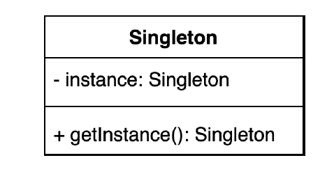

## 2021.11.11_싱글톤패턴1-싱글톤패턴을가장단순히구현하는방법

## 싱글턴 패턴

- 어떤 클래스의 인스턴스를 오직 하나만 

- 그하나만 존재하는 인스턴스에 접근할 수 있는 글로벌하게 액세스할 수있는 방법 제공해야함

  

```java
Settings settings = new Settings();
settings settings1 = new Settings();
```

- 두개를 비교하면 다르다 
- 싱글톤을 사용하려면 new를 사용하면 안된다.

- 그렇게 하려면 아래와 같이 한다.

```java
public class Settings{
  private Settings(){}
}
```

- 이러면 클래스 밖에서 사용 못함
- 밖에서 인스턴스 못만들어서 Settings안에서 글로벌 접근 가능하게 함

```java
public class Settings{
  private Settings(){ }
      public static Settings getInstance(){
      return new Settings();
  }
}

// main문에서 선언
public static void main(String[] args){
	Settings settings = Settings.getInstance();
  Settings settings1 = Settings.getInstance();
  System.out.println(settings ==settings1);
}

// 결과
false
```

- 이렇게 하더라도 new를 썼기때문에 이전과 같은 결과가 나온다 두개가 다르다가 아님 같다가 나와야함

```java
public class Settings{
private static Setttings instance ;

  private Settings(){ }
      public static Settings getInstance(){
        if(instance == null){
     			 instance = new Settings();
       }
        return instance ;
  }
}

// main문에서 선언
public static void main(String[] args){
	Settings settings = Settings.getInstance();
  Settings settings1 = Settings.getInstance();
  System.out.println(settings ==settings1);
}

// 결과
true
```

- 이렇게 하면 매번 같은 인스턴스가 나오게 된다.

- 이방법이 나이브하게 구현한 방법
  - 심각한 문제가 있는데 
    - 웹앱을 예로 들면 멀티 쓰레드로 만들게 되는데 멀티 쓰레드에서 코드가 안전한지에 대해서
      - 안전하지 않음