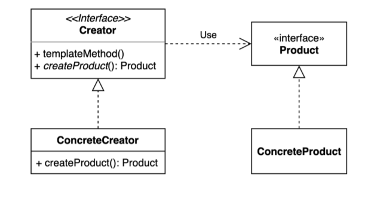

## 2021.11.15_01.패턴소개

## 팩토리 메소드 패턴

- 해결하는 문제 어떤 객체 인스턴스를 생성하는 책임을 구체적인 클래스가 아니라
  - 추상적인 인터페이스의 메소드로 감싸는것
- 이렇게 하는 이유는?
  - 배를 만든다고 할때, 화이트 쉽만 만들면서 사업이 잘됬는데 
    - 추후에 블랙 쉽을 만들게 됬는데, 이전은 그냥 static일때 화이트 쉽 만드는 과정이 있었는데
    - 색을 입힌다거나 로고, 글씨 등등 배송을 할꺼라는 처리가 일어났다.
    - 블랙 쉽을 만들기 시작했는데
      - 이전의 클래스에 다른 로고와 다른 색 등등 하면서 if else가 늘어나면서 복잡해짐
    - 다른 배가아니 수륙양용을 만드는 경우에 모든 과정을 하나의 구체적인 클래스에
      - 모두담기에는 로직 자체가 복잡해짐 
  - 그래서 추상화 되어 있는 팩토리가 필요하다.



- 우선 인터페이스를 만들고 
- 추방 매소들 하위 클래스에서 만들게 해줌, 이 하위 클래스에서 구체적인 것을 만듦
- product도 인터페이스로 만들고 하위클래스에서 구체적으로 만들게 해서 용이하게함

## Client.class

```java
public class Client{
	Client client new Client();
  
  ship whiteship = ShipFactory.orderShip("Whiteship", "oksos0817@naver.com");
  System.out.println(whiteship);
  
  ship whiteship = ShipFactory.orderShip("Blackship", "oksos0817@naver.com");
  System.out.println(Blackship);
  
}
```

## ShipFactory.class

```java
public class ShipFactory {

    public static Ship orderShip(String name, String email) {
        // validate
        if (name == null || name.isBlank()) {
            throw new IllegalArgumentException("배 이름을 지어주세요.");
        }
        if (email == null || email.isBlank()) {
            throw new IllegalArgumentException("연락처를 남겨주세요.");
        }

        prepareFor(name);

        Ship ship = new Ship();
        ship.setName(name);

        // Customizing for specific name
        if (name.equalsIgnoreCase("whiteship")) {
            ship.setLogo("\uD83D\uDEE5️");
        } else if (name.equalsIgnoreCase("blackship")) {
            ship.setLogo("⚓");
        }

        // coloring
        if (name.equalsIgnoreCase("whiteship")) {
            ship.setColor("whiteship");
        } else if (name.equalsIgnoreCase("blackship")) {
            ship.setColor("black");
        }

        // notify
        sendEmailTo(email, ship);

        return ship;
    }

    private static void prepareFor(String name) {
        System.out.println(name + " 만들 준비 중");
    }

    private static void sendEmailTo(String email, Ship ship) {
        System.out.println(ship.getName() + " 다 만들었습니다.");
    }

}
```

## Ship.java

```java
package me.whiteship.designpatterns._01_creational_patterns._02_factory_method._01_before;

public class Ship {

    private String name;

    private String color;

    private String logo;

    public String getName() {
        return name;
    }

    public void setName(String name) {
        this.name = name;
    }

    public String getColor() {
        return color;
    }

    public void setColor(String color) {
        this.color = color;
    }

    public String getLogo() {
        return logo;
    }

    public void setLogo(String logo) {
        this.logo = logo;
    }

    @Override
    public String toString() {
        return "Ship{" +
                "name='" + name + '\'' +
                ", color='" + color + '\'' +
                ", logo='" + logo + '\'' +
                '}';
    }
}
```

- 이런경우는 그냥 요구사항에 따라서 변수가 바뀌고 하면 다 바꿔줘야한다.
- 이경우 변경에 닫혀있지 않는 경우가 되어버린다.
- 그래서 이를 변경에 닫혀있게 해줘야함