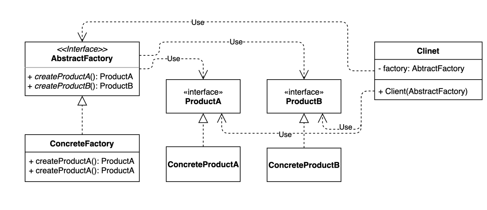

## 2021.11.21_01.패턴소개

## 추상팩토리 패턴



- 여러 관련있는 인스턴스를 만들어주는 팩토리를 추상화된 형태로 정의하는 패턴
  - 인터페이스나 추상클래스로 정의하는 등등
- 초점이 클라이언트쪽에 맞춰야함
- 목적은 클라이언트 코드를 인터페이스 기반으로 코딩할 수 있게하는것
  - 모습은 팩토리 패턴과 비슷하지만 그것을 사용하는것과 같이 봐야함

### WhiteshipFactory.class

```
public class WhiteshipFactory extends DefaultShipFactory{
	@Override
	public Ship createShip(){
		Ship ship = new WhiteShip();
		ship.setAnchor(new WhiteAnchor());
		ship.setWheel(new WhiteWheel());
		return ship;
   }
}
```

- 여기서는 구체적인 클래스 타입으로 하고 있지만 
  - 다른 것이 필요한 경우 필요한것을 만들어서 넣었는데 
  - 스타일이 바뀌는경우 다시 구현을 해야하는 점이 있음
    - 코드가 그때마다 다 바뀌게 되는 단점이 있음


