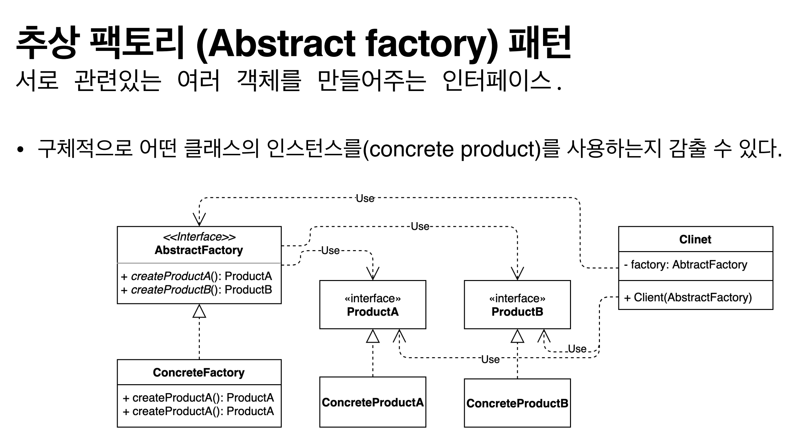

## 2021.11.21_03.장단점

- 우리가 보는 각도에 따라서 사물의 형태가 다를 수 있음
- 산이라는 자체는 그대로 인데 다를 수 있다는 의미

- 객체를 만드는 과정에 중점되어 있음
  - 객체 만드는 과정을 추상화 한것음 맞지만
  - concreate 타입 을 만드는 과정을 그것을 숨기고 
  - 추상화 되어있는 것을 제공하는 것을 말한다.

- 클라이언트 관점에서 팩토리를 통해서 추상화된 인터페이스만 사용하게 하기 때문에 클라이언트 입장에서 concreate를 직접 참조해서 쓸 필요가 없음

## 팩토리 메소드 패턴과 추상 팩토리 패턴의 차이

- 모양과 효과는 비슷
  - 둘다 구체적인 객체 생성 과정을 추상화한 인터페이스 제공
- 관점이 다름
  - 팩토리 메소드 패턴은 팩토리를 구현하는 방법에 초점
  - 추상 팩토리 패턴은 팩토리를 사용하는 방법에 초점
- 목적이 다름
  - 팩토리 메소드 패턴은 구쳊거인 객체 생성 과정을 하위 또는 구체적인 클래스로 옮기는 것
  - 추상 팩토리 패턴은 관련있는 여러 객체를 구체적인 클래스에 의존하지 않고 만들 수 있게 해주는 것이 

