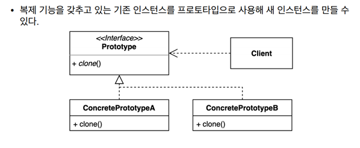

## 2021.12.02_프로토타입패턴01.패턴소개

- 기존 인스턴스를 복제하여 새로운 인스턴스를 만드는 방법




- 기존 객체응용해서 새로운 객체 만들때
- 데이터 베이스 읽어와서 네트워크 http를 기반으로 만들어야한다면
  - 그 인스턴스 만들때 마다 오래 걸리고 리소스를 많이 사용함
  - 다 복사해서 새로운 인스턴스 만들어서 일부분만 고쳐쓴다면 더 빠르게 사용가능함
- 구현이 없는 clone()이라는 매소드를 복제기능을 제공할 클래스들이 해당 클래스 구현할 수 있게하는것

## GithubRepository.java

```java
package me.whiteship.designpatterns._01_creational_patterns._05_prototype._01_before;

public class GithubRepository {

    private String user;

    private String name;

    public String getUser() {
        return user;
    }

    public void setUser(String user) {
        this.user = user;
    }

    public String getName() {
        return name;
    }

    public void setName(String name) {
        this.name = name;
    }
}
```

## GithubIssue.java

```java
package me.whiteship.designpatterns._01_creational_patterns._05_prototype._01_before;

public class GithubIssue {

    private int id;

    private String title;

    private GithubRepository repository;

    public GithubIssue(GithubRepository repository) {
        this.repository = repository;
    }

    public int getId() {
        return id;
    }

    public void setId(int id) {
        this.id = id;
    }

    public String getTitle() {
        return title;
    }

    public void setTitle(String title) {
        this.title = title;
    }

    public GithubRepository getRepository() {
        return repository;
    }

    public String getUrl() {
        return String.format("https://github.com/%s/%s/issues/%d",
                repository.getUser(),
                repository.getName(),
                this.getId());
    }
}
```

## App.java

```java
package me.whiteship.designpatterns._01_creational_patterns._05_prototype._01_before;

public class App {

    public static void main(String[] args) {
        GithubRepository repository = new GithubRepository();
        repository.setUser("whiteship");
        repository.setName("live-study");

        GithubIssue githubIssue = new GithubIssue(repository);
        githubIssue.setId(1);
        githubIssue.setTitle("1주차 과제: JVM은 무엇이며 자바 코드는 어떻게 실행하는 것인가.");

        String url = githubIssue.getUrl();
        System.out.println(url);
    }

}
```

- 이슈에 해당하는 url 만드는 것임
- 일련의 과정을 두번째 인스턴스 만들때 다 입력해서 하면 짜증도 나고 오래걸리기 때문에

```java
      GithubIssue githubIssue2 = new GithubIssue(repository);
      githubIssue.setId(2);
      githubIssue.setTitle("2주차 과제:");
```

- 위와 같이 이부분만 다시 만들고 싶은것임

```java
      GithubIssue githubIssue2 = githubIssue.clone();
```

- 인스턴스 새로 만드는것 아니고 clone을 이용해서 만들고 싶은것
  - 이때,  clone과 githubIssue는 같지 않음
  - clone.equals(githubIssue)는 내용이 같아서 true가 나옴