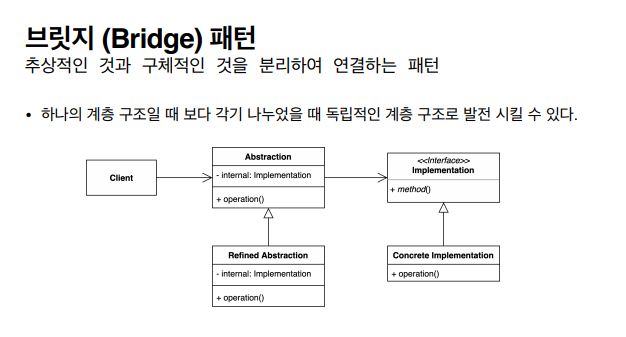

## 2021.12.08_브릿지패턴01.패턴소개

- 구조적인 디자인패턴중하나
- 추상적인것과 구체적인 것을 분리하여 연결하는 것
- 상속이 아닌 Conposition을 사용함

- 구분 짓는것에 더 집중함



- 둘을 나눠서 구현한다는 의미로 브릿지
- 둘로 나눠져있으니 연결해야한다에 초점을 맞추자

- 클라이언트는 implement를 사용하지 않고 추상적인 계층 구조사용하고
  - 추상적인 계층구조에서 사용하는 implementation을 간접적으로 사용

## Champion.java

```java
public interface Champion{
  
}
```

- 챔피언이라는 여러가지 있고 
  - 여러가지 복장이 있다는 것을 가정할때
  - KDA의 여러가지 캐릭터등 여러개를 만들수 있다고 할때
    - 단점은 스킨만 가지고 있지만 다른 특징인 스킬등을 계층 구조에 반영되기 시작하면 많은 클래스들이 늘어나기 시작함
    - 이 문제를 해결하기 위해 브릿지 패턴을 씀

## 클라이언트

- 클라이언트 abstraction을 사용함
- 구현체는 추상적인 개념을 변형, 확장 Refined를 하면서 생김

## Implementat ion

- 액션이나 플랫폼에 최적화된 코드 등
- 인터페이스나 상위 클래스를 사용해서 다른 Concreate Implementaion을 가지고 별도의 계층구조로 발전시킬 수 있는 것

- 위의 이런것이 브릿지 패턴이다.