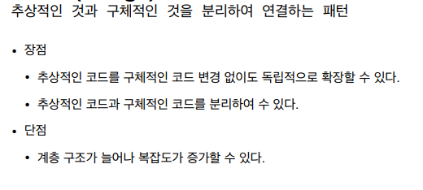

## 2021.12.08_브릿지패턴03.장점과단점

## 장점

- 추상적인 것과 구체적인 것 분리하고, 추상적인것 그대로 유지한채 우리가 구체적인 코드만 변경 또는 확장 가능

  - 개방-폐쇄 **원칙**(**OCP**, Open-Closed Principle)임

  - 제각각 본인의 일만 관리하면됨
    - single responsibility임

- 두가지 객체지향 원칙을 지킴으로 얻을 수 있는것
  - 기존의 코드 재사용, 중복코드를 줄일 수 있음

## 단점

- 분리하면서 코드가 복잡해 보일 수 있고,
- 계층 구조 늘어나서 코드를 파악하는데 복잡해보일 수 있음

