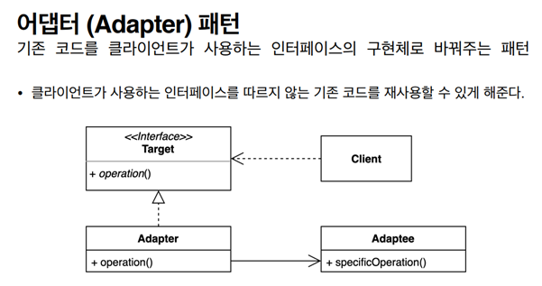
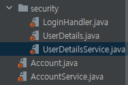

## 2021.12.07_어댑터패턴01.패턴소개

- 어댑터 패턴은 일상생활에서 쉽게 찾아볼 수 있음
- 110v 를 220v에 꽂는다던가 반대로 꽂는 경우에 쓰는 어댑터(돼지코)
  - 어댑터패턴과 가장 유사함
- 소프트웨어적으로 
  - 클라이언트가 사용하는 인터페이스가 전혀 다름
  - 벽에 있는것이 110v인데 한국에서 가져온 전자기기가 220v인경우
    - 호환되는것이면 좋겠지만 그사이에 볼트 전압 변경해주는 변압기를 사용해야함
    - 인터페이스가 다르다고 생각하면됨

- 서로 맞지 않는 코드를 맞게 하는 어댑터를 만들어서 사용하는 것
- 재사용이 가능하고 인터페이스 다르더라도 같이 사용할 수 있게 함
- 구성요소
  - 클라이언트
    - 항상 타켓인터페이스 기반으로 작성
    - 인터페이스만 사용
  - 어댑티
    - 우리가 사용하는 구현체라는 클래스
  - 클라이언트와 어댑티 사이에 있는 어댑터를 구현할 예정

## 코드

- 파일 구성

- security 패키지와 Account와 AccountService와  별개고
  - security는 공용으로 쓰지만 Account 시리즈들은 다르고 사용자가 어떻게 코드를 구성하는지에 따라 다름