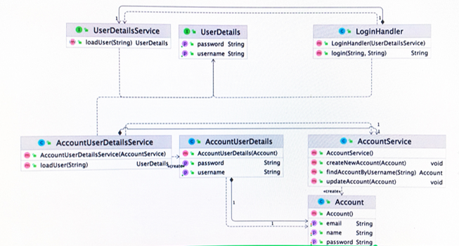

## 2021.12.07_어댑터패턴03.장점과단점

## 어댑터 패턴

- 기존 코드를 클라이언트가 사용하는 인터페이스의 구현체로 바꿔주는 패턴

### 장점

- 기존 코드를 변경하지 않고 원하는 인터페이스 구현체를 만들어 사용할 수 있음
  - open close 원칙에 가깝다 할 수 있음
- 기존코드가 하던 일과 특정 인터페이스 구현체로 변환하는 작업을 각기 다른 클래스로 분리하여 관리할 수 있음
  - 단일 책임 원칙에 가까움

### 단점

- 새 클래스가 생겨 복잡도가 증가할 수 있음
- 경우에 따라서는 기존 코드가 해당 인터페이스를 구현하도록 수정하는 것이 좋은 선택이 될 수도 있음

- 직접 구현이 불가한 경우 어댑터 패턴을 적용해야하지만 그런게 아니면 직접 구현해도 된다면 클래스를 따로 추가하지 않아도 구현이 더깔끔하게 될 수 있음 판단은 개인이 알아서 하기