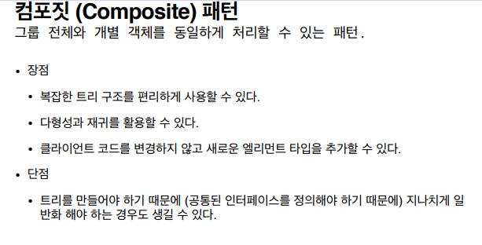

## 2021.12.09_컴포짓패턴03.장점과단점

## 장점

- 복잡한 트리구조를 편리하게 사용가능
  - 어디에 해당하는지 상관 없이 공통된 인터페이스를 구현하고 있으면 그 인터페이스로 활용가능
  - 다형성, 재귀 가능
  - 클라이언트 입장에서 새로운 컴포짓, 리프가 새로 생겨도 클라이언트 코드는 바뀌지 않음
    - 확장에는 열려있고, 변경에는 닫혀있는 원칙에 해당

## 단점

- 코드의 경우 아이템, 가방이라는 공통된 오퍼레이터가 있어서 간단했지만
- 공통된 것을 찾기 힘들고 그것을 일반화를 억지로 해야할 수 있는데 그런점이나
  - 런타임시 타임을 생각해야할 수 있으니 그때는 너무 특정 패턴으로 종속하는게 아닌지 생각해야함

