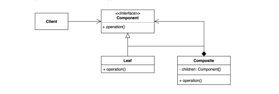
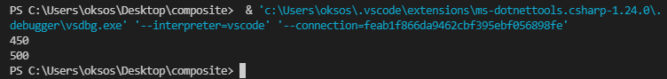

## 22.02.14_컴포짓패턴정리

## 1.컴포짓 패턴이란?

- 전체 계층구조와 그  계층구조를 구성하는 부분적인 객체를
  - 클라이언트 입장에서 동일하게 생각할 수 있게
  - 전체인지 전체의 부분인지, 하위단에 있는 것인지(트리의 마지막 오브젝트) 상관없이
  - 동일한 인터페이스로 사용하게 하는것
- 트리구조로 구성해야하는 제약 사항이 있음
  - 많이 쓸까? 생각하지만 일상에 트리 구조가 많음



- 그룹 전체와 개별 객체를 동일하게 처리할 수 있는 패턴
  - 클라이언트 입장에서는 전체나 부분이나 모두 동일한 컴포넌트로 인식할 수 있는 계층구조를 만듦
    - (Part-Whole Hierarchy)

## 2. 컴포짓 패턴 적용 전

### 2.1 Client.cs

```csharp
namespace Game;

public class Client
{
    public static void Main(string[] args)
    {
        Item doranBlade = new Item("도란검", 450);
        Item healingPosion = new Item("체력 물약",50);

        Bag bag = new Bag();
        bag.add(doranBlade);
        bag.add(healingPosion);

        Client client =  new Client();
        client.PrintPrice(doranBlade);
        client.PrintPrice(bag);
    }

    private void PrintPrice(Item item)
    {
        Console.WriteLine($"{item.getPrice()}");
    }
    private void PrintPrice(Bag bag)
    {
        int sum =0;
        for(int i=0; i<bag._item.Count;i++)
        {
            sum += bag._item[i]._price;
        }
        Console.WriteLine($"{sum}");
    }
}
    
```



- 위와 같이 하게 되면 클라이언트는 많은것을 알고 있어야함
- 이러면 객체지향으로 옳은것인지 고민되고,
- 또는 캐릭터가 아이템을 가지고 있는데 그것을 어떻게 이런 디테일한것들을 클라이언트가 알아야하는지 
  -  개수나 합을 알 수 있는 것인지 고민해야함

### 2.2 Bag.cs

```csharp
namespace Game;
public class Bag
{
  public List<Item> _item = new List<Item>();
  public void add(Item item)
  {
      _item.Add(item);
  }
  public List<Item> getItems() {
      return _item;
  }
}
```

### 2.3 Client.cs

```csharp
namespace Game;
public class Item
{
    public string _name;
    public int _price;
    public Item(string name, int price)
    {
        _name=name;
        _price=price;
    }
    public int getPrice(){
        return _price;
    }
}
```

## 3. 컴포짓을 적용

- 클라이언트는 컴포넌트의 공통 인터페이스를 정의 하고 인터페이스 타입만 클라이언트가 보면됨
- 즉, 위에서는 캐릭터, 아이템, 백은 Leaf , Composite 객체가 됨
  - Leaf는 기본적인 단위가 되고 , 크리미티브한 타입
  - Composite은 여러개 컴포너트를 배열 리스트로 가지고 있음 
    - 대신 리프타입이 아니고 컴포넌트 타입임
  - 모든것은 지원이 되어야함
    - 그렇게 해야지 클라이언트 코드가 좋아질 수 있음

### 3.1 IComponent.cs

```csharp
namespace Game;

public interface IComponent{
    int getPrice();
}
```

- 위처럼 공통오퍼레이션이 정의되어야하는 것이 핵심

### 3.2 Item.cs

```csharp
public class Item : IComponent
{
    private string _name;
    private int _price;
    public Item(string name, int price)
    {
        _name=name;
        _price=price;
    }
    public int getPrice(){
        return _price;
    }
}
```

### 3.3 Bag.cs

```csharp
namespace Game;
public class Bag
{
  public List<Item> _item = new List<Item>();
  public void add(Item item)
  {
      _item.Add(item);
  }
  public List<Item> getItems() {
      return _item;
  }
}
```

- 이렇게 leaf를 참조하면안됨
- compoent를 찹조해야함 그래서 아래와 같이 구현

```csharp
namespace Game;
public class Bag : IComponent
{
  private List<IComponent> _compoent = new List<IComponent>();
  public void add(IComponent compoent)
  {
      _compoent.Add(compoent);
  }
  public List<IComponent> getItems() {
      return _compoent;
  }

  public int getPrice()
  {
    int sum = 0;
    foreach(Item compoent in _compoent)
    {
        sum+=compoent._price;
    }
		return  sum;
  }
}
```

###  3.4 Client.cs

- before

  ```csharp
  namespace Game;
  
  public class Client
  {
      public static void Main(string[] args)
      {
          Item doranBlade = new Item("도란검", 450);
          Item healingPosion = new Item("체력 물약",50);
  
          Bag bag = new Bag();
          bag.add(doranBlade);
          bag.add(healingPosion);
  
          Client client =  new Client();
          client.PrintPrice(doranBlade);
          client.PrintPrice(bag);
      }
  
      private void PrintPrice(Item item)
      {
          Console.WriteLine($"{item.getPrice()}");
      }
      private void PrintPrice(Bag bag)
      {
          int sum =0;
          for(int i=0; i<bag._item.Count;i++)
          {
              sum += bag._item[i]._price;
          }
          Console.WriteLine($"{sum}");
      }
  }
  ```

- after

  ````csharp
  namespace Game;
  
  public class Client
  {
      public static void Main(string[] args)
      {
          Item doranBlade = new Item("도란검", 450);
          Item healingPosion = new Item("체력 물약",50);
  
          Bag bag = new Bag();
          bag.add(doranBlade);
          bag.add(healingPosion);
  
          Client client =  new Client();
          client.PrintPrice(doranBlade);
          client.PrintPrice(bag);
      }
      private void PrintPrice(IComponent compoent)
      {
          Console.WriteLine($"{compoent.getPrice()}");
      }
  }
  ````
  
  - 공통된 인터페이스를 사용해서 저렇게 사용가능
  - 가능하면 가장 추상적인 타입으로 쓰면 좋음
  - 가격을 어떻게 할지 컴포짓 객체가 알고, leaf가 안다.
    - 전체나 부분이나 동일하게 처리할 수 있게됨
  - 클라이언트 입장에서는 동일함

## 4. 컴포짓 패턴의 장단점

### 4.1 장점

- 복잡한 트리구조를 편리하게 사용가능
  - 어디에 해당하는지 상관 없이 공통된 인터페이스를 구현하고 있으면 그 인터페이스로 활용 가능
  - 다형성, 재귀 가능
  - 클라이언트 입장에서 새로운 컴포짓, 리프가 생겨도 클라이언트 코드는 바뀌지 않음
    - 확장에는 열려있고, 변경에는 닫혀있는 open closed principle 법칙에 부합

### 4.2 단점

- 코드의 경우 아이템, 가방 공통된 오퍼레이터가 있어서 간단했지만
  - 공통된것을 찾기 힘듦, 그것을 억지로 일반화 해야할 수도 있는데
  - 그런점이 런타임시 타임을 생각해야 할 수 있으니
  - 그때는 너무 특정 패턴으로 종속하는게 아닌지 생각해야함
    - 즉, 트리를 만들어야하기 때문에 (공통된 인터페이스를 정의해야 하기때문에) 지나치게 일반화 해야하는 경우가 생기는게 단점
