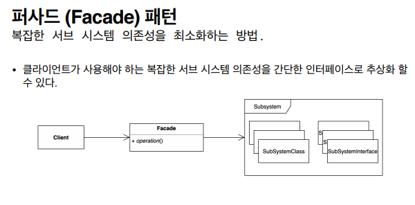

## 2021.12.12_퍼사드패턴01.패턴소개

- 퍼사드 어떤 건물의 입구쪽에서 바라보는 전경
- 건물안에 뭐가 있는지 알 수 없음
  - 안에 있어도 수도나 전기 등등이 어떻게 되어 있는지 알 수 없음
- 특정 라이브러리와 프레임 워크에 종속적인것을 좋아하지 않음 
- 스프링 자체도 비침투적 이다.
- 스프링 소스를 직접쓰기 보다 우리 소스에 집중함

- 소프트웨어 철학중 

  - 루즐리 커플드

  - 의존성이 클 수록 단점이 많음

  - 가급적 유연하게 의존성을 쉽게하고 테스트 할 수 있는 구조를 만드려고 함
~~~java
import javax.mail.Message;
import javax.mail.MessagingException;
import javax.mail.Session;
import javax.mail.Transport;
import javax.mail.internet.InternetAddress;
import javax.mail.internet.MimeMessage;
import java.util.Properties;

public class Client {

    public static void main(String[] args) {
        String to = "keesun@whiteship.me";
        String from = "whiteship@whiteship.me";
        String host = "127.0.0.1";

        Properties properties = System.getProperties();
        properties.setProperty("mail.smtp.host", host);

        Session session = Session.getDefaultInstance(properties);

        try {
            MimeMessage message = new MimeMessage(session);
            message.setFrom(new InternetAddress(from));
            message.addRecipient(Message.RecipientType.TO, new InternetAddress(to));
            message.setSubject("Test Mail from Java Program");
            message.setText("message");

            Transport.send(message);
        } catch (MessagingException e) {
            e.printStackTrace();
        }
    }
}

~~~
