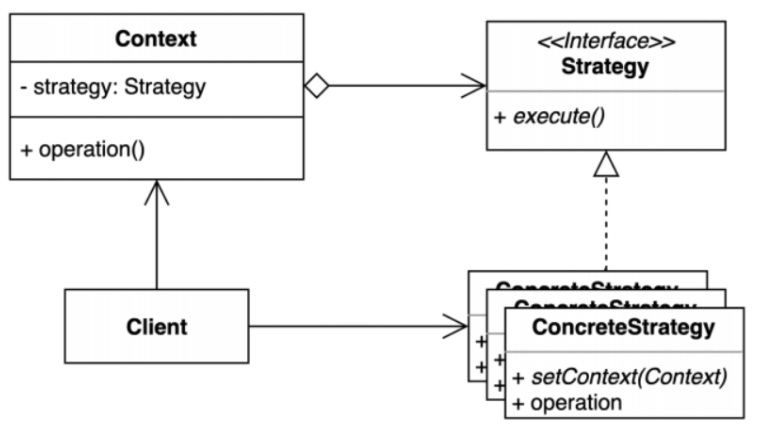

## 22.02.21_전략패턴

## 목차

> 1.전략패턴이란?
>
> 2.전략패턴 적용 전 소스
>
> > 2.1 생성자에서 변수적용
> >
> > > 2.1.1 BlueLightRedLight.cs 
> > >
> > > 2.1.2 Client.cs
> >
> > 2.2 메소드에서 변수적용
> >
> > > 2.2.1 BlueLightRedLight.cs 
> > >
> > > 2.2.2 Client.cs
>
> 3.전략패턴 적용 후 소스
>
> > 3.1 생성자에서 변수 적용
> >
> > > 3.1.1 Speed.cs
> > >
> > > 3.1.2 Normal.cs
> > >
> > > 3.1.3 Faster.cs
> > >
> > > 3.1.4 BlueLightRedLight.cs
> > >
> > > 3.1.5 Client.cs
> >
> > 3.2 메소드에서 변수 적용
> >
> > > 3.2.1 Speed.cs
> > >
> > > 3.2.2 Normal.cs
> > >
> > > 3.2.3 Faster.cs
> > >
> > > 3.2.4 BlueLightRedLight.cs
> > >
> > > 3.2.5 Client.cs
> >
> > 3.3전략이 하나더 추가되는 경우
>
> 4.장점과단점
>
> > 4.1 장점
> >
> > 4.2 단점

## 1.전략패턴이란?



- 은연중에 많이 쓰는 패턴이다.
- 프레임워크에서 많이 표현해서 사용
- 어떤 일을 수행하는 방법이 여러개 일때
  - 그 여러 알고리즘을 각 개별적인 클래스로 캡슐화하고 
  - 그 캡슐화하나 것을 공통된 인터페이스로 추상해서 로직을 수행하는 곳에서는
  - 추상화된 인터페이스만 사용함으로써 클라이언트 코드는 바뀌지 않지만
    - 사용하는 알고리즘이 추가되거나 수정되어도 클라이언트 코드에 이상이 없음
-  Compareater인터페이스를 예로 들수 있음

## 2.전략패턴 적용 전 소스

## 2.1 생성자에서 변수적용

#### 2.1.1 BlueLightRedLight.cs 

```csharp
using System;
using System.Collections.Generic;
using System.Linq;
using System.Text;
using System.Threading.Tasks;

namespace StrategyPattern
{
    public class BlueLightReadLight
    {
        private int _speed;
        public BlueLightReadLight(int speed)
        {
            _speed = speed;
        }

        public void blueLight()
        {
            if (_speed == 1)
                Console.WriteLine("무  궁  화  꽃  이");
            else if (_speed == 2)
                Console.WriteLine("무 궁 화 꽃 이");
            else if (_speed == 3)
                Console.WriteLine("무궁화꽃이");
        }

        public void redLight()
        {
            if (_speed == 1)
                Console.WriteLine("피  었  습  니  다.");
            else if (_speed == 2)
                Console.WriteLine("피 었 습 니 다.");
            else if (_speed == 3)
                Console.WriteLine("피었습니다.");
        }
    }
}

```

- 위와 같이 분기가 여러개가 생기게 해서 구현하는게 보편적임 

#### 2.1.2 Client.cs

```csharp
using System;

namespace StrategyPattern;

public class StrategyPattern
{
   public static void Main(string[] args)
   {
        BlueLightReadLight blueLightReadLight = new BlueLightReadLight(1);
        blueLightReadLight.blueLight();
        blueLightReadLight.redLight();
   }
}
```

## 2.2 메소드에서 변수적용

#### 2.2.1 BlueLightRedLight.cs 

```csharp
using System;
using System.Collections.Generic;
using System.Linq;
using System.Text;
using System.Threading.Tasks;

namespace StrategyPattern
{
    public class BlueLightReadLight
    {
        public void blueLight(int speed)
        {
            if (speed == 1)
                Console.WriteLine("무  궁  화  꽃  이");
            else if (speed == 2)
                Console.WriteLine("무 궁 화 꽃 이");
            else if (speed == 3)
                Console.WriteLine("무궁화꽃이");
        }

        public void redLight(int speed)
        {
            if (speed == 1)
                Console.WriteLine("피  었  습  니  다.");
            else if (speed == 2)
                Console.WriteLine("피 었 습 니 다.");
            else if (speed == 3)
                Console.WriteLine("피었습니다.");
        }
    }
}

```

- 위와 같이 분기가 여러개가 생기게 해서 구현하는게 보편적임 

#### 2.2.2 Client.cs

```csharp
using System;

namespace StrategyPattern;

public class StrategyPattern
{
   public static void Main(string[] args)
   {
        BlueLightReadLight blueLightReadLight = new BlueLightReadLight();
        blueLightReadLight.blueLight(1);
        blueLightReadLight.redLight(2);
   }
}
```

## 3.전략패턴 적용 후 소스

### 3.1 생성자에서 변수 적용

#### 3.1.1 Speed.cs

```csharp
using System;
using System.Collections.Generic;
using System.Linq;
using System.Text;
using System.Threading.Tasks;

namespace StrategyPatternNotConstructor;

public interface Speed
{
    public void blueLight();
    public void redLight();
}
```

#### 3.1.2 Normal.cs

```csharp
using System;
using System.Collections.Generic;
using System.Linq;
using System.Text;
using System.Threading.Tasks;

namespace StrategyPatternNotConstructor;

public class Normal : Speed
{
    public void blueLight()
    {
        Console.WriteLine("무  궁  화  꽃  이");
    }

    public void redLight()
    {
        Console.WriteLine("피  었  습  니  다.");
    }
}
```

#### 3.1.3 Faster.cs

```csharp
using System;
using System.Collections.Generic;
using System.Linq;
using System.Text;
using System.Threading.Tasks;

namespace StrategyPatternNotConstructor;

public class Faster : Speed
{
    public void blueLight()
    {
        Console.WriteLine("무 궁 화 꽃 이");
    }

    public void redLight()
    {
        Console.WriteLine("피 었 습 니 다.");
    }
}
```

#### 3.1.4 BlueLightRedLight.cs

```csharp
using System;
using System.Collections.Generic;
using System.Linq;
using System.Text;
using System.Threading.Tasks;

namespace StrategyPatternNotConstructor;

public class BlueLightReadLight
{
    private Speed _speed;
    public BlueLightReadLight(Speed speed)
    {
        _speed = speed;
    }
    public void blueLight()
    {
        _speed.blueLight();
    }

    public void redLight()
    {
        _speed.redLight();
    }
}
```

#### 3.1.5 Client.cs

```csharp
using System;

namespace StrategyPatternNotConstructor;

public class Client
{
    public static void Main(string[] args)
    {
        BlueLightReadLight blueLightReadLight = new BlueLightReadLight(new Normal());
        blueLightReadLight.blueLight();
        blueLightReadLight.redLight();
    }
}
```

### 3.1 메소드에서 변수 적용

#### 3.1.1 Speed.cs

```csharp
using System;
using System.Collections.Generic;
using System.Linq;
using System.Text;
using System.Threading.Tasks;

namespace StrategyPatternNotConstructor;

public interface Speed
{
    public void blueLight();
    public void redLight();
}
```

#### 3.1.2 Normal.cs

```csharp
using System;
using System.Collections.Generic;
using System.Linq;
using System.Text;
using System.Threading.Tasks;

namespace StrategyPatternNotConstructor;

public class Normal : Speed
{
    public void blueLight()
    {
        Console.WriteLine("무  궁  화  꽃  이");
    }

    public void redLight()
    {
        Console.WriteLine("피  었  습  니  다.");
    }
}
```

#### 3.1.3 Faster.cs

```csharp
using System;
using System.Collections.Generic;
using System.Linq;
using System.Text;
using System.Threading.Tasks;

namespace StrategyPatternNotConstructor;

public class Faster : Speed
{
    public void blueLight()
    {
        Console.WriteLine("무 궁 화 꽃 이");
    }

    public void redLight()
    {
        Console.WriteLine("피 었 습 니 다.");
    }
}
```

#### 3.1.4 BlueLightRedLight.cs

```csharp
using System;
using System.Collections.Generic;
using System.Linq;
using System.Text;
using System.Threading.Tasks;

namespace StrategyPatternNotConstructor;

public class BlueLightReadLight
{
    private Speed _speed;
    public BlueLightReadLight(Speed speed)
    {
        _speed = speed;
    }
    public void blueLight()
    {
        _speed.blueLight();
    }

    public void redLight()
    {
        _speed.redLight();
    }
}
```

#### 3.1.5 Client.cs

```csharp
using System;

namespace StrategyPatternNotConstructor;

public class Client
{
    public static void Main(string[] args)
    {
        BlueLightReadLight blueLightReadLight = new BlueLightReadLight(new Normal());
        blueLightReadLight.blueLight();
        blueLightReadLight.redLight();
    }
}
```

### 3.2 전략이 하나더 추가되는 경우

```csharp
using System;
using System.Collections.Generic;
using System.Linq;
using System.Text;
using System.Threading.Tasks;

namespace StrategyPatternAddStrategy;

public class Fastest : Speed
{
    public void blueLight()
    {
        Console.WriteLine("무궁화꽃이");
    }

    public void redLight()
    {
        Console.WriteLine("피었습니다.");
    }
}
```

- 위의 경우 전략이 추가되더라도 기존의 코드는 제대로 동작함
- 즉, open closed principle이 적용되는 것

### 4.장점과단점

- 여러 알고리즘을 캡슐화하고 상호 교환 가능하게 만드는 패턴

#### 4.1장점

- 새로운 전략을 추가하더라도 기존 코드를 변경하지 않음
- 상속대신 위임을 사용할 수 있음
  - 상속은 하나 밖에 상속이 안되고, 상속를 강요하면 진짜 상속이 필요할 때 못쓰고
  - 상위클래스가 변경되면 하위클래스가 영향을 받으니 좀더 구현을 이용해서 유연해짐
- 런타임에 전략을 변경할 수 있음

#### 4.2단점

- 복잡도가 증가함
  - 클래스가 많이 늘어나고 복잡도 늘어난다고 할 수 있는데 한번만들어지고 재사용되지 않는다면 클래스는 많이 늘어나지 않을 것임
- 클라이언트가 구체적인 전략을 알아야함
