# 2021.11.15_03.머신러닝이해

## 학습내용

- 01.지도학습
- 02.비지도학습
- 03.강화학습
- 04.머신러닝이 빛을 발하기 위해서는

## 학습목표

- 머신러닝을 이해할 수 있음

## 01. 지도학습

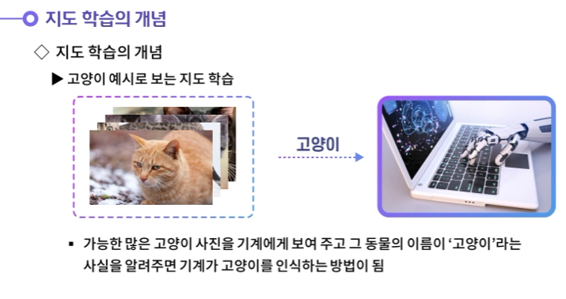

- 지도학습의 프로세스가 위가 같은 방법

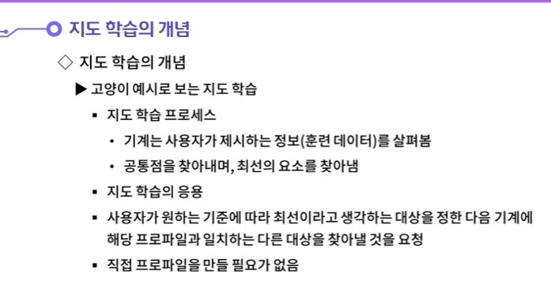

---

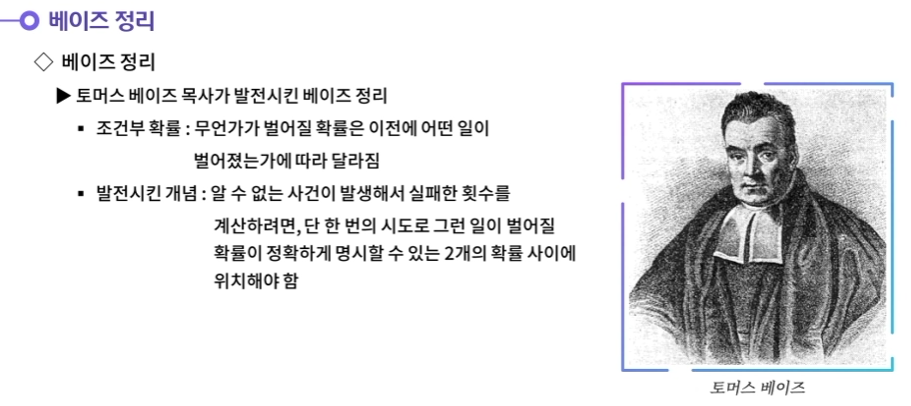

---

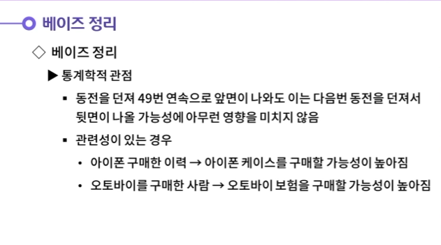

---

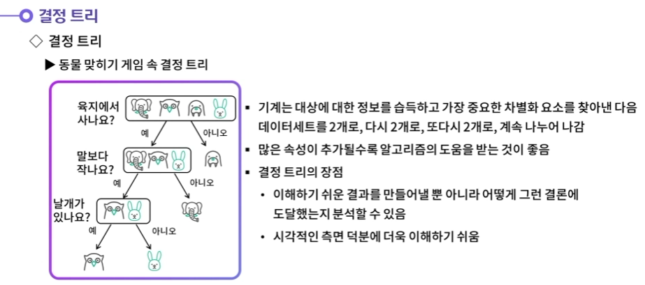

---

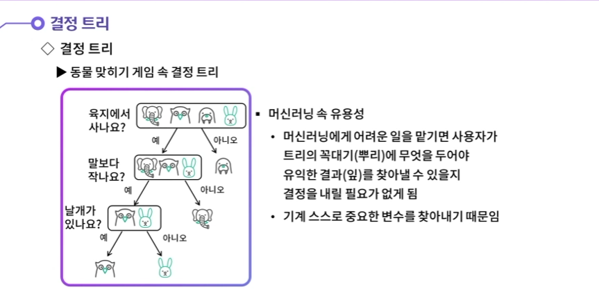

---

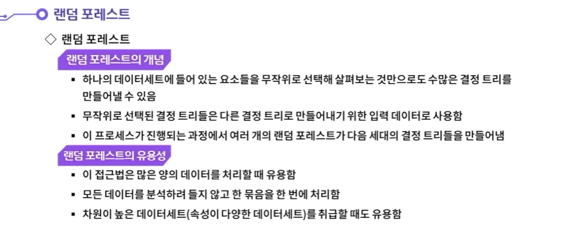

---

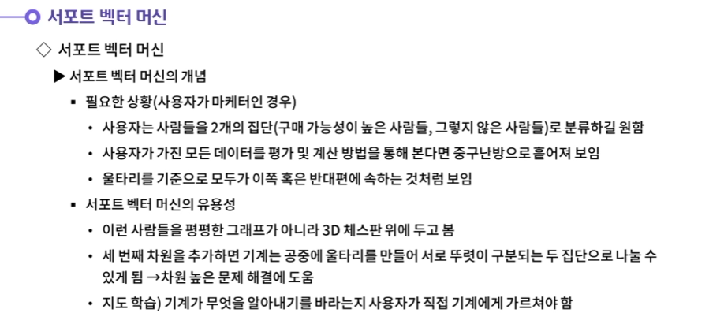

---

## 02.비지도학습

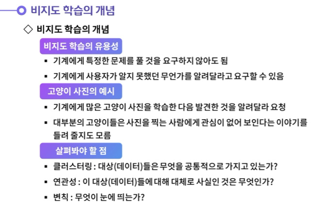

---

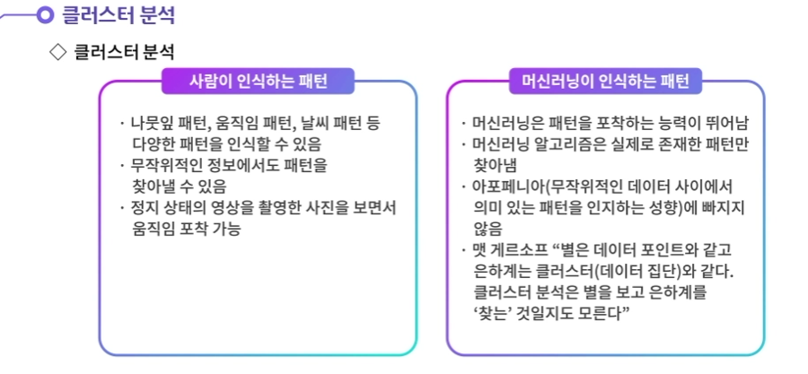

---

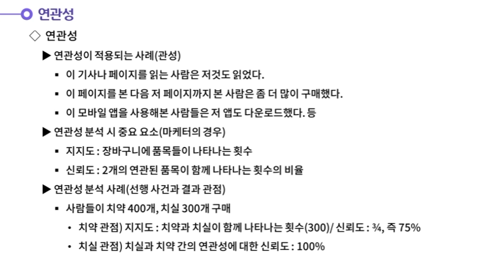

---

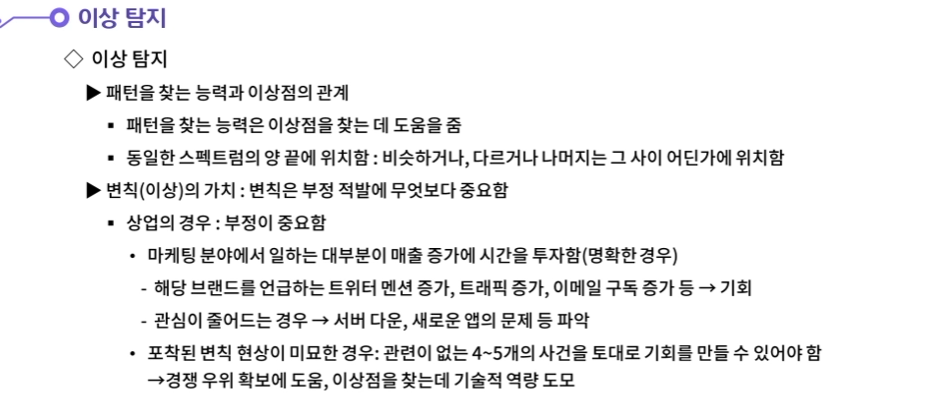

---

## 03.강화학습

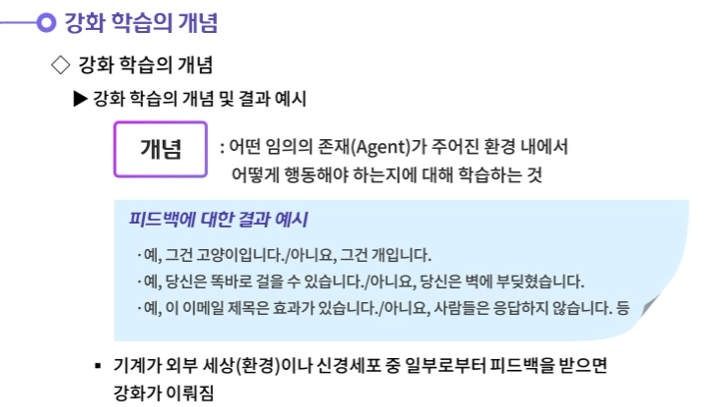

---

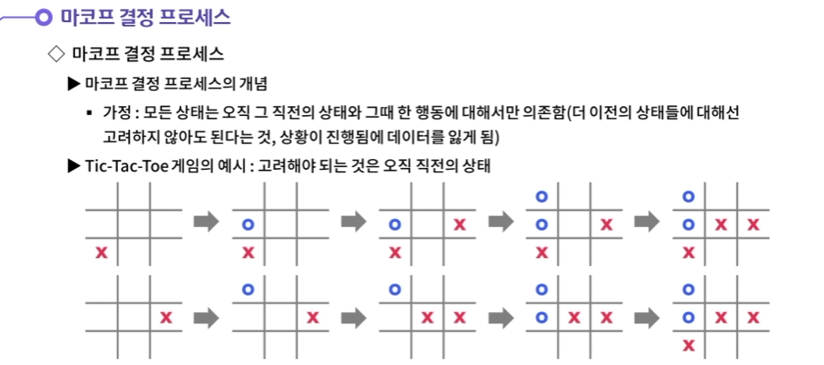

---

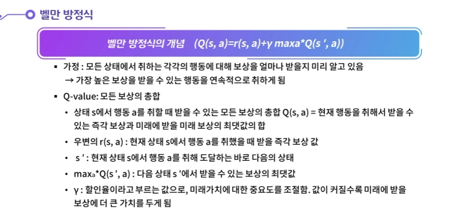

---

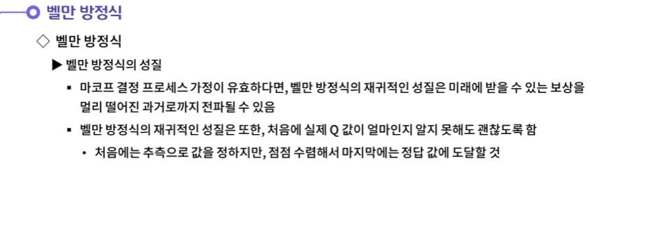

---

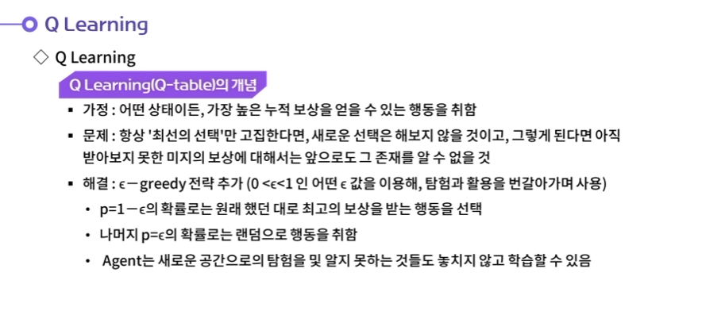

---

## 04.머신러닝이 빛을 발하기 위해서는

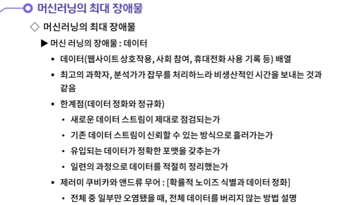

---

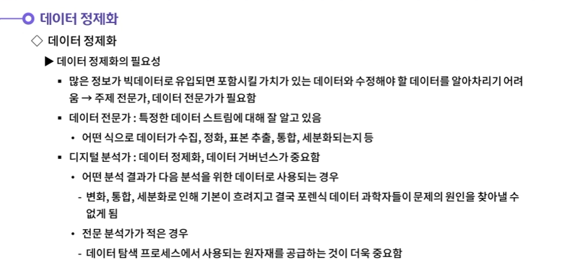

---

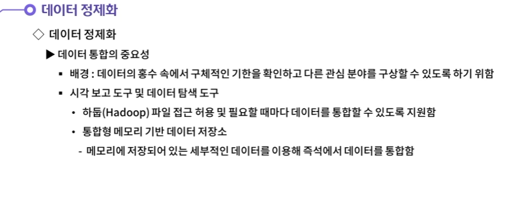

---

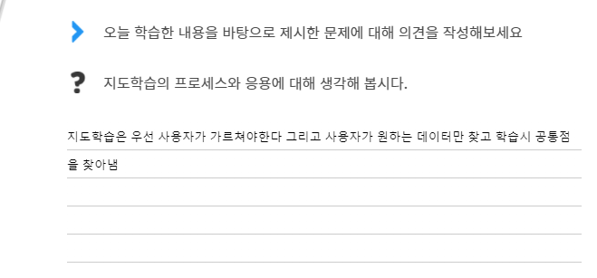

- **지도학습을 한 기계는 사용자가 제시하는 정보(훈련 데이터)를 살펴보며, 공통점을 찾아내며, 최선의 요소를 찾아낸다.**
  **사용자가 원하는 기준에 따라 최선이라고 생각하는 대상을 정한 다음 기계에 해당 프로파일과 일치하는 다른 대상을 찾아낼 것 요청한다. 직접 프로파일을 만들 필요가 없다.**

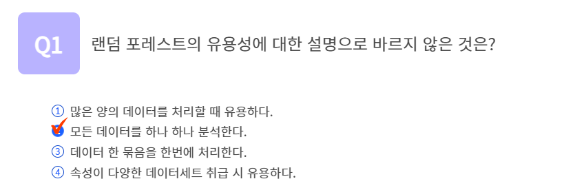

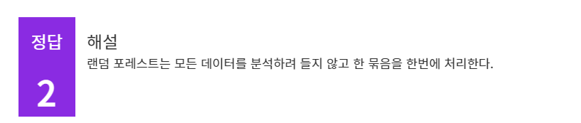

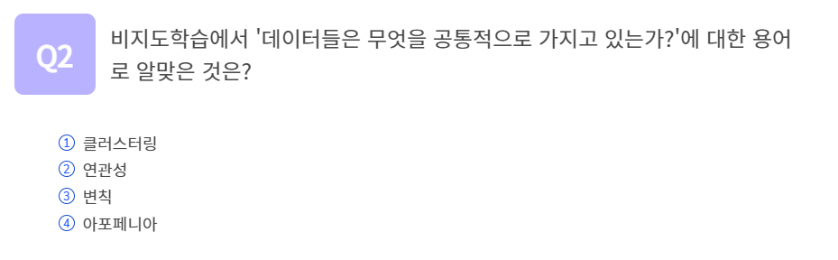

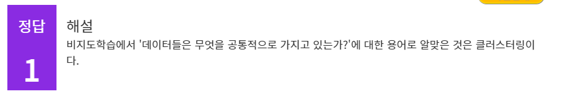

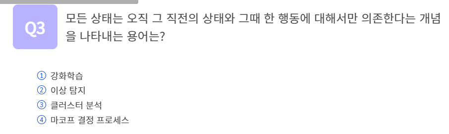

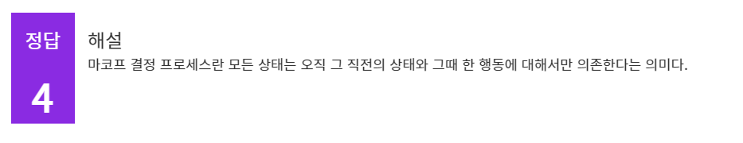

## 정리하기

#### . 지도학습의 프로세스와 응용에 대해 생각해 봅시다.

1. 지도학습을 한 기계는 사용자가 제시하는 정보(훈련 데이터)를 살펴보며, 공통점을 찾아내며, 최선의 요소를 찾아낸다.
   사용자가 원하는 기준에 따라 최선이라고 생각하는 대상을 정한 다음 기계에 해당 프로파일과 일치하는 다른 대상을 찾아낼 것 요청한다. 직접 프로파일을 만들 필요가 없다.