## 2021.11.15_04.딥러닝의이해

## 학습내용

- 01.딥러닝 동작원리
- 02.신경망의 이해

## 학습 목표

- 딥러닝을 이해할 수 있음

## 01.딥러닝 동작원리

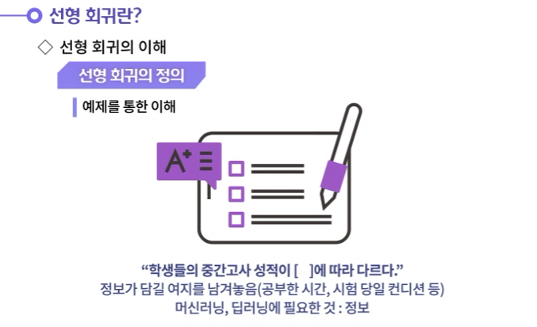

---

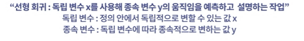

---

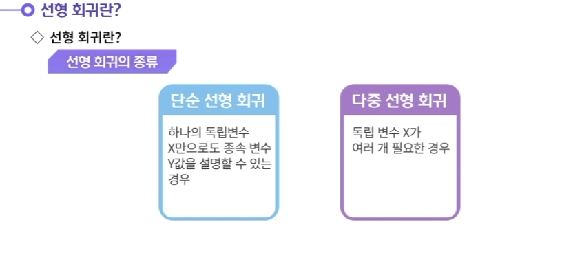

---

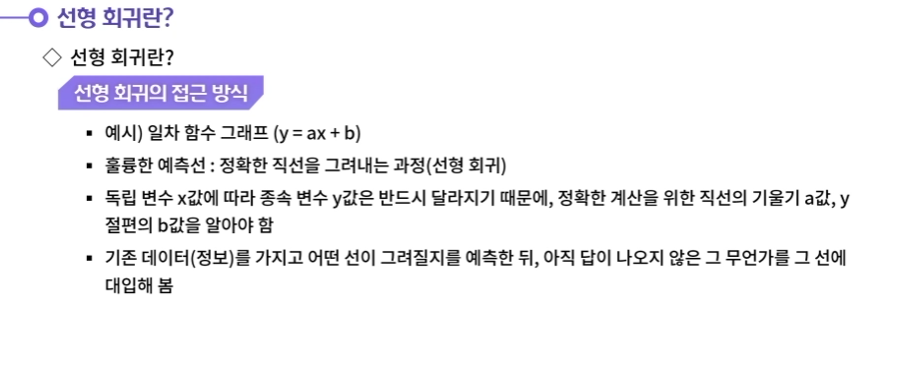

---

---

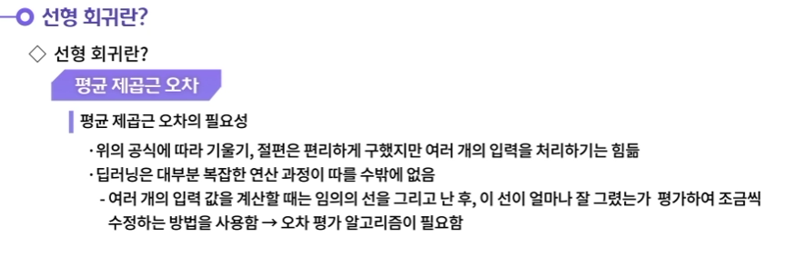

---

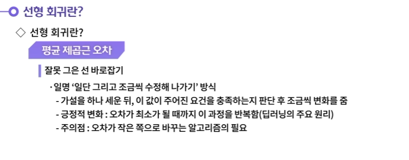

---

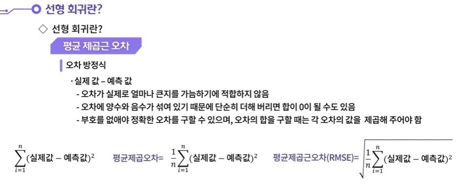

---

---

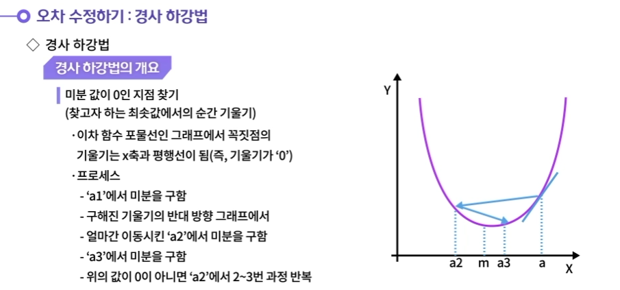

---

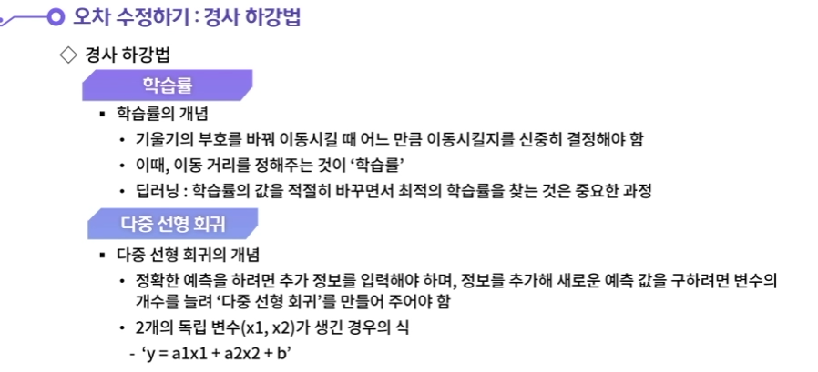

---

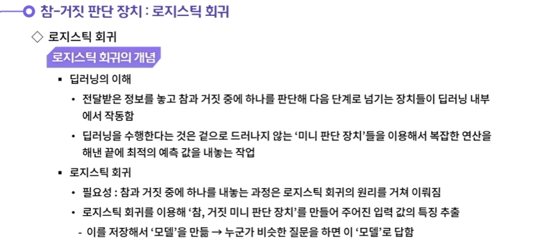

---

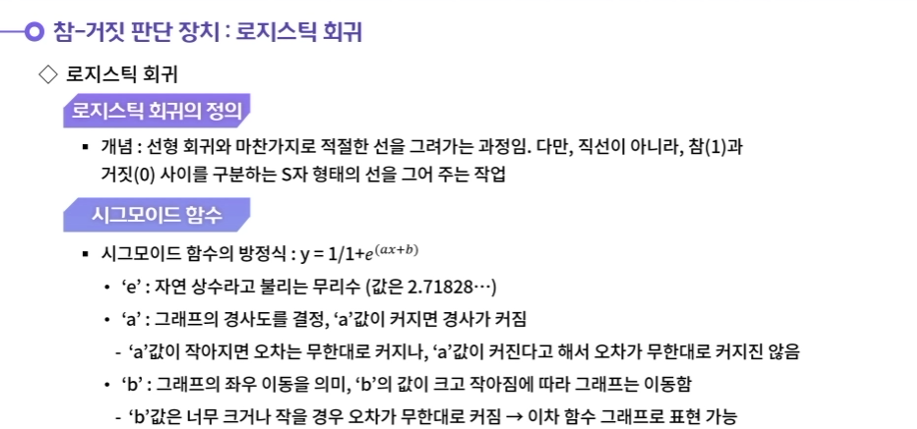

---

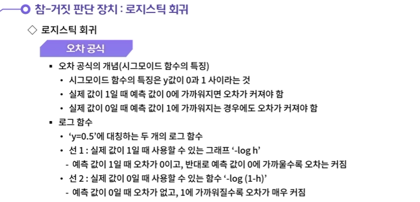

---

## 02.신경망의 이해

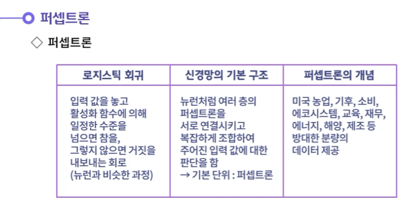

---

---

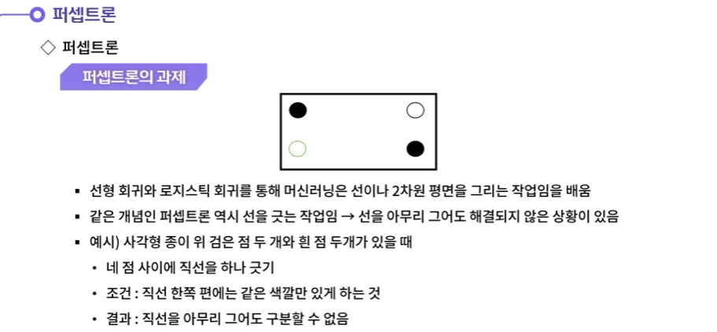

---

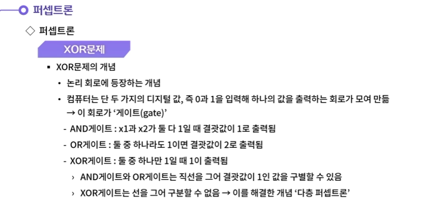

---

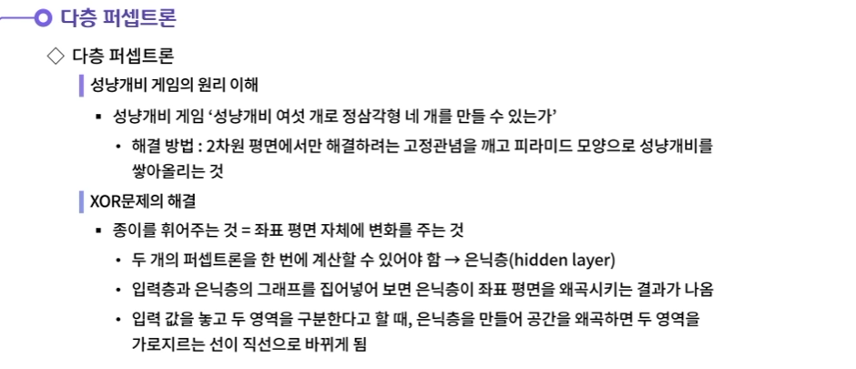

---

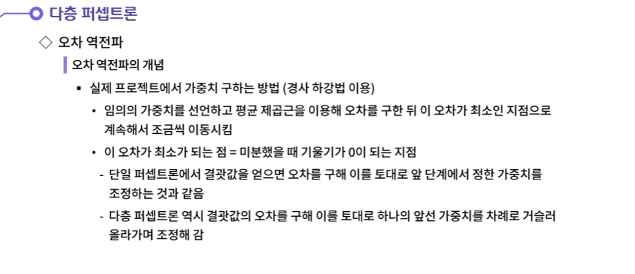

---

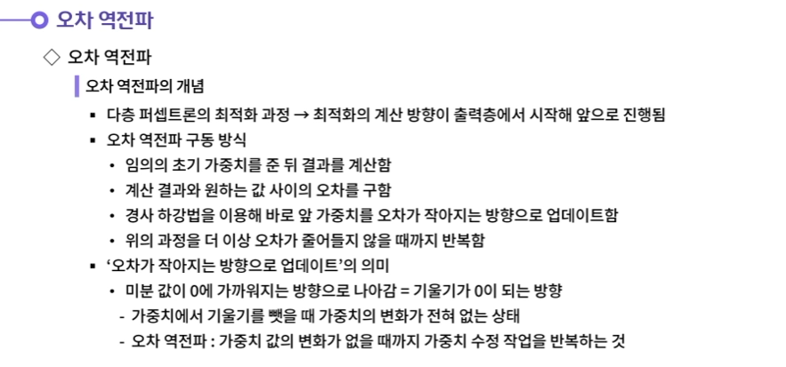

---

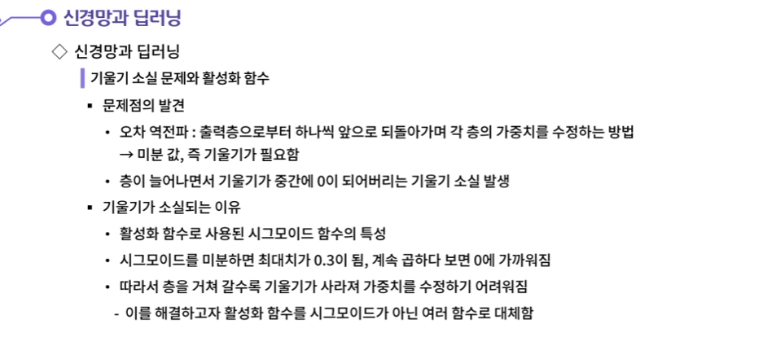

---

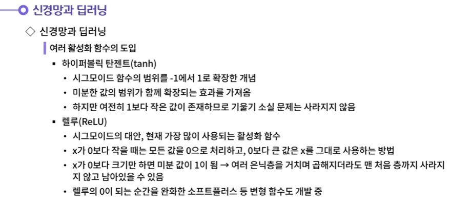

---

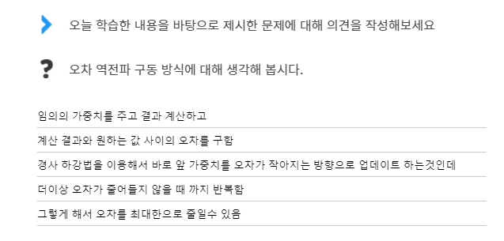

- **첫째로, 임의의 초기 가중치를 준 뒤 결과를 계산한다.**
  **둘째로, 계산 결과와 원하는 값 사이의 오차를 구한다.**
  **셋째로, 경사 하강법을 이용해 바로 앞 가중치를 오차가 작아지는 방향으로 업데이트한다.**
  **넷쨰로, 위의 과정을 더 이상 오차가 줄어들지 않을 때까지 반복한다.**

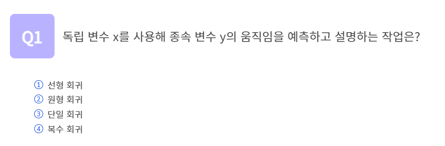

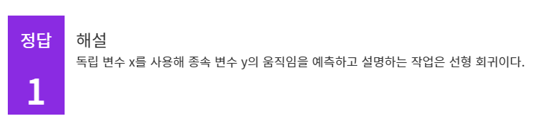

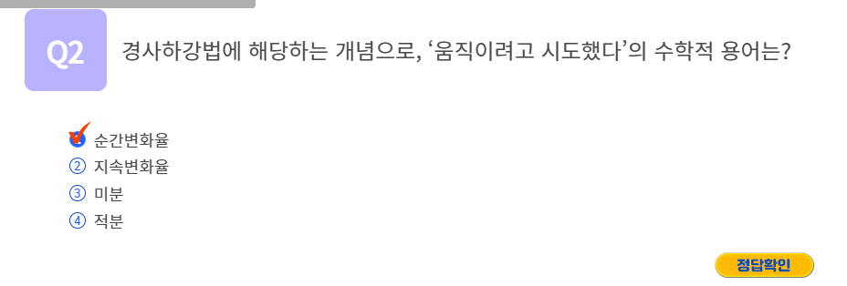

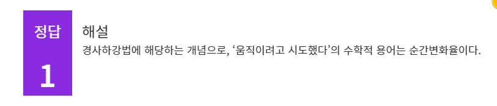

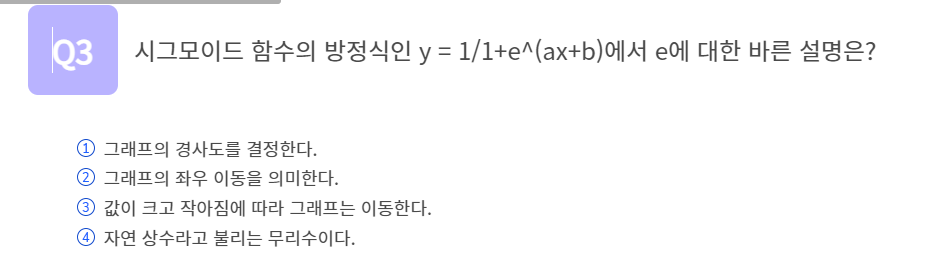

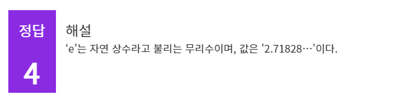

## 정리하기

#### 1. 오차 역전파 구동 방식에 대해 생각해 봅시다.

1. 첫째로, 임의의 초기 가중치를 준 뒤 결과를 계산한다.
   둘째로, 계산 결과와 원하는 값 사이의 오차를 구한다.
   셋째로, 경사 하강법을 이용해 바로 앞 가중치를 오차가 작아지는 방향으로 업데이트한다.
   넷쨰로, 위의 과정을 더 이상 오차가 줄어들지 않을 때까지 반복한다.